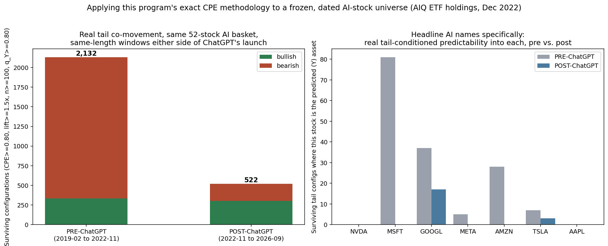
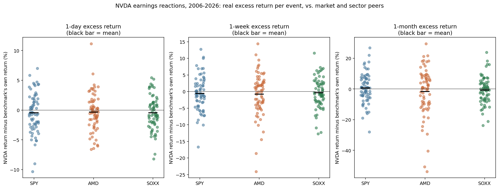
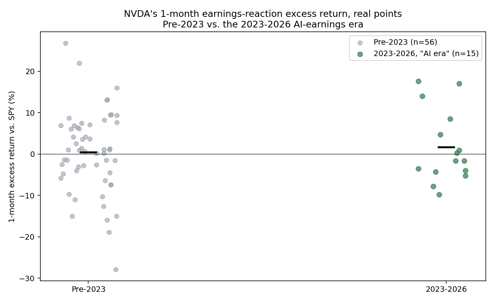
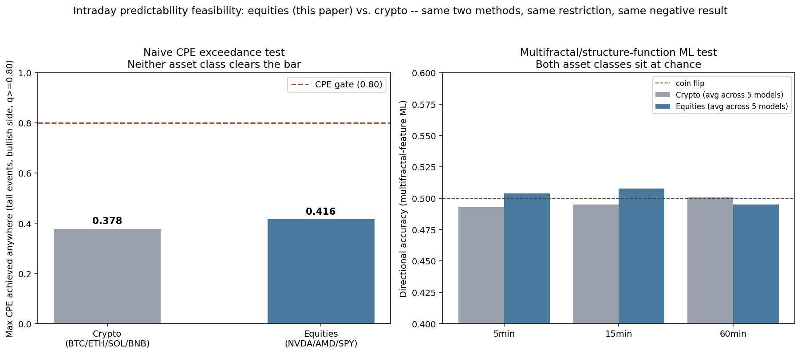

# The AI Narrative, Tested Three Ways

There are three things people say about AI stocks so often they've stopped sounding like claims and started sounding like facts. They move together more than they used to, because it's all one trade now. NVIDIA reliably pops on its own earnings, because the results keep being extraordinary. And with this much money and attention pointed at a handful of names, there's obviously *something* exploitable in the data if you look closely enough. I decided to actually check all three instead of nodding along.

**First: do AI stocks move together more now than before ChatGPT?**

I needed a real, dated universe for this, not a list of today's winners picked with hindsight. I found one: Global X's AIQ ETF publishes its full holdings on its website, and the Wayback Machine had a snapshot from December 1, 2022 — right at the ChatGPT inflection point. 52 US-listed names, archived before anyone could cherry-pick them.

Applying this program's usual tail-co-movement test to that basket, in equal-length windows immediately before and after ChatGPT's launch, real tail-level co-movement *fell* — from 2,132 surviving configurations pre-launch to 522 after. I checked the obvious objection myself: the pre-window contains the COVID crash, which could be doing all the work. Excluding it doesn't shrink the pre-window's count, it grows it, to 2,678 — the decline survives the one confound that could have explained it away.

The more specific result: NVIDIA, Microsoft, Meta, Amazon, and Apple each show *zero* surviving tail-level predictability from anything else in the basket, post-launch. None of them predict each other's bad days better than chance would. The one exception is Alphabet, which does show a real, narrow pattern tied to Alibaba's own tail moves — an odd, specific pairing I'm reporting rather than explaining, because I don't have a mechanism for it that the data actually supports.

**Second: does NVIDIA actually pop on its own earnings?**

I pulled all 71 of its quarterly reports since 2006 and measured its return in the day, week, and month after, against the S&P 500, AMD, and the semiconductor sector. It beats those benchmarks on 44% to 55% of occasions depending on the window — close to a coin flip in every direction.

I expected the "misses get punished" version of the story to hold up at least. It mostly doesn't: NVIDIA has only missed its own estimate 4 times in 71 quarters, and only 2 of those 4 produced a real, sustained selloff. The other 2 — including a -17% EPS miss in November 2022 — were forgotten by the market within a month.

The part that actually surprised me: splitting the sample at the start of 2023, when NVIDIA's results became genuinely extraordinary, its one-month return *relative to its own sector peers* hasn't improved during that stretch. If anything it's worse (-3.65% vs. AMD, -2.25% vs. SOXX in the AI era, versus -1.20% and -0.29% before). Whatever's driving the stock, it isn't a growing earnings-day edge over the companies it's compared to.

**Third: is there anything in the minute-by-minute data?**

This program already asked this question about crypto back in July and found nothing — zero of 73,728 configurations cleared the bar, and a more sophisticated multifractal-feature machine-learning approach landed at a coin flip too. I signed up for a free market-data account and ran the identical two methods on real 1-minute NVDA, AMD, and SPY data instead.

Same answer. Zero of 41,472 configurations cleared the bar, and the maximum conditional hit rate achieved anywhere (0.416) sits close to crypto's own figure under the identical restriction (0.378) — equities didn't turn out to behave any differently from crypto here. The machine-learning approach landed at 49.2% to 51.4% directional accuracy, indistinguishable from chance, across three horizons and five different model types.

**Put together**

Three independent checks, three different timescales, two different asset classes in the third case — and none of them found what the story says should be there. AI stocks aren't moving together more; NVIDIA, Microsoft, Meta, Amazon, and Apple each show no real tail-level link to anything else in the theme. NVIDIA's earnings reports don't reliably beat the market, and whatever edge the stock has carried through its best quarters hasn't come from outperforming its peers specifically on earnings day. And the minute-by-minute data is as quiet for these names as it already was for crypto.

The stock prices went up. That part is real and I'm not disputing it. I just can't find the specific, tradeable mechanism everyone assumes travels along with that price action — and I went looking for it three separate ways before writing this.

Full paper, all three tests in full: https://zenodo.org/records/23092634
Code and every piece of data behind it: https://github.com/quantarram/quant-regime-research

*Independent quantitative research. Not investment advice.*
