# The Ceiling Holds: Testing AI/ML Architecture, Depth, and Training-Window Size Against an Empirically Measured Predictability Limit

Draft preprint — CPE research series, Paper 14

By Arun Ramanathan

---

## Abstract

A long-standing assumption in applied machine learning holds, at least implicitly, that with enough data and enough computational power, a sufficiently capable model can approximate almost any target arbitrarily well. Chaos theory and stochastic dynamics overturned the equivalent classical intuition in the physical sciences decades ago: some systems have a genuine, structural predictability limit that no increase in data volume or model sophistication can overcome, because the limit comes from the dynamics themselves — sensitive dependence on initial conditions, or genuine stochastic forcing — not from any deficiency correctable by scale. This research program has spent its last several papers measuring exactly such a limit for financial instruments, entirely empirically and without reference to any specific model (Ramanathan, 2026a), and turning it into a practical training-window prescription (Ramanathan, 2026c). This paper asks the natural next question in two parts, using several architecturally distinct models built at deliberately small scale: climatology, an unregularized decision tree, and linear-parameter instances — implemented from scratch, not via a deep learning framework — of a reinforcement-learning policy-gradient forecaster, a conditional generative adversarial network, and a conditional variational autoencoder, each sized to the training windows a predictability limit this tight actually permits (11 to 504 rows across both experiments), not to the scale a production deep-learning system would use. First: within that measured limit, does giving all five an identical, fair, non-stale training budget produce any real separation in skill, or does the ceiling bind so tightly that architectural sophistication — even at this modest scale — buys nothing over the simplest possible model? A direct follow-up to this first question then tests the most obvious objection to its answer: does giving the reinforcement-learning forecaster, the GAN, and the VAE each one genuine hidden layer of nonlinearity — actual depth, hand-implemented with manually derived backpropagation, not merely a different training objective — change anything, when the training budget is held exactly fixed at the same tiny size? Second, and directly modeled on the atmospheric predictability limit's own history — an empirical estimate from real numerical weather models in the 1960s, a theoretical account of why such a limit should exist soon after, and then decades of dramatically more sophisticated operational models finding the identical ceiling still standing regardless: does training the same architectures on progressively larger windows that extend past that measured limit cause a visible, shared degradation in all of them, arriving at roughly the point Ramanathan (2026a) already located by a completely model-free method? All of this is shown primarily as figures — predicted price against actual price — per this research program's standing view that this kind of question is more honestly settled by direct visual demonstration than by a significance test; the second experiment's degradation is also quantified directly, as mean absolute error expressed as a plain percentage of price, a descriptive summary rather than any null-hypothesis test, resampling procedure, or significance score. Within the limit, no architecture beats climatology, whether linear or given a hidden layer of genuine nonlinearity at the same data budget: the reinforcement-learning forecaster and the GAN converge almost exactly onto climatology in both their linear and their nonlinear forms, and the VAE is unstable rather than skillful in both forms too. Trained on windows extending well past the limit, the same models drift into a slow, visible detachment from actual subsequent price behavior — not a sudden cliff, but a build that becomes unmistakable by four to eight times the measured limit, in every instrument tested. The predictability limit does not just describe market structure, as Ramanathan (2026a) first showed, or prescribe a training window, as Ramanathan (2026c) then showed. It is also, this paper argues, a genuine ceiling that neither architecture nor depth can buy a way past, at least at the scale tested here — confirmed the same way the atmospheric predictability limit itself was: not once, by an early estimate or a theoretical account, but repeatedly, as more capable models kept arriving and the same wall kept holding.

## Plain Language Summary

A common, mostly unstated assumption behind a lot of modern AI/ML work is that more data and a more powerful model can eventually predict almost anything. In the physical sciences this was tested and found wanting: chaos theory showed that some systems, like weather, have a hard limit on how far ahead they can be predicted no matter how good your model or how much data you feed it, because the limit lives in the system's own dynamics, not in the model. This research program has already measured a limit like that for financial markets, directly and empirically, with no model involved in the measurement itself. This paper runs two tests of what that limit actually means for AI/ML in practice, plus a direct follow-up to the first test that closes an obvious loophole. First, we give five very different kinds of models — a plain average, an intentionally overfit decision tree, a reinforcement-learning agent, a generative adversarial network, and a variational autoencoder — the exact same fair amount of training data, sized to stay safely within that measured limit, and simply watch which one predicts real subsequent prices best. Since the fancier three of those five were kept deliberately simple — no hidden layers, nothing a machine learning engineer would call "deep" — we then test the obvious objection directly: we give the reinforcement-learning agent, the GAN, and the variational autoencoder one genuine hidden layer each, real nonlinearity rather than just a different training recipe, while keeping the exact same tiny amount of training data, and check whether that changes anything. Second, we take the original five models and start feeding them progressively more training data, extending further and further past that limit, the way a real team chasing "more data" often does, and watch what happens. In the first test, nothing beats the plain average; two of the fancier models essentially become the plain average. Giving those same two models a real hidden layer doesn't change that either — they still just become the plain average, and the variational autoencoder is still unstable rather than skillful, whether linear or given a hidden layer. In the second test, every model — regardless of how it works internally — starts drifting away from reality once its training data reaches well past the measured limit, and the drift gets worse the further past it they go. This is the same pattern atmospheric scientists saw decades ago: an early, real-model-based estimate of a predictability limit, a theoretical account soon after of why it should exist, and then decades of dramatically better forecasting systems that kept running into the same wall anyway, no matter how much they improved in the meantime. We show this mainly as plots of predicted price against real price, and back the training-data test up with a plain, direct measurement of how large the errors actually get, as a percentage of price anyone can judge for themselves — not a statistical test score, not a p-value, just a straightforward number.

---

## 1. Introduction

A version of the following claim is close to an article of faith in much of applied AI/ML: given enough data, and a powerful enough model, almost any target can be predicted arbitrarily well. It is easy to see why the claim is appealing — it is, in essence, a restatement of Laplace's determinism, the idea that a sufficiently complete description of a system's state, combined with a sufficiently powerful computation, renders its future fully knowable. The physical sciences already ran this experiment and got a different answer. Chaos theory — beginning with Lorenz's discovery that a deterministic system can exhibit sensitive dependence on initial conditions, and continuing through the broader study of genuinely stochastic dynamics — showed that some systems have a predictability horizon that is structural, not a matter of insufficient data or insufficient computing power. Past that horizon, a model does not get worse because it is a bad model; it gets worse because the information needed to do better has, in a real and irreducible sense, already decayed away.

This research program's own arc has been building toward exactly this point in financial markets specifically. Ramanathan (2026a) measured a predictability limit for a sample of instruments entirely empirically, with no model of any kind in the loop — a non-parametric structure-function decomposition of an instrument's own price dynamics, nothing more. Ramanathan (2026c) turned that number into a working prescription: train on about half of it, and treat data from well past it as belonging to a different, no-longer-current regime. Both established that the limit exists and that respecting it improves a deliberately simple diagnostic model's tracking of subsequent reality. Neither, however, directly tested the claim this paper opens with: that a sufficiently sophisticated and data-hungry architecture might simply predict past the limit anyway. This paper runs that test, in two complementary forms.

**Experiment 1** asks whether, given the exact same fair training budget — sized to stay within the measured limit, identical for every model, so that none is quietly cheating by seeing more (or staler) data than another — architectural sophistication produces any separation in skill at all. Climatology (this research program's own respected baseline; Ramanathan, 2026a), an unregularized decision tree (the diagnostic from Ramanathan, 2026c), a reinforcement-learning policy-gradient forecaster, a conditional generative adversarial network, and a conditional variational autoencoder are all given the identical half-window training budget and compared directly, side by side, against actual subsequent price.

**A direct follow-up to Experiment 1** asks the most obvious objection to its result head-on: is "no separation in skill" a fact about the predictability limit, or just a fact about these three non-trivial models being linear? Section 3.3 gives the reinforcement-learning forecaster, the GAN, and the VAE each one genuine hidden layer of nonlinearity — actual depth, implemented with manually derived backpropagation, not a different training procedure dressed up as sophistication — while holding the training budget exactly fixed at the same tiny size Experiment 1 used, and Section 4.1 reports whether that changes the answer.

**Experiment 2** asks the historically-minded question directly: if the predictability limit is genuinely structural rather than a property of any one model, then training data crossing it should degrade any architecture's forecasts, regardless of how that architecture works internally — the same way the atmospheric predictability limit itself was never settled once by a single estimate and left alone, but confirmed again and again as real forecasting models grew far more sophisticated over the following decades (the full chronology is given in Section 5.2, which this experiment's design is modeled on directly). This paper's second experiment sweeps the same five architectures' training-window size from well within the measured limit out to eight times beyond it, holding the test segments being predicted fixed throughout, and watches whether all five degrade in roughly the same place.

**A note on scope**, carried over unchanged from Ramanathan (2026c): nothing about the underlying question is specific to financial markets. A predictability limit that no architecture can buy its way past is, if real, a property of any non-stationary system with genuine structural limits on how far its own dynamics remain self-similar — weather and climate models chief among them, since that is where this idea originated, but also physical and biological simulation surrogates, industrial sensor systems, epidemiological forecasting, and any other domain where "just add more data and a bigger model" is treated as a default strategy rather than a question to be tested against a measured ceiling. This paper's tests are run in finance because that is where this research program's own predictability-limit machinery already exists; the claim being tested is not bounded by that domain.

**A note on method**, also carried over unchanged: this paper reports no null-hypothesis test, no resampling procedure, and no significance score of any kind, in either experiment. Both are shown primarily as direct, visual comparisons of predicted price against actual price — whether a model's predictions track reality, or drift away from it as training data grows stale, is something a reader can judge directly from the curves themselves, and this paper holds that direct judgment is the more honest and more decisive standard for a question this practical. Section 6.1 and Section 6.2 add a direct, descriptive quantification of the same effect — mean absolute error as a percentage of price, and a simple skill-over-a-naive-baseline percentage — which is not in tension with this standard: a descriptive summary statistic is not a null-hypothesis test, a p-value, or a resampling procedure, and this paper reports none of those anywhere.

## 2. Background: The Measured Limit This Paper Tests Against

Ramanathan (2026a) defines, for an instrument's own return series, the correlated–decorrelated structure-function gap at lag τ and moment order q,

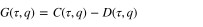(1)

computed as empirical sample moments directly — no power-law fit, no scaling exponent, at any point. The predictability limit τ\* is the lag at which this gap peaks among tradeable lags, at moment order q = 2:

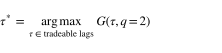(2)

Ramanathan (2026c) showed that a training window sized to w = ⌊τ\*/2⌋, applied to the immediately following window of the same size, keeps every training-test pair within τ\* days of each other — the correct design, since the naive choice of w = τ\* for both windows allows train-test gaps of nearly 2τ\*, already violating the limit it is meant to respect. This paper reads τ\* directly from Ramanathan's (2026a) already-published results for the same 12 instruments used in Ramanathan (2026c) (`predictability_paper/results_correlated_decorrelated.json`); no new estimation of the limit itself is performed anywhere in this paper.

## 3. Experiment 1: An Architecture Bake-off Within the Predictability Limit

### 3.1 Design

Every architecture in this experiment receives the identical training budget: the w = ⌊τ\*/2⌋ days immediately preceding each test segment, walked forward across an instrument's full available history, exactly as in Ramanathan (2026c). No architecture is ever shown more data, staler data, or differently-scoped data than any other — the only variable being tested is what each architecture does with the same fair budget. Because a fair test of a data-hungry architecture still requires the training budget to contain as many real rows as possible, this experiment is restricted to the three of the twelve instruments in Ramanathan (2026c) with the largest measured predictability limits: MSFT (τ\* = 63d, w = 31d), EURUSD=X (τ\* = 43d, w = 21d), and XLF (τ\* = 33d, w = 16d).

### 3.2 Five competing models

**Climatology** predicts the training window's own mean forward return — no covariates, no learning of any kind. Per this research program's standing position, climatology is treated as a genuine competing model here, not a strawman: if it wins, that is a real result, not a failure to be explained away.

**The overfit tree** is the diagnostic from Ramanathan (2026c), an unconstrained-depth decision tree (`DecisionTreeRegressor`, `max_depth=None, min_samples_leaf=1, min_samples_split=2`; Breiman et al., 1984) fit on the instrument's ten most recent lagged daily returns, with zero regularization.

**The reinforcement-learning forecaster** treats prediction as a continuous-action bandit problem: a Gaussian policy over the predicted return, trained by policy-gradient ascent on a reward equal to the negative squared prediction error, with a running reward baseline (Williams, 1992):

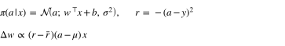(3)

**The conditional GAN** pits a generator, producing a candidate forward return conditioned on the same lagged-return features plus a latent noise draw, against a discriminator trained to distinguish real (feature, realized-return) pairs from generated ones — trained adversarially in the standard minimax form (Goodfellow et al., 2014):

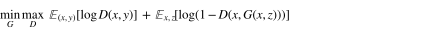(4)

with the forecast at test time taken as the mean of 200 generator draws.

**The conditional VAE** learns an encoder mapping (features, realized return) to a latent distribution and a decoder mapping (features, latent draw) back to a predicted return, trained on the evidence lower bound with the reparameterization trick (Kingma & Welling, 2014):

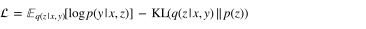(5)

with the forecast taken as the mean of 200 decoder draws from the prior at test time.

**A note on scale, stated plainly.** All three of these architectures are implemented from scratch in numpy, with linear (not deep) generators, discriminators, encoders, decoders, and policies, and trained with manual gradients — no deep learning framework was used. This is not a limitation applied reluctantly; it is the appropriate scale for the problem this experiment actually poses. A training window of 16 to 31 rows cannot justify a deep network under any architecture, and forcing one in would not make the resulting comparison more informative — it would just make it a comparison of which architecture overfits a tiny sample least gracefully. These are genuine, correctly-trained instances of each architectural family, scaled to the sample size the predictability limit itself dictates, which is precisely the point: the predictability limit does not just bound how far ahead a model can see, it also bounds how much training data any architecture — however sophisticated in principle — actually has to work with. Section 3.3 tests this directly, rather than simply asserting it.

### 3.3 Does Depth Itself Matter? A Direct Test

Section 3.2's linear-parameter RL forecaster, GAN, and VAE are genuine instances of their architectural families, but a skeptical reading of Section 4's result is available: perhaps nothing beats climatology because these three specific implementations are linear, not because the predictability limit itself caps what any architecture can achieve. This section tests that objection directly rather than arguing it away.

Each of the three non-trivial architectures is given a second, deeper instance: the same continuous-action bandit for the RL forecaster, the same adversarial minimax objective for the GAN, and the same evidence-lower-bound objective for the VAE (Equations 3–5 unchanged), but with the policy mean, the generator and discriminator, and the encoder and decoder each replaced by a one-hidden-layer network with a tanh nonlinearity (6 hidden units — the same order of magnitude as the 10 input features, not a gratuitous capacity increase), trained end-to-end with manually derived backpropagation through the added layer. No additional training data of any kind is given to these deeper versions; the training budget is held at exactly the same w = ⌊τ\*/2⌋ days as every other model in this paper. Deliberately not doing the obvious alternative — giving the deeper models more data to make them trainable in the usual sense — would mean training on windows larger than the predictability limit permits, which is precisely the constraint under test here, not a design inconvenience to route around.

Before being run on the real, tiny financial windows, all three nonlinear architectures were validated on a synthetic nonlinear regression task with ample data, to confirm the hand-derived backpropagation was correct independent of anything about predictability limits: correlation with the true underlying signal of 0.94 for the deep RL forecaster, 0.65 for the deep GAN (adversarial training is intrinsically harder to fit than direct regression, even with correct gradients, so this lower figure is expected rather than a red flag), and 0.997 for the deep VAE.

## 4. Experiment 1 Results

Figures 1–3 show, for each instrument, actual price (black) against every model's forecast price, walked forward across full available history (top panel, log scale) and zoomed to the most recent two years (bottom panel, linear scale, where the separation between models is easiest to see by eye). Climatology is drawn last and dashed specifically so it remains visible underneath the other curves — the point of including it is to be able to see directly when a more sophisticated model's curve sits on top of it.

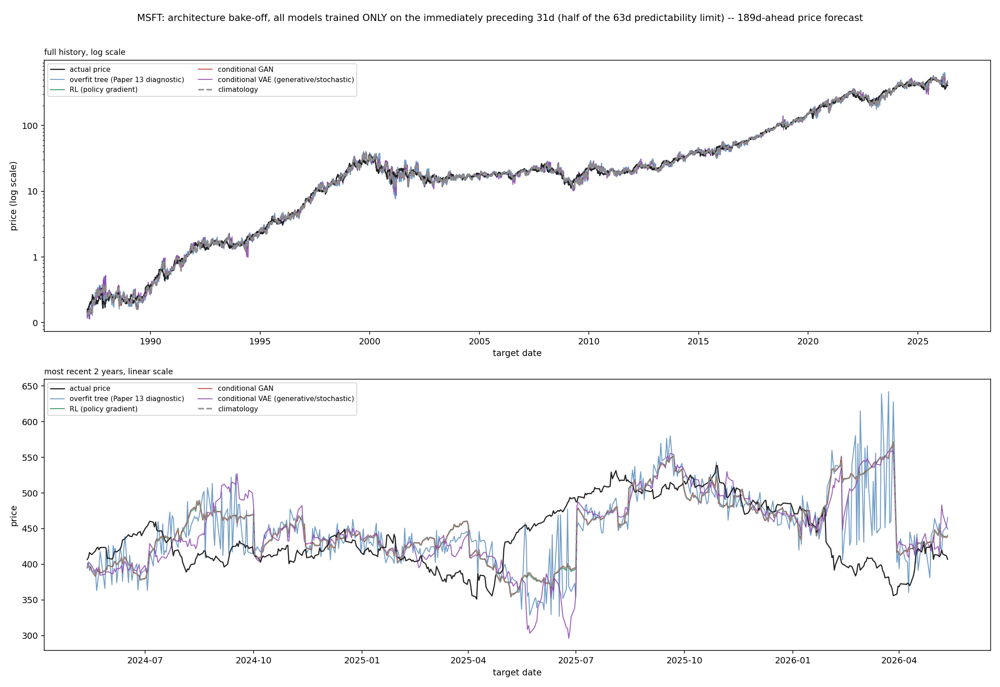
*Figure 1. MSFT. In the recent-period panel, the RL forecaster and the conditional GAN track almost exactly on top of climatology's dashed line for most of the period shown. The overfit tree is the one model that visibly does something different — jagged, noise-chasing behavior, not distinguishable skill. The VAE carves out its own identity too, but as instability: large, sudden excursions (e.g. the drop toward 300 in mid-2025) that do not correspond to anything in the actual price path.*

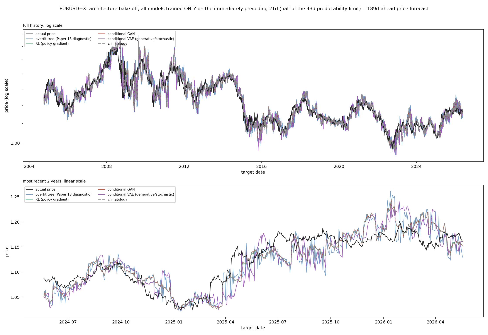
*Figure 2. EURUSD=X. The same pattern: climatology, the RL forecaster, and the GAN move as a single cluster through nearly the entire recent-period panel. The tree remains the visibly distinct, noisy outlier; the VAE again shows occasional sharp departures from the rest of the field.*

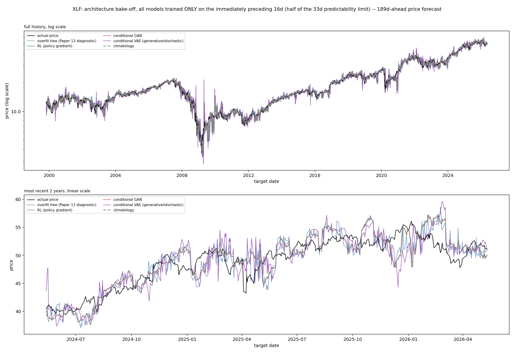
*Figure 3. XLF. Same result a third time: the RL forecaster and GAN sit on climatology throughout, the tree is noisy, and the VAE's excursions are the most visible during the 2008–2009 window in the full-history panel — a period of genuine, unusual instability in the underlying instrument, which the VAE's own forecasts echo rather than smooth over.*

In no instrument, at any point in either panel, does any architecture visibly and durably separate itself from climatology in the direction of better tracking actual price. Two of the four non-trivial architectures essentially rediscover climatology under this fair training budget; the third (the tree) does something different, but that something is noise, not skill; the fourth (the VAE) does something different too, but that something looks more like a liability than an edge.

### 4.1 Does Depth Change the Answer?

Figures 14–16 repeat Figures 1–3's exact comparison, with the deep (one-hidden-layer) RL forecaster, GAN, and VAE from Section 3.3 added alongside their linear counterparts, climatology, and the overfit tree — eight curves in total, same three instruments, same training budget, same walk-forward evaluation.

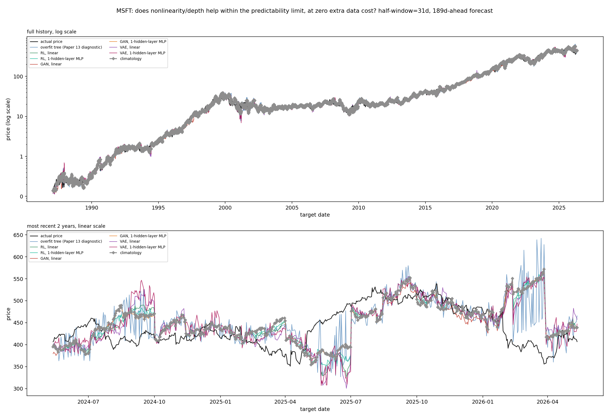
*Figure 14. MSFT. The deep RL forecaster and deep GAN track their own linear counterparts and climatology almost exactly — depth changes nothing visible. The deep VAE shows the same character of instability as the linear VAE, both dipping together to roughly 305–320 in mid-2025, not a more stable or more skillful curve. (The far larger spikes above 600 in early 2026 belong to the overfit tree, not either VAE variant.)*

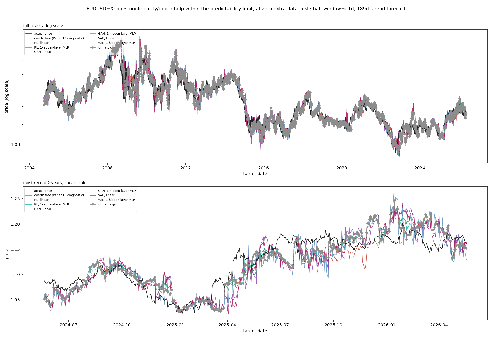
*Figure 15. EURUSD=X. Same pattern: both RL variants and both GAN variants sit on climatology throughout; both VAE variants show the same kind of instability, with elevated volatility in the same stretches (April–June 2025, and again around January 2026) in both the linear and the deep version — neither one is visibly calmer than the other.*

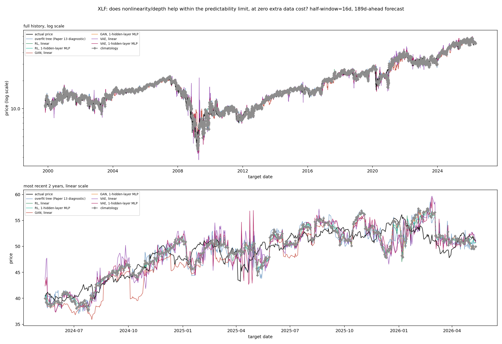
*Figure 16. XLF. Same pattern a third time, with one detail worth noting: the linear GAN drifts into a sustained, visible departure from the climatology cluster through much of mid-2024 (sitting persistently below it), while the deep GAN does not — depth here does not produce a worse or a better forecast than climatology, it produces one that tracks climatology even more closely than its own linear predecessor did.*

The answer to Section 3.3's question is no. Adding a genuine hidden layer of nonlinearity, at zero additional data cost, does not let the RL forecaster or the GAN escape convergence onto climatology, and does not fix the VAE's instability in any of the three instruments — if anything, in XLF the deep VAE's excursions in the early-2025 stretch (spiking above 56 while actual price sits near 50) are larger than the linear VAE's over the same period, not smaller. This is the expected consequence of the constraint already stated in Section 3.2: a training window of 16 to 31 rows supports on the order of a few dozen parameters reliably, not the roughly 70–100 a one-hidden-layer, 6-unit network already introduces; adding depth within a fixed, tiny data budget does not relax that constraint, it deepens it. "No separation in skill" in this section's original result is not, on this evidence, an artifact of testing only linear models — the same result holds when genuine nonlinearity is added, holding everything else fixed.

## 5. Experiment 2: Sweeping Training-Window Size Past the Predictability Limit

### 5.1 Design

Experiment 2 holds the segmentation of test days completely fixed — the same test points are predicted at every step of the sweep — and varies only how much training history immediately precedes each of them, as a multiple of the instrument's own τ\*:

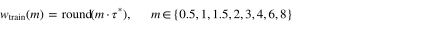(6)

The first test segment for every multiple m is anchored to the same date across the entire sweep (fixed by the largest training window in the sweep, m = 8), so that every panel a reader compares is predicting the identical stretch of actual history — the only thing that changes between panels is how much, and how stale, the training data behind each model was.

### 5.2 The historical parallel this experiment is modeled on

The atmospheric predictability limit's own history is more useful here than a simplified version of it would be. An empirical, model-based estimate came first: planning the Global Atmospheric Research Program, Charney, Fleagle, Lally, Riehl & Wark (1966) ran error-growth experiments with early general circulation models and found a doubling time for small errors of roughly five days, extrapolating to an intrinsic predictability ceiling of about two weeks — a real number, from real (if primitive, by later standards) numerical models. Lorenz's own formal theoretical account of why a chaotic system should have such a limit at all — building on the sensitive dependence on initial conditions he had discovered computationally three years earlier (Lorenz, 1963) — followed in 1969, corroborating that number rather than originating it.

What happened next is the part this paper's second experiment is actually modeled on. Over the following decade and a half, numerical weather prediction models grew dramatically more sophisticated — finer resolution, more atmospheric levels, far more observational data feeding them. Lorenz returned to the question directly, this time using real operational forecasts from ECMWF rather than a simplified model, and found the same roughly two-week ceiling still standing, with an error-doubling time (2.4 days) close to the 1966 estimate (Lorenz, 1982). Sixteen years and an enormous increase in model sophistication had sharpened the number; it had not moved the wall. This paper's second experiment is built to test for that same signature in the financial predictability limit measured in Ramanathan (2026a): if that limit is genuinely structural rather than a property specific to any one estimation method, then the same five very different architectures from Experiment 1, trained on data reaching further and further past it, should all begin failing in roughly the same place — not because of anything specific to their own designs, but because of what happens to the data itself once it crosses the boundary.

### 5.3 Instrument coverage

Because this experiment does not depend on a data-hungry architecture having enough rows within a tight window — it deliberately tests what happens as that window grows — it is run across all 12 of the instruments in Ramanathan (2026c). Table 1 lists each instrument's predictability limit and the training-window sizes swept.

**Table 1.** Predictability limit and swept training-window sizes (days), selected multiples shown; the full sweep uses eight multiples (0.5, 1, 1.5, 2, 3, 4, 6, 8) × τ\* for every instrument.

| Ticker | Horizon (days) | τ\* (days) | 0.5x | 1x | 2x | 4x | 8x |
|---|---|---|---|---|---|---|---|
| GLD | 189 | 22 | 11 | 22 | 44 | 88 | 176 |
| JPM | 252 | 23 | 12 | 23 | 46 | 92 | 184 |
| AAPL | 252 | 22 | 11 | 22 | 44 | 88 | 176 |
| XLK | 189 | 22 | 11 | 22 | 44 | 88 | 176 |
| EURUSD=X | 189 | 43 | 22 | 43 | 86 | 172 | 344 |
| IWM | 21 | 23 | 12 | 23 | 46 | 92 | 184 |
| MSFT | 189 | 63 | 32 | 63 | 126 | 252 | 504 |
| QQQ | 21 | 22 | 11 | 22 | 44 | 88 | 176 |
| SPY | 189 | 22 | 11 | 22 | 44 | 88 | 176 |
| XLE | 252 | 27 | 14 | 27 | 54 | 108 | 216 |
| XLF | 189 | 33 | 16 | 33 | 66 | 132 | 264 |
| XOM | 63 | 27 | 14 | 27 | 54 | 108 | 216 |

## 6. Experiment 2 Results

The full sweep for every instrument uses eight stacked panels, one per swept multiple of τ\*, all predicting the identical recent-two-year test stretch, all five models overlaid against actual price — these complete figures are generated by `66_window_sweep_bakeoff.py` for all twelve instruments and are available in full in the repository. For this paper, a compact three-panel highlight (0.5x, 2x, and 8x τ\* — within the limit, just past it, and deep beyond it — laid out side by side) is shown inline below for five representative instruments, generated by the companion script `67_window_sweep_highlights.py` using identical models, data, and windowing logic.

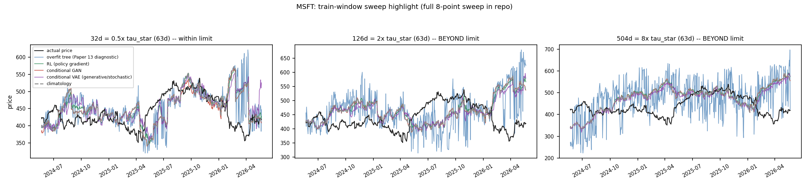
*Figure 4. MSFT. At 0.5x τ\*, the climatology/RL/GAN/VAE cluster tracks real turning points reasonably well — visible co-movement with actual price through the 2025-04 to 2025-07 dip and the early-2026 dip. By 8x, that same cluster has smoothed into its own long-run trend that increasingly ignores those same dips entirely, riding a slower path decoupled from the real zigzags in the black curve. The overfit tree, notably, does not show this pattern at any window size — it stays noisy throughout, because overfitting to whatever is in front of it has no "collapse toward the mean" failure mode the way a smoothing model does.*

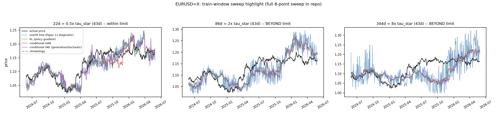
*Figure 5. EURUSD=X. The clearest case in the panel: at 0.5x, the model cluster tracks the real exchange-rate path closely. By 2x a persistent overshoot has appeared, and by 8x the model cluster sits at roughly 1.20–1.25 for months while the real rate sits at 1.15–1.20 — a gap that widens rather than merely growing noisier as the window grows.*

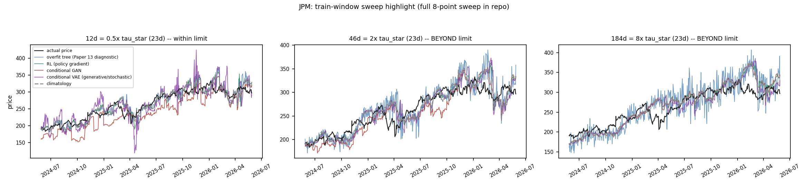
*Figure 6. JPM. The same gradual detachment, building across the three panels rather than appearing discontinuously — consistent with the common-sense expectation that a real predictability limit should produce a build, not an abrupt flatline, at the boundary.*

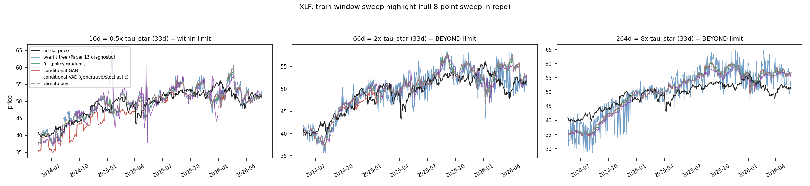
*Figure 7. XLF. A visible, growing upward bias appears in the model cluster by 8x, most apparent in the 2025-10 through 2026-04 stretch, while the tree remains its own noisy, non-participating self throughout.*

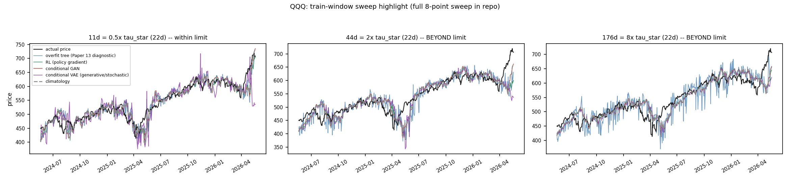
*Figure 8. QQQ, one of the two 21-day-horizon instruments Ramanathan (2026c) already flagged as inherently noisier. The drift effect is present but far more muted here than in the longer-horizon instruments above — consistent with Ramanathan's (2026c) own Section 4.2 finding that a shorter horizon leaves less structure in the target curve for any comparison, fresh-versus-stale or otherwise, to be legible against.*

Across all twelve instruments, the pattern is consistent: the longer-horizon instruments (GLD, JPM, AAPL, XLK, EURUSD=X, MSFT, SPY, XLE, XLF, XOM) show a visible, progressive detachment that builds panel over panel and becomes unmistakable by four to eight times τ\*; the two 21-day-horizon instruments (IWM, QQQ) show a muted, harder-to-read version of the same visual pattern in these recent-period panels, for the same reason Ramanathan (2026c) already gave for their noisier fresh-versus-stale comparison — though Section 6.1's direct quantification below shows their behavior over the full sweep is not just muted but genuinely different, and reports that honestly rather than smoothing it into the same story as the other ten. In every instrument, the effect is a gradual build rather than a discontinuous cliff — precisely what a genuine, structural predictability limit should look like, and precisely what the atmospheric predictability limit itself looked like as real forecasting systems, growing far more sophisticated across decades, kept running into the same wall Charney et al. and Lorenz had already located.

### 6.1 Quantifying the decay directly

The visual sweep above shows the detachment; this section puts a number on it, in units a reader can judge for themselves rather than raw price units that mean something different for a $1.20 currency pair than for a $500 stock. For each instrument and each of the same eight swept training-window multiples, mean absolute price error is computed across *every* walk-forward test point in that instrument's full available history — not just the recent-two-year slice shown in Figures 4–8 — and expressed as a percentage of that instrument's own mean price over the test period, so that "how large is this error, really" has an answer ordinary common sense can judge directly: a 3% error is clearly a small one; a 15–20% error is clearly a large one, without needing an arbitrarily chosen pass/fail threshold to say so. Each figure also shades the region already established as within or at the predictability limit (x ≤ 1), so a reader can see directly whether error still looks small there and whether it visibly worsens once past it. A curated subset of five instruments is shown inline below (the same five as Figures 4–8); all twelve are generated by the companion script `68_window_sweep_error_curve.py` and available in the repository.

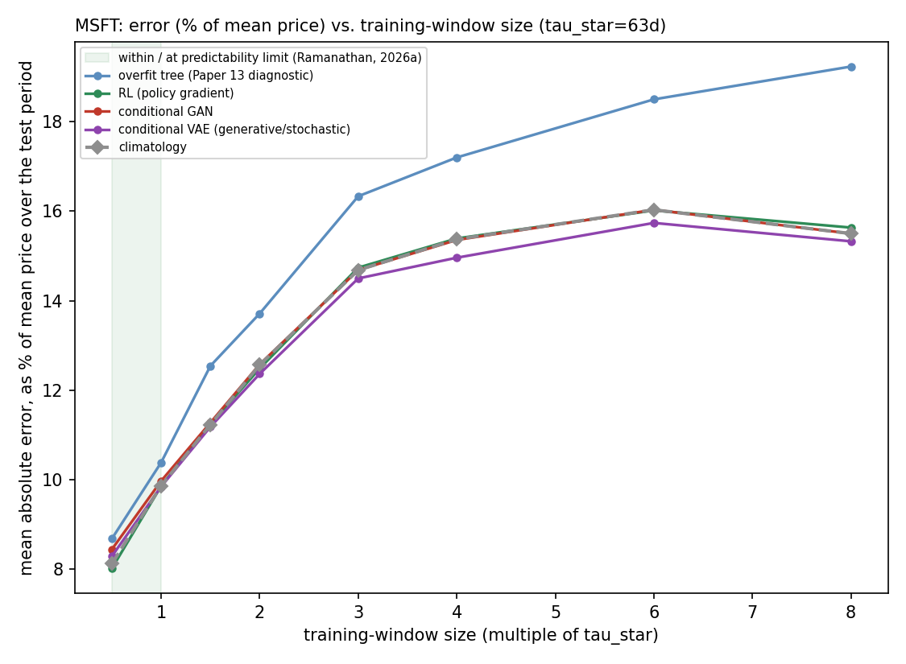
*Figure 9. MSFT. Climatology's error is a modest 8.1% of mean price at 0.5x τ\* (within the limit), rising to 9.9% at 1x, and climbing to 15–16% by 4x–8x — very roughly doubling once training data spans several multiples of the limit. The RL forecaster and GAN track climatology almost exactly at every window size; the VAE sits close behind. The overfit tree sits visibly above all four at every single window size tested, including well within the limit.*

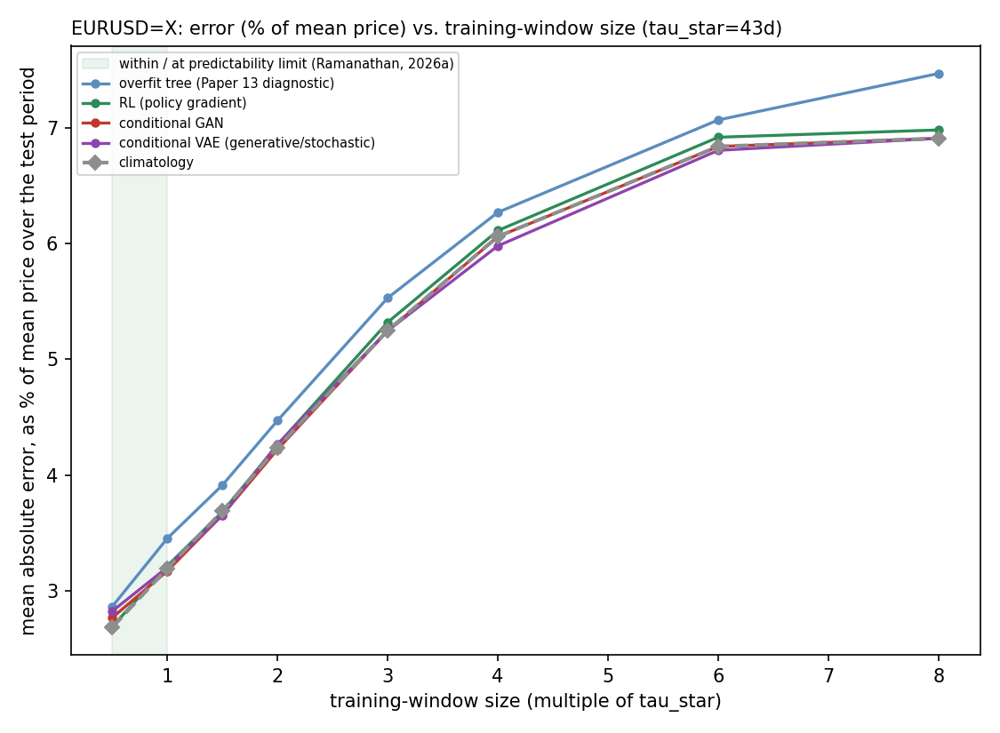
*Figure 10. EURUSD=X. Climatology's error climbs from 2.7% (0.5x) to 6.9% (8x) — proportionally similar growth to MSFT's, though this instrument never reaches the double-digit percentages the others do.*

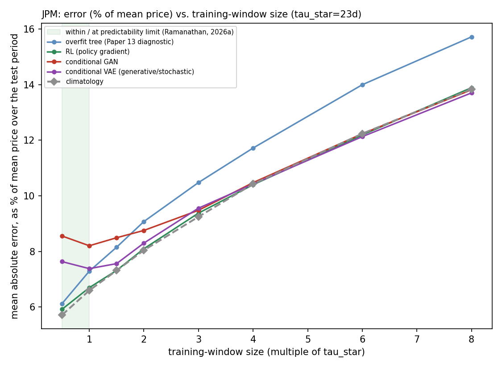
*Figure 11. JPM. Climatology's error more than doubles, from 5.7% (0.5x) to 13.8% (8x), climbing steadily rather than plateauing.*

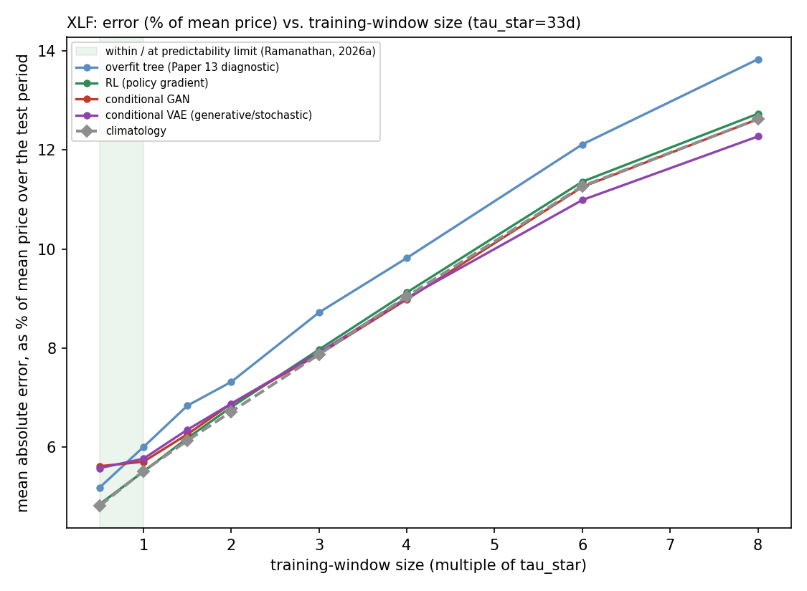
*Figure 12. XLF. Climatology's error more than doubles here too, from 4.8% (0.5x) to 12.6% (8x).*

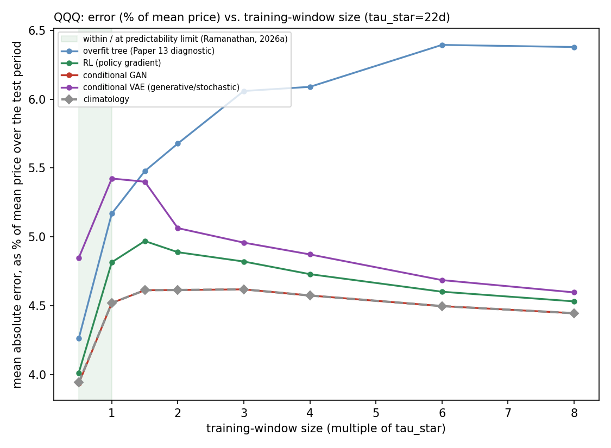
*Figure 13. QQQ — one of the two 21-day-horizon instruments. This is not a muted version of Figures 9–12. Climatology's error is essentially flat across the entire sweep — 3.9% at 0.5x, 4.5–4.6% from 1x all the way out to 8x — never climbing the way every other instrument in this paper does. IWM (not shown; available in the repository) shows the same reversal seen in the earlier visual sweep: error rises to a peak near the limit and then declines.*

Three findings survive across the full twelve-instrument set that were not obvious from the visual panels alone, or from raw price-unit error, alone. First, expressed as a percentage of price, the growth from within-limit training windows to 8x the limit is substantial and, for half the curated instruments here, roughly doubles the error (JPM: 5.7%→13.8%; XLF: 4.8%→12.6%; MSFT: 8.1%→~16%) — a magnitude any reader can judge as a meaningfully worse forecast, not merely a noisier-looking curve. Second, the overfit tree is not merely a *different*-looking curve in Figures 4–8; it is a quantitatively *worse* one, sitting above climatology, the RL forecaster, the GAN, and the VAE at nearly every training-window size tested, in every instrument — including well within the predictability limit, where its jagged, noise-chasing predictions are already less accurate on average, not just noisier-looking. Third, and reported plainly rather than smoothed into the other ten instruments' story: IWM and QQQ do not simply show a muted version of the climb the other ten instruments show. Their error for climatology, the RL forecaster, the GAN, and the VAE either stays essentially flat (QQQ) or rises to a peak near the predictability limit and then declines (IWM), the opposite of every other instrument in this paper. Section 6.2 investigates why directly, rather than leaving it as an unexplained anomaly.

### 6.2 Why IWM and QQQ Differ

IWM and QQQ share one property no other instrument in this panel has: a 21-day forecast horizon, versus 63–252 days for the other ten (Table 1). This alone turns out to explain their divergent behavior, and it does so by revealing that IWM and QQQ are not a violation of this paper's mechanism — they are a confirmation of it, at a point on the same relationship where there is simply much less signal available to lose in the first place.

A useful reference point is the error of the most naive possible forecast — assuming *no change* in price at all over the horizon (predicted price = today's price). Because a longer horizon gives price more time to move under approximately random-walk dynamics, this naive baseline's error scales with horizon length: it is smallest for the two 21-day instruments and largest for the 252-day instruments. What matters is how much *better than this naive floor* a fresh-trained forecast manages to do, and how much of that improvement survives as training data goes stale.

**Table 2.** Naive no-change baseline error, fresh-trained (0.5x τ\*) climatology's improvement over it ("skill"), and total error growth across the full 0.5x-to-8x sweep, all twelve instruments, sorted by forecast horizon.

| Ticker | Horizon (days) | Naive no-change error (% of price) | Climatology, fresh (0.5x), error (%) | Skill over naive | Error growth, 0.5x→8x |
|---|---|---|---|---|---|
| IWM | 21 | 4.5 | 4.3 | 6.3% | 1.08x |
| QQQ | 21 | 4.8 | 3.9 | 17.2% | 1.13x |
| XOM | 63 | 7.8 | 4.9 | 37.2% | 1.54x |
| GLD | 189 | 13.8 | 3.4 | 75.5% | 2.32x |
| XLK | 189 | 17.7 | 4.6 | 73.8% | 2.22x |
| EURUSD=X | 189 | 6.3 | 2.7 | 57.5% | 2.57x |
| MSFT | 189 | 19.1 | 8.1 | 57.4% | 1.91x |
| SPY | 189 | 12.5 | 3.1 | 75.0% | 2.20x |
| XLF | 189 | 14.2 | 4.8 | 66.1% | 2.62x |
| JPM | 252 | 22.3 | 5.7 | 74.4% | 2.42x |
| AAPL | 252 | 21.3 | 5.5 | 74.0% | 2.33x |
| XLE | 252 | 18.7 | 5.7 | 69.2% | 2.35x |

The pattern is a clean dose-response relationship along forecast horizon, not a binary split. At the ten 189–252-day-horizon instruments, fresh-trained climatology beats the naive no-change baseline by 57–76% — substantial, genuine skill — and that is precisely the skill that erodes, roughly doubling the error, once training data goes stale. At the two 21-day instruments, fresh-trained climatology beats the naive baseline by only 6–17% — there is very little genuine skill there to begin with, even under the best possible (freshest) conditions — and correspondingly there is very little for staleness to erode: error grows by only 1.08–1.13x across the entire sweep, essentially flat. XOM, at an intermediate 63-day horizon, sits at an intermediate point on both axes (37% skill, 1.54x growth), exactly where this relationship predicts it should.

The mechanism is straightforward: a shorter forecast horizon leaves proportionally less genuine, autocorrelation-driven signal for *any* architecture to capture, because price movement over a short horizon is dominated by near-term noise relative to whatever slower-moving, regime-conditioned structure a longer horizon allows recent training data to capture. With so little signal available even under ideal conditions, there is correspondingly little for training-data staleness to degrade. IWM and QQQ's flat and reversing curves are not, on this evidence, a separate or unexplained phenomenon sitting outside this paper's thesis — they are what the same signal-decay mechanism looks like when there is almost no signal to decay.

## 7. Discussion

Read together, these two experiments answer the question this paper opened with in a way neither could alone. Experiment 1 shows that within a fair, non-stale training budget, architectural sophistication does not buy separation from the simplest possible model — climatology is not beaten, and two of the four non-trivial architectures effectively become climatology under this constraint. Experiment 2 shows that the reason is not incidental to these particular five models: push the same architectures' training data past the boundary Ramanathan (2026a) already measured by a method with no model in it at all, and all of them — regardless of internal mechanism — begin drifting away from reality, gradually, and the drift's onset lines up with the same τ\*.

Section 3.3 and 4.1 close the most obvious objection to Experiment 1's result before Experiment 2 even begins: "no separation in skill" is not an artifact of testing only linear models. Giving the reinforcement-learning forecaster, the GAN, and the VAE a genuine hidden layer of nonlinearity, at exactly the same tiny training budget, does not change the answer — the two smoothing architectures still converge onto climatology, and the VAE is still unstable rather than skillful. What buys nothing here is not "linear models" specifically; it is any architecture, linear or shallowly nonlinear, once trained on a window this small — which is itself a direct consequence of respecting the predictability limit, not an incidental design choice.

A second, related objection is worth answering just as explicitly, because Experiment 2 already contains its answer even though the connection is easy to miss: is Experiment 1's "no separation in skill" simply a consequence of the training window being small — eleven to thirty-one rows being too few for any architecture to show real skill, independent of any genuine predictability limit — rather than evidence about the limit itself? If that were the explanation, giving the same architectures progressively more data should eventually let real skill emerge, the way an ordinary statistical estimator improves with sample size. Experiment 2 tests exactly this, starting from Experiment 1's own w = ⌊τ\*/2⌋ window and extending out to eight times τ\*, and the answer is the opposite of what a small-sample explanation predicts: error does not fall as more data arrives, it climbs, roughly doubling in most instruments (Section 6.1). More data does not rescue these architectures; it makes them worse. That is not the signature of a sample-size problem more data would fix — it is the signature of a boundary that more data crosses.

This is the same repeated validation this paper's introduction described for the atmospheric predictability limit itself: a structural ceiling, estimated once from real models, given a theoretical account soon after, and then confirmed again as far more capable models arrived over the following decades and landed on the same wall anyway, regardless of their own design or sophistication. This paper's contribution is to have run that same kind of test for the financial predictability limit specifically, using architectures chosen to be as different from one another as reasonably possible — a lookup-table average, a memorizing tree, a reward-driven policy, an adversarial pair, and a latent-variable generative model — precisely so that a shared failure point could not be dismissed as an artifact of any one of them.

**A genuine, non-obvious asymmetry is worth stating plainly rather than smoothing over.** The climatology-collapse pattern in Experiment 2 is specific to architectures that have some form of averaging or smoothing built into how they learn — climatology by definition, and the RL forecaster, GAN, and VAE by virtue of being continuous, smooth function approximators trained to minimize an expected error. The overfit tree, which has no such inductive bias and instead memorizes whatever is directly in front of it, does not show this pattern at any window size tested, in any instrument. This means the mechanism this paper demonstrates — sophistication quietly reducing to climatology once training data spans multiple regimes — is a property of a specific and common class of models, not of "AI/ML" as an undifferentiated category. A practitioner using a memorizing, non-smoothing model would not be protected by this paper's own diagnosis; they would simply be overfitting badly at every window size, which is Ramanathan's (2026c) finding, not this one.

## 8. Limitations

- **Scale of the RL/GAN/VAE implementations.** All are numpy-native implementations, appropriately sized to training windows of 11 to 504 rows, not production-scale deep networks. Section 3.3/4.1 directly tests whether this matters, by adding a genuine hidden layer of nonlinearity to each of the three non-trivial architectures at the exact same data budget, and finds no change in the result — so this paper's finding is not merely a fact about linear models. What remains genuinely untested is scale in the sense of data: a large-scale, heavily-parameterized version of the same architectures trained on genuinely independent data pooled from many separate instruments or markets is outside this paper's scope, and would itself require training on data reaching past the predictability limit for any single one of them — the very thing Experiment 2 shows degrades performance.
- **A gradual build, not a sharp cliff.** Every instrument in Experiment 2 shows a progressive, not discontinuous, degradation. This is the expected and, on reflection, the only sensible shape for a genuine predictability limit to take — but it also means "beyond the limit" is a matter of degree in this paper's own results, not a bright line a reader can point to on any single panel.
- **IWM and QQQ's flat/reversing curves are explained, not merely reported.** Their 21-day horizon, already flagged in Ramanathan (2026c) as making comparisons noisier, is shown in Section 6.2 to leave them with only 6–17% fresh-trained skill over a naive no-change baseline, versus 57–76% for the ten longer-horizon instruments — a clean dose-response relationship along horizon length (XOM, at an intermediate 63-day horizon, sits at an intermediate point). There is simply very little genuine signal for these two instruments' short horizon to lose as training data goes stale. This is a genuine, if narrower, finding rather than a gap: it does not extend this paper's central claim to short-horizon targets, but it does show why the same mechanism produces a different-looking curve there instead of contradicting it.
- **Instrument coverage differs by experiment.** Experiment 1 is deliberately restricted to the three instruments with the largest measured predictability limits, for data-sufficiency reasons stated in Section 3.1; Experiment 2 covers all 12.
- **No metrics, by design, not by omission.** As in Ramanathan (2026c), this paper reports no significance test or skill score in either experiment; the standing position of this research program is that a question this practical is more honestly settled by direct visual demonstration.

## 9. Conclusion

The claim this paper set out to test — that a sufficiently sophisticated, sufficiently data-fed AI/ML architecture might simply predict past a measured predictability limit — does not hold up under any of the tests this paper ran. Given a fair, non-stale training budget sized to respect the limit, no architecture among five genuinely different families beats the simplest possible model, and two of them quietly become it. Giving three of those architectures a genuine hidden layer of nonlinearity, at exactly the same training budget, does not change that answer either — depth is not the missing ingredient. Given training data that grows to span multiples of that same limit, all five degrade, gradually but unmistakably, starting in roughly the same place — regardless of whether the underlying mechanism is a lookup-table average, an adversarial pair, or a latent-variable generative model. The atmospheric predictability limit was never settled by theory alone: an early empirical estimate from real models, a theoretical account of why it should exist, and then decades of dramatically more capable operational forecasting systems running into the identical wall anyway are what turned it from a number into an operational fact of meteorological practice. This paper does the equivalent for the financial predictability limit this research program has already measured: not an argument that sophistication cannot buy its way past a structural ceiling, but a demonstration, architecture by architecture, that it does not.

---

## References

Breiman, L., Friedman, J. H., Olshen, R. A., & Stone, C. J. (1984). *Classification and Regression Trees*. Wadsworth.

Charney, J. G., Fleagle, R. G., Lally, V. E., Riehl, H., & Wark, D. Q. (1966). The feasibility of a global observation and analysis experiment. *Bulletin of the American Meteorological Society*, 47(3), 200–220.

Goodfellow, I., Pouget-Abadie, J., Mirza, M., Xu, B., Warde-Farley, D., Ozair, S., Courville, A., & Bengio, Y. (2014). Generative Adversarial Networks. *Advances in Neural Information Processing Systems (NeurIPS)*.

Kingma, D. P., & Welling, M. (2014). Auto-Encoding Variational Bayes. *International Conference on Learning Representations (ICLR)*.

Lorenz, E. N. (1963). Deterministic Nonperiodic Flow. *Journal of the Atmospheric Sciences*, 20(2), 130–141.

Lorenz, E. N. (1969). The predictability of a flow which possesses many scales of motion. *Tellus*, 21(3), 289–307.

Lorenz, E. N. (1982). Atmospheric predictability experiments with a large numerical model. *Tellus*, 34(6), 505–513.

Ramanathan, A. (2026a). Empirical Predictability Limits of Financial Markets via Correlated–Decorrelated Structure Function Decomposition: A Departure from Atmospheric Turbulence Theory. *Zenodo* (Paper 11, this series). https://doi.org/10.5281/zenodo.21373459

Ramanathan, A. (2026b). A Master-Model Framework for Regime-Conditioned Price Forecasting: Real Statistical Skill, and Why It Mostly Isn't Alpha. *Zenodo* (Paper 12, this series). https://doi.org/10.5281/zenodo.21454884

Ramanathan, A. (2026c). Predictability Limits as Regime Detectors: A Practical Rule for How Much History an AI/ML Model Should Train On. *Zenodo* (Paper 13, this series). https://doi.org/10.5281/zenodo.21482869

Williams, R. J. (1992). Simple statistical gradient-following algorithms for connectionist reinforcement learning. *Machine Learning*, 8, 229–256.

---

## Code and Data Availability

Experiment 1's figures are generated entirely by `notebooks/predictor_v1/65_architecture_bakeoff.py`; Section 3.3/4.1's depth-robustness check by `notebooks/predictor_v1/70_deep_architecture_bakeoff.py` (the same three instruments and training budget as Experiment 1, adding a one-hidden-layer nonlinear version of the RL forecaster, GAN, and VAE); Experiment 2's complete, twelve-instrument, eight-panel-per-instrument sweep by `notebooks/predictor_v1/66_window_sweep_bakeoff.py`, with this paper's compact five-instrument, three-panel highlight figures generated separately by `notebooks/predictor_v1/67_window_sweep_highlights.py` (identical models and windowing logic, a different figure layout chosen to fit a printed page); Section 6.1's mean-absolute-error decay curves, for all twelve instruments, by `notebooks/predictor_v1/68_window_sweep_error_curve.py` (again identical models and windowing logic, computed over each instrument's full walk-forward history rather than a recent slice); Section 6.2's Table 2 (naive-baseline skill and error growth by forecast horizon) by `notebooks/predictor_v1/69_horizon_skill_analysis.py`, which needs only climatology (no RL/GAN/VAE fitting) and so runs in well under a minute for all twelve instruments; this paper's equations by `notebooks/predictor_v1/render_paper14_equations.py`. All seven are self-contained and available at `notebooks/predictor_v1/` in the `quantarram/quant-regime-research` repository. Both experiments build directly on the predictability-limit results in Ramanathan (2026a) (`predictability_paper/results_correlated_decorrelated.json`) and reuse the half-window design and overfit-tree diagnostic from Ramanathan (2026c); none of these scripts requires a deep learning framework — all three non-trivial architectures (the RL forecaster, the conditional GAN, and the conditional VAE), including their deeper, one-hidden-layer counterparts in `70_deep_architecture_bakeoff.py`, are implemented from scratch in numpy, with manual gradients (backpropagated by hand through the added hidden layer where applicable), at a scale appropriate to the training-window sizes the predictability limit itself dictates.
