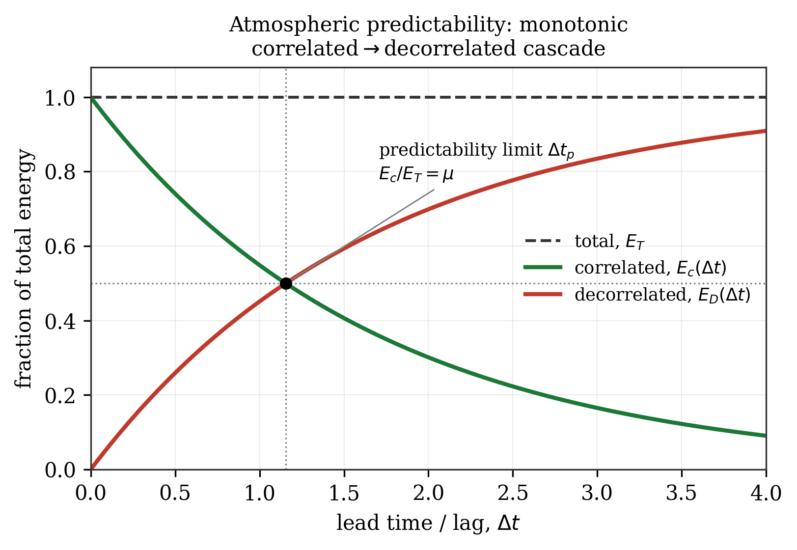
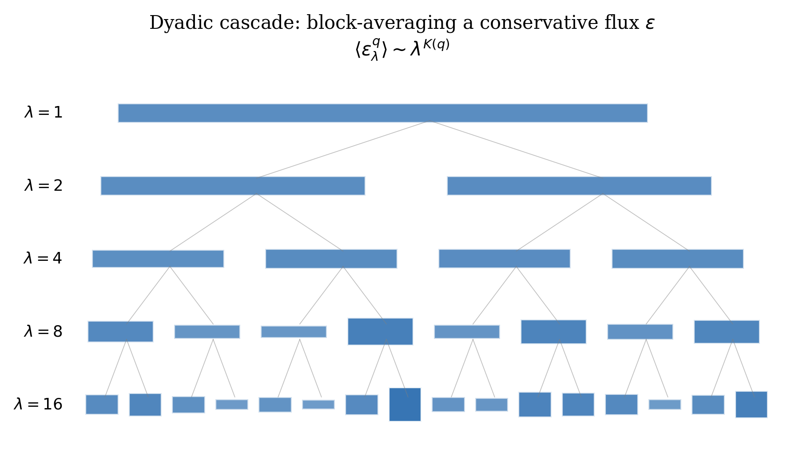
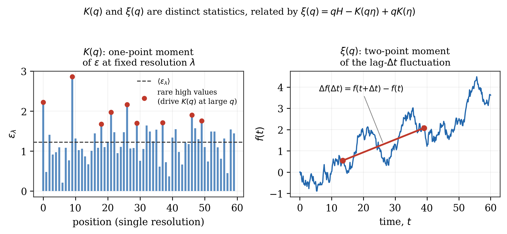
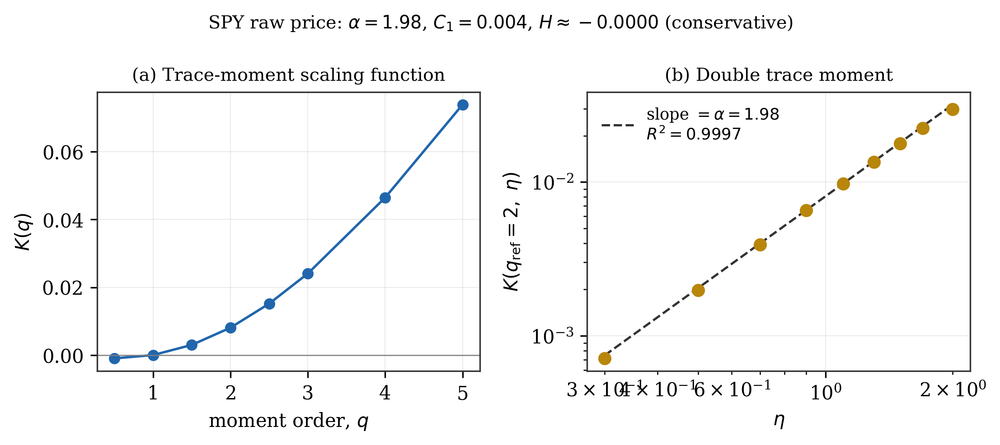
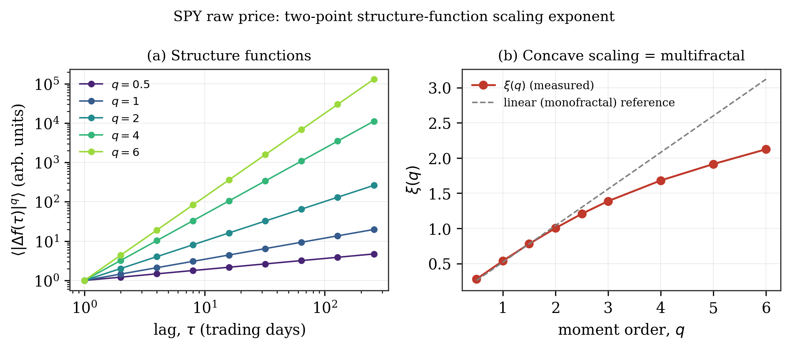
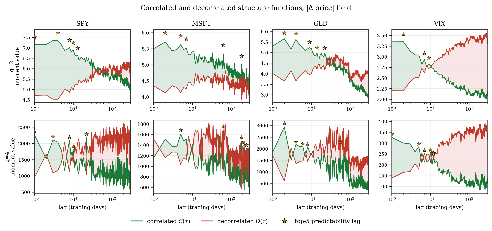
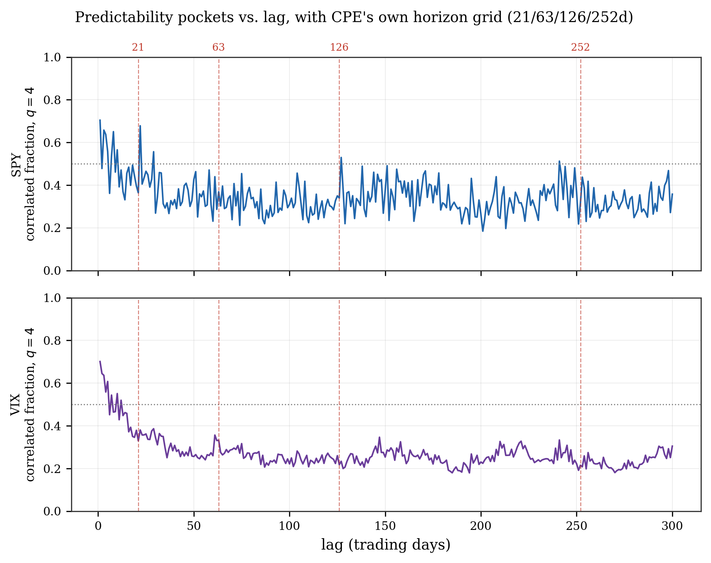
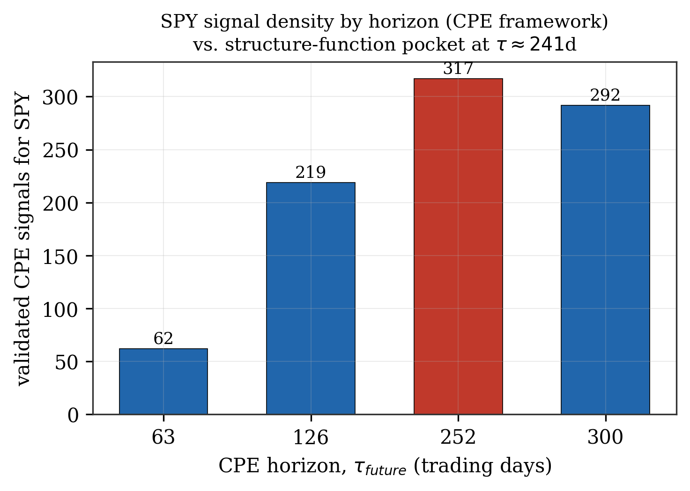
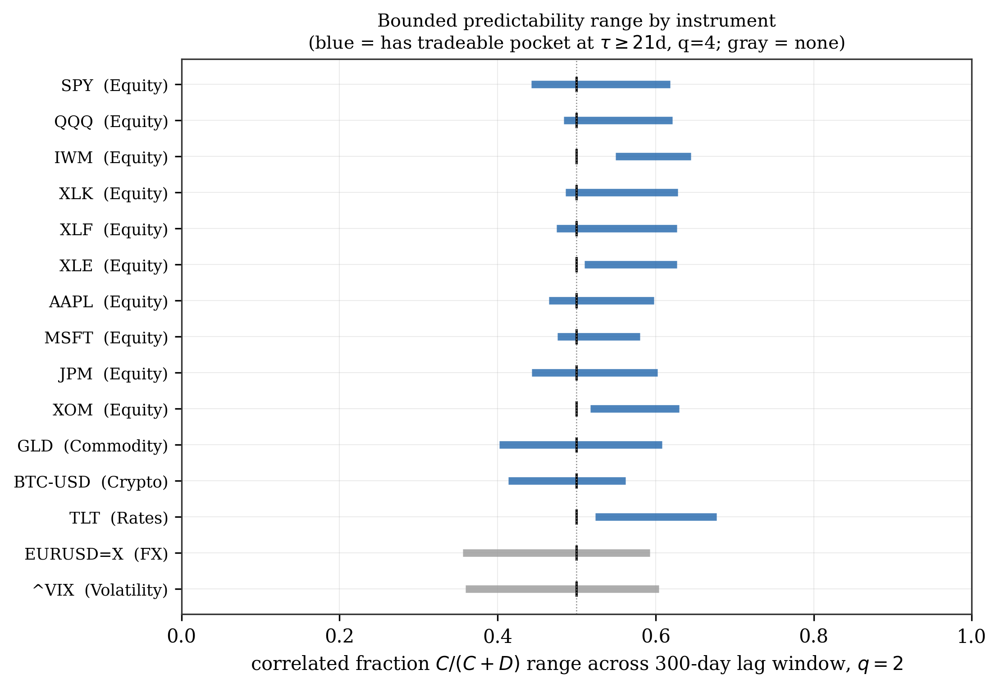

# Empirical Predictability Limits of Financial Markets via Correlated–Decorrelated Structure Function Decomposition: A Departure from Atmospheric Turbulence Theory

**Draft preprint — CPE research series**

Arun Ramanathan

---

## Abstract

Theoretical predictability limits of the atmosphere have been derived, in prior work by the author and others, from a multifractal cascade formalism in which the correlated and decorrelated components of a turbulent field's polyspectrum are tracked as a function of lead time, with the predictability limit defined as the time at which correlated energy falls to a fixed fraction of total energy (Ramanathan et al., 2019; Ramanathan & Satyanarayana, 2019, 2021). This paper investigates whether the same formalism transfers to financial markets. We show that it does not transfer directly: financial return/price-increment fields are empirically conservative (Hurst-type non-conservation exponent H ≈ 0), which collapses the moment-scaling relationship (ξ(q) = qH − K(qη) + qK(η)) that the atmospheric derivation depends on, and removes the spatial dimension (and with it, the entire generalized-scale-invariance anisotropy apparatus — sphero-scale, aspect ratio, vertical stratification exponent) that the atmospheric formula's lead-time dependence is built on. We therefore abandon the parametric route and construct the correlated and decorrelated structure functions directly and empirically, defining the predictability limit operationally as the lag at which they are equal, and — going further — treating the full gap between them as a function of lag as the object of interest rather than a single crossing time. Applied to a raw (untransformed) multi-asset universe spanning equities, commodities, crypto, rates, FX, and volatility, this reveals that financial predictability is qualitatively unlike atmospheric predictability: rather than decaying monotonically toward total decorrelation, the correlated fraction of the moment budget remains bounded within an instrument-specific range across the entire 300-trading-day lag window tested, and predictability is concentrated in discrete, recurring "pockets" at specific lags rather than smoothly decaying from an initial value. A pocket at approximately 21–24 trading days recurs across most equities tested; a second pocket near 252 trading days (one calendar year) is prominent for SPY specifically, and coincides with the strongest validated-signal concentration independently found for SPY by the authors' unrelated Conditional Probability of Exceedance (CPE) framework — a nonparametric methodology sharing no assumptions with the structure-function approach used here. We argue this cross-method convergence, together with the observed asset-class heterogeneity (strong in equities, weak in commodities, absent in FX and, once trivial short-lag continuity is filtered out, in volatility), supports treating these pockets as genuine, economically meaningful features of market structure rather than artifacts of either method.

## Plain Language Summary

Weather forecasters have a rigorous way of asking "how far into the future can this storm, in principle, ever be predicted?" — not limited by today's computers or models, but by the physics of turbulence itself. This paper asks the same question of financial markets, starting from the exact mathematical machinery the author previously used to answer it for the atmosphere. That machinery turns out not to transfer directly: it assumes a kind of field (like wind, which "forgets itself" as you look further ahead) that financial prices do not resemble once you actually measure their statistical properties — prices behave more like an already-settled, self-contained quantity than like a field that dissipates over time. Rather than forcing the atmospheric formula to fit, we built a direct, data-driven version of the same underlying idea — comparing how much of a market's statistical structure remains "linked to its own past" versus "genuinely new," at every possible time horizon out to about 14 months. The result looks nothing like weather predictability: instead of fading out smoothly, financial predictability shows up in sharp, recurring pockets at specific horizons — around one month, and, for the S&P 500 specifically, around one year — and never fully disappears or fully takes over, unlike the atmosphere's one-way slide into unpredictability. The one-year pocket in the S&P 500 also shows up, independently, in the author's separate, differently-built market-signal framework (CPE), which is a meaningful cross-check that this is a real feature of markets rather than a coincidence of one particular method.

---

## 1. Introduction

Quantifying the theoretical predictability limits of complex geophysical systems has a long history beginning with Lorenz's (1969) scaling argument, which related the predictability of a turbulent flow to the shape of its energy spectrum. Subsequent work generalized this to intermittent, anisotropic multifractal fields (Marsan et al., 1996; Schertzer et al., 1997), and the author's own prior work extended it further: to spatially anisotropic fields via a correlation-spectrum approach (Ramanathan et al., 2019), and to the full range of statistical moments — capturing the predictability of rare, extreme events specifically, rather than only second-order (average) behavior — via a polyspectral formalism (Ramanathan & Satyanarayana, 2019), with empirical validation against CloudSat-derived spheroscale estimates over convective weather (Ramanathan & Satyanarayana, 2021). Underlying all of this work is the Universal Multifractals (UM) framework (Schertzer & Lovejoy, 1987), in which a small number of scale-invariant parameters describe a cascade process across an entire range of scales, with predictability limits and extreme-event statistics both falling out of the same moment-scaling function.

Financial markets are, like the atmosphere, complex systems characterized by intermittency, fat tails, and — as documented extensively in the econophysics literature (e.g., Mandelbrot, 1963; Ghashghaie et al., 1996; Bacry, Muzy & Delour, 2001) — multifractal scaling. It is therefore natural to ask whether the same theoretical machinery used to derive storm-scale atmospheric predictability limits can be transposed to financial return series to derive a genuine, theoretically grounded predictability limit for a financial instrument, as opposed to a purely empirical backtest of the kind more commonly seen in quantitative finance.

This paper documents that attempt, including where it succeeded, where it failed, and why the failure itself was informative. Section 2 reviews the atmospheric formalism and its universal-multifractal underpinnings in enough detail to make the later comparison precise. Section 3 shows why the direct transposition to financial fields breaks down, with the empirical multifractal parameter estimates that establish the failure. Section 4 develops the empirical alternative used for the remainder of the paper. Section 5 presents results across a fifteen-instrument, six-asset-class sample, including a methodological correction found and fixed during the analysis. Section 6 discusses the findings, including an independent cross-validation against the author's pre-existing CPE framework, candidate economic mechanisms, and limitations.

---

## 2. Theoretical Background

### 2.1 Predictability via correlated/decorrelated energy decomposition

Following Lorenz (1969), the predictability limit of a field is the time until which prediction errors have not exceeded a pre-chosen magnitude — large enough to matter, but small enough to be distinguishable from the difference between two randomly chosen states of the system. In the multifractal/scaling generalization used in the author's prior work (Ramanathan & Satyanarayana, 2019), a turbulent field f obeys the space-time scaling law

Δf(ΔR) = φ · [[ΔR]]^H,  φ = ε^η / ⟨ε^η⟩,  (Eq. 1)

where ΔR is a space-time separation vector, H is the conservation/fluctuation exponent (H > 0: fractional integration, i.e., mean fluctuations grow with scale; H < 0: fractional differentiation), ε is a conservative multifractal flux, and η relates the observed field to that flux (η = 1/3 for horizontal wind shear, under Kolmogorov-Obukhov dimensional reasoning). The q-th order structure function ⟨(Δf(ΔR))^q⟩ can be decomposed, via the binomial theorem, into a decorrelated component (the structure function itself) and a correlated component (the cross moments between f at two separated points):

⟨(Δf(ΔR))^q⟩ = decorrelated + correlated,
correlated = Σ_{n=1}^{q−1} (−1)^{n+1} C(q,n) ⟨f(R+ΔR)^{q−n} f(R)^n⟩.  (Eq. 2)

At ΔR = 0 the field is fully correlated (correlated = total, decorrelated = 0); as the lag grows, the decorrelated component grows and the correlated component shrinks, terminating — in the atmospheric picture — at total decorrelation. **Figure 1** illustrates this schematically for the classical monotonic case: correlated energy E_c decays smoothly from 1 toward 0 as decorrelated energy E_D rises from 0 toward 1, crossing at the point that defines the predictability limit.

*Figure 1. Schematic of the atmospheric correlated/decorrelated energy decomposition. Correlated energy (green) decays monotonically from full correlation at zero lag toward zero as decorrelated energy (red) rises to consume the total (dashed). The predictability limit Δt_p is defined as the lag at which the correlated fraction crosses a critical ratio μ (here μ = 0.5). This one-way, monotonic cascade is the picture the atmospheric formalism assumes throughout — Section 5.2 shows financial markets do not follow it.*

The theoretical predictability limit Δt_p(q) is defined as the lag at which the correlated polyspectrum has fallen to a fixed critical ratio μ of the total:

E_c(k, Δt_p(q)) / E_T(k) = μ.  (Eq. 3)

Solving this — via a semi-Fourier-space construction that converts the spatial wavenumber dependence into an equivalent lead-time dependence through the Kolmogorov-Obukhov eddy-turnover-time relation, Δt ∝ |Δr|^{1/H_t} — yields a closed-form expression

Δt_p(q) = (l_st / l_s^{H_t}) · [ (μ^(−2/β_q) − 1) / ((2π)^{−2} ‖k‖_FS²) ]^{H_t/2},
β_q = 1 + qH − K(qη) + qK(η),  (Eq. 4)

where K(q) is the universal-multifractal moment-scaling function (Section 2.2), H_t is the space-time anisotropy exponent, and l_s, l_st are the sphero-scale and sphero-time — the spatial scale and corresponding eddy-turnover time at which turbulent structures are approximately roundish (Ramanathan & Satyanarayana, 2019, Eq. 9). The critical ratio μ is taken as 0.5 in the moment-order-generalized formulation of Ramanathan & Satyanarayana (2019), following the convention used elsewhere in Schertzer and Lovejoy's predictability work; an earlier, second-order-only formulation by Ramanathan et al. (2019) used μ = 0.75. The two values are not interchangeable and reflect two independently chosen thresholds in the prior literature; we adopt μ = 0.5 throughout this paper as the more general, better-precedented choice, and note the discrepancy here rather than resolve it silently.

### 2.2 Universal multifractals

The moment-scaling function K(q) describes how the q-th statistical moment of a conservative multifractal flux ε, aggregated to resolution λ (the ratio of the largest to the intermediate scale), scales:

⟨ε_λ^q⟩ = λ^{K(q)}.  (Eq. 5)

Under the Universal Multifractals framework, K(q) takes the closed form

K(q) = C1/(α−1) · (q^α − q),  0 ≤ α < 1 or 1 < α ≤ 2,  (Eq. 6)

parameterized by just two numbers: α, the Lévy index of multifractality (α = 0: monofractal, a single scaling exponent describes the whole field; α = 2: maximally multifractal, generated by a fat-tailed/stable process), and C1, the codimension of the mean (how sparse the field's dominant contribution is — C1 = 0 for a spatially homogeneous field). These are estimated empirically via Trace Moment (TM) and Double Trace Moment (DTM) analysis (Lavallee et al., 1993), following the same procedure the author used for rainfall rate in Ramanathan et al. (2022):

1. **Trace Moment (TM) analysis.** Build a dyadic cascade of the field by successive pairwise block-averaging (**Figure 2**), giving values at each resolution λ = 2ⁿ. Regress the normalized moment ⟨ε_λ^q⟩/⟨ε_λ⟩^q against λ in log-log coordinates to obtain K(q) directly, as the fitted slope.
2. **Conservation check.** Separately, regress the *unnormalized* first moment ⟨ε_λ¹⟩ against λ; a slope indistinguishable from zero indicates the field is (to first approximation) conservative, H ≈ 0.
3. **Double Trace Moment (DTM) analysis.** Raise the finest-resolution field to a range of powers η, rebuild the cascade for each, and repeat step 1 at a fixed reference order q_ref to obtain K(q_ref, η). Because K(q, η) = η^α K(q, 1) for a universal-multifractal generator, α follows as the slope of log K(q_ref, η) against log η, and C1 follows from α and the directly measured K(q_ref) via Eq. 6.

*Figure 2. Schematic of the dyadic multifractal cascade underlying trace-moment analysis. The raw field at the finest resolution (λ=16, bottom) is repeatedly block-averaged in pairs to produce coarser-resolution versions (λ=8, 4, 2, 1); bar height and shading intensity indicate the local value of the field at each node. Trace moments computed across this pyramid of resolutions give K(q); this is a one-point statistic in the sense of Section 2.3 — no separation or lag is involved, only resolution.*

### 2.3 Two distinct statistical objects: K(q) and ξ(q)

A point of confusion worth stating explicitly, because it drove a methodological correction in this work: K(q) and the structure-function exponent ξ(q) — defined by ⟨(Δf(Δt))^q⟩ ~ Δt^{ξ(q)} — are not the same statistic, even though a single closed-form relation connects them for a given field (**Figure 3**). K(q) is a **one-point, single-resolution** moment: the q-th moment of the field's own value at cascade resolution λ, with no reference to separation or lag — this is exactly what trace-moment analysis (Section 2.2) measures. ξ(q) is a **two-point, lag-based** moment: the q-th moment of the *difference* between the field at two points separated by a lag.

For a conservative field (H = 0), Eq. 1 degenerates to Δf = φ — the fluctuation equals the (normalized) flux itself, with no lag-dependent growth — and the general relation ξ(q) = qH − K(qη) + qK(η) reduces, under the natural choice η = 1 for a field that already equals its own conservative flux, to

ξ(q) = −K(q)  (H = 0, η = 1),  (Eq. 7)

since K(1) = 0 identically for any universal-multifractal field (Eq. 6 evaluated at q = 1 gives zero regardless of α, C1). This algebraic reduction is exact, but — as Section 3.3 shows — it does not correspond to a physically sensible structure function for financial fields.

*Figure 3. K(q) versus ξ(q). Left: a one-point moment — the raw flux value ε_λ at many positions, all at the same resolution λ; K(q) describes how the q-th moment of this distribution scales with λ, and is driven at large q by the rare, large excursions (red). Right: a two-point moment — the field f(t) traced over time, with the structure function built from the difference f(t+Δt) − f(t) between two specific, separated points; ξ(q) describes how the q-th moment of this difference scales with the separation Δt.*

---

## 3. Why the Direct Transposition to Financial Fields Fails

### 3.1 No spatial dimension

The atmospheric derivation (Eq. 4) depends critically on a spatial wavenumber k, held fixed while lead time Δt varies; the lead-time dependence is introduced by converting the field's *own* spatial-scale-to-turnover-time relation (the Kolmogorov-Obukhov law) into an equivalent frequency, via a semi-Fourier-space construction. A purely temporal financial field has no independent spatial axis to hold fixed while this conversion is performed — the two roles that k and Δt play in the atmospheric derivation collapse onto the same single axis. The entire generalized-scale-invariance apparatus that carries the anisotropy information (H_t, the sphero-scale l_s, the horizontal aspect ratio a, the vertical stratification exponent H_z) is consequently without an object to describe, and drops out of the financial problem entirely.

### 3.2 Financial fields are empirically conservative

We estimated the universal-multifractal parameters of SPY's raw daily closing price (the untransformed field — no log, no return, no other normalization — following standard practice in the multifractal literature of using a raw physical field rather than a derived quantity, and matching the convention the author used for rainfall rate in Ramanathan et al., 2022) via TM/DTM analysis, using a dyadic cascade built by successive pairwise block-averaging over the most recent 8,192 trading days (**Figure 2**, Section 2.2). **Figure 4** shows the result.

*Figure 4. TM/DTM analysis of SPY's raw daily closing price. (a) The trace-moment scaling function K(q), convex and passing through zero at q=1 as required. (b) The double-trace-moment regression at q_ref=2: log K(2,η) against log η is closely linear (R²=0.9997), with slope giving α=1.98.*

The DTM estimate is stable and precisely determined: α = 1.98, C1 = 0.004, with the DTM regression achieving R² = 0.9997. The K(q) fit itself (Figure 4a) is markedly weaker in R² (0.44–0.46 across q) than the DTM ratio fit — consistent with raw price's multi-decade upward trend contaminating block-averaged moments at coarse resolution (each coarse "box" mostly reflects which era of the trend it falls in, rather than genuine multifractal intermittency); the DTM estimate of α is comparatively robust to this because it is a *ratio* of two similarly trend-affected quantities. Critically, the conservation exponent H — estimated via the scaling of the *unnormalized* first moment ⟨R_λ¹⟩ ~ λ^{−H} — is indistinguishable from zero (H ≈ 0.0000; the associated regression has essentially no slope to recover, so R² is not a meaningful diagnostic here, and the flat slope itself is the evidence). This mirrors a result the author obtained previously for rainfall rate (Ramanathan et al., 2022), where the same diagnostic likewise supported treating the field as conservative.

The two-point structure-function exponent ξ(q) can, separately, be measured directly and empirically from the same raw price series via ⟨|Δp(τ)|^q⟩ ~ τ^{ξ(q)} (**Figure 5**), and this measurement is unaffected by the trend-contamination issue that weakens the K(q) fit, since differencing removes the trend.

*Figure 5. Structure-function scaling for SPY raw price. (a) ⟨|Δp(τ)|^q⟩ against lag τ for five representative q, all clean power laws (R² > 0.98 throughout, not shown per-panel for clarity). (b) The fitted exponent ξ(q) against q: concave relative to the dashed linear (monofractal) reference, the standard signature of genuine multifractal scaling.*

ξ(q) is well-defined, clean (R² > 0.98 for every q tested, 0.5 through 6), and concave in q/ξ(q)/q — the expected multifractal signature. What fails is not the measurement of ξ(q) itself, but its use as an input to the atmospheric Δt_p(q) formula via the conservative-field shortcut of Eq. 7, and more generally the applicability of that formula's *physical* assumptions to a field that is empirically conservative, as the next section shows.

### 3.3 A conservative field breaks the atmospheric predictability derivation

The reduction ξ(q) = −K(q) established in Section 2.3 is negative for every q > 1, since K(q) > 0 throughout that range under the canonical UM form (Eq. 6) — visible directly in Figure 4a. Substituted into a structure-function model of the form ⟨(Δf(Δt))^q⟩ ∝ (Δt/T)^{ξ(q)} — the natural direct analogue of the atmospheric decorrelation-growth assumption, with T an outer/reference timescale — a negative exponent produces a function that diverges as Δt → 0 and *decreases* as lag grows: the opposite of what a structure function must do to represent decorrelation. This is not a sign error to be patched; it reflects a real physical fact about conservative fields established already in Section 3.2 — for H = 0, Eq. 1 gives Δf = φ, meaning the "fluctuation" does not grow with separation at all, it is simply the bare (already-stationary) flux value. A field with no growing fluctuation has no meaningful decorrelation-over-time to define a predictability limit against, in the sense the atmospheric formalism uses. Consequently, neither the algebraic route (deriving ξ(q) from K(q) via the conservative-field identity, Eq. 7) nor a direct empirical measurement of ξ(q) used naively as a growing-structure-function input (Section 3.2, Figure 5) is well posed as an input to Eq. 4, and the analytic predictability-limit formula cannot be applied as-is.

---

## 4. An Empirical Alternative

Given Section 3's conclusion, we abandon the parametric (K(q)-derived) route for the predictability limit and construct the correlated and decorrelated moments directly and empirically from data, retaining only the *definition* of predictability loss from the atmospheric formalism (correlated ≈ decorrelated) rather than its closed-form derivation.

### 4.1 Field

Following standard multifractal cascade practice — the raw field itself, untransformed, mirroring how the atmospheric literature uses wind velocity or rainfall rate directly rather than a log or normalized variant — we use the absolute daily price increment |Δp_t| = |p_t − p_{t−1}| for each instrument, positive by construction (satisfying the nonnegativity that a conservative-flux-style cascade treatment requires without any further transform).

### 4.2 Correlated and decorrelated structure functions

For a given lag τ and even integer moment order q, we compute directly, from the raw field f = |Δp|:

D(τ, q) = ⟨(f(t+τ) − f(t))^q⟩  (decorrelated / structure function),  (Eq. 8)

C(τ, q) = Σ_{n=1}^{q−1} (−1)^{n+1} C(q,n) ⟨f(t+τ)^{q−n} f(t)^n⟩  (correlated / cross-moment),  (Eq. 9)

matching Eq. 2, with both quantities computed as sample averages over all available overlapping pairs at each lag — consistent with standard practice in multifractal/turbulence structure-function estimation, where the full continuous record is used at every lag without subsampling to notionally "independent" episodes.

### 4.3 Operational predictability definition

We define the predictability limit at moment order q as the lag τ at which C(τ,q) = D(τ,q) (equivalently, the correlated fraction C/(C+D) = μ = 0.5, matching the atmospheric convention), when such a crossing exists. Because — as Section 5.2 documents — the financial correlated/decorrelated relationship does not decay monotonically, we generalize beyond a single crossing time and treat the *entire* gap G(τ,q) = C(τ,q) − D(τ,q) as the object of interest, ranking lags by local maxima of G(τ,q) rather than reporting a single Δt_p.

### 4.4 Data

We use the same 161-instrument multi-asset daily price universe (1960–2026, yfinance-sourced) underlying the author's CPE framework, spanning equities (broad-market and sector ETFs, single large-cap names), commodities, cryptocurrencies, rates, FX, and volatility. Results below focus on a 15-instrument sample spanning all six asset classes: SPY, QQQ, IWM, XLK, XLF, XLE, AAPL, MSFT, JPM, XOM, GLD, BTC-USD, TLT, EURUSD=X, and ^VIX (the CBOE volatility index level; leveraged/inverse volatility ETPs such as UVXY and VIXY were deliberately excluded, as their structural roll-decay contaminates any genuine informational signal). All computations use τ from 1 to 300 trading days at 1-day resolution.

---

## 5. Results

### 5.1 A methodological note: boundary lags

An initial implementation of the local-peak search for G(τ,q) excluded the boundary lags τ=1 and τ=2 from candidacy by construction (the search required a strict interior local maximum, i.e., both left and right neighbors present and lower). Because the correlated fraction is often at or near its global maximum at the shortest lags (Section 5.2), this silently dropped the true top-ranked lag for several instruments — for example, GLD's true top q=2 predictability lag is τ=2 (gap = 2.009), not the τ=4 (gap = 1.964) an earlier, boundary-excluding pass reported; ^VIX's true top q=4 lag is τ=1 (gap ≈ 187), roughly double its second-ranked τ=5 (gap ≈ 100), also silently dropped by the same bug. All results below, including all figures, use the corrected, boundary-inclusive peak search (Eq. 8–9 evaluated with the endpoints τ=1 and τ=300 eligible as local maxima).

### 5.2 Financial predictability is bounded, not monotonically decaying

Across every instrument tested, the correlated fraction C/(C+D) remains within a bounded, instrument-specific range across the full 300-trading-day lag window — never approaching either extreme (full correlation, fraction → 1, or full decorrelation, fraction → 0) that the atmospheric energy-cascade picture (Figure 1) assumes as its terminal state. **Figure 6** shows this directly for four representative instruments (SPY, MSFT, GLD, VIX) at q=2 and q=4: in every panel, the green (correlated) and red (decorrelated) curves visibly bound each other and neither ever collapses to the axis.

*Figure 6. Correlated (green) and decorrelated (red) structure functions against lag, on log-lag axes, for SPY, MSFT, GLD, and VIX at q=2 (top row) and q=4 (bottom row). The shaded region indicates which component is larger at each lag (green shading: correlated dominates, i.e., predictable; pink shading: decorrelated dominates). Gold stars mark the top-5 predictability lags by gap magnitude (boundary-corrected, Section 5.1). Note MSFT's qualitatively different pattern — long, slow crossings rather than the fast early oscillation seen in SPY, GLD, and VIX.*

Representative correlated-fraction ranges (q=2 / q=4) across the fifteen-instrument sample:

| Ticker | q=2 range | q=4 range |
|---|---|---|
| SPY | [0.44, 0.62] | [0.18, 0.70] |
| QQQ | [0.48, 0.62] | [0.27, 0.73] |
| IWM | [0.55, 0.64] | [0.47, 0.74] |
| XLK | [0.49, 0.63] | [0.32, 0.74] |
| XLF | [0.48, 0.63] | [0.31, 0.70] |
| AAPL | [0.47, 0.60] | [0.29, 0.72] |
| MSFT | [0.48, 0.58] | [0.27, 0.72] |
| JPM | [0.44, 0.60] | [0.27, 0.64] |
| XOM | [0.52, 0.63] | [0.46, 0.72] |

This bounded-range property holds across the full fifteen-instrument sample, not just the nine shown above (Section 5.6, Figure 9, summarizes it across the complete sample).

This is a genuine departure from the physical turbulence picture, where E_c/E_T is a monotonic function of lag by construction, running the full range from 1 at zero lag toward 0 as decorrelation completes. Here, the market appears to maintain a permanent floor of both persistence and stochasticity: it never fully "forgets" its own recent state (correlated fraction never reaches 0), and never becomes perfectly self-predictable either (never reaches 1). This is consistent with — and arguably a structure-function-level restatement of — the well-documented finite, long-memory autocorrelation structure of financial volatility (Ghashghaie et al., 1996; Bacry, Muzy & Delour, 2001), but to our knowledge has not previously been framed as a bounded-range counterpart to the atmospheric correlated/decorrelated energy decomposition specifically.

### 5.3 Predictability pockets

Rather than a single decay time, G(τ,q) shows local maxima — "predictability pockets" — recurring at specific lags (visible as the star markers in Figure 6, and directly as peaks in the fine-grained lag scan of **Figure 7**). A pocket at approximately 21–24 trading days recurs across nearly every equity tested: SPY (τ=22 is the top boundary-corrected tradeable q=4 pocket, gap=1142), QQQ (τ=22 is the single strongest q=4 pocket of the entire 300-day scan, gap=1623), IWM, XLK (τ=22, gap=6.99), XLF, XLE, AAPL (τ=22, gap=67.5), GLD (τ=22 present though weaker, gap=332), and TLT. ^VIX also shows this pocket (visible as the local spike near lag 20 in Figure 7's lower panel) despite being a fundamentally different kind of instrument (an index of implied, not realized, volatility), suggesting the mechanism is not specific to equity price dynamics per se.

*Figure 7. Correlated fraction (q=4) against lag for SPY (top) and VIX (bottom), full 1–300 trading-day range at daily resolution, with CPE's own horizon grid (21, 63, 126, 252 trading days) marked as vertical dashed lines. Local peaks are visible near the 21-day and 126-day lines for SPY, and near the 21-day line for VIX.*

MSFT is a clear exception: its predictability pockets sit almost entirely at longer horizons (τ=63, 123, 187, 250 — visible in Figure 6's second column as the qualitatively different, slower-oscillating pattern) rather than the ~21-day pocket dominant elsewhere, indicating the pocket structure is real but not universal even within a single asset class.

### 5.4 Trading-relevant filtering

The shortest lags (τ=1–2) frequently dominate the raw gap ranking (visible in Figure 6 as the tall initial spikes before τ≈10), but this is not economically meaningful: at τ=1, high measured "predictability" primarily reflects ordinary price continuity (tomorrow's price is close to today's), not a directional, exploitable signal, and any attempt to trade on it would be dominated by transaction costs. We therefore impose a floor of τ ≥ 21 trading days, chosen to coincide with the shortest horizon at which the author's independent CPE framework has previously found any validated signal at all (below 21 days, CPE finds essentially zero validated signal across the same instrument universe). Applying this floor:

| Ticker | q=2 tradeable top-5 (τ≥21) | q=4 tradeable top-5 (τ≥21) |
|---|---|---|
| SPY | 22, 25, 29, 33, 46 | 22, 29, 127, 241 |
| QQQ | 22, 24, 29, 32, 46 | 22, 29, 144, 127, 51 |
| MSFT | 63, 187, 33, 123, 250 | 187, 63, 202, 250, 50 |
| GLD | 22, 55, 33, 27, 37 | 55, 90, 22, 33, 203 |
| BTC-USD | 35, 28, 21, 56, 77 | 126, 66, 28, 77, 84 |
| EURUSD=X | 43 (only one negligible positive-gap point in the entire scan) | 43 (same) |
| ^VIX | none | none |

Two results stand out (Figure 9, Section 5.6, shows both as a blue/gray split across the full sample). First, the ~21–24-day pocket survives this filter for almost every equity, confirming it is not solely an artifact of trivial short-lag continuity bleeding into nearby lags. Second, ^VIX loses *every* tradeable pocket once τ<21 is excluded — all of its apparent predictability lived in the first ten days (Figure 6, rightmost column), consistent with a sharp initial persistence (today's implied-volatility level is highly informative about tomorrow's) that decays before any economically actionable horizon is reached. EUR/USD shows a qualitatively different failure mode: the correlated and decorrelated components are effectively equal at every lag tested (gap magnitude below 10% of the mean decorrelated moment throughout — only a single, numerically negligible positive-gap point in the entire 300-day scan), indicating no exploitable structure by this measure at any horizon, not merely at short ones.

### 5.5 Cross-validation against the CPE framework

SPY's q=4 tradeable ranking includes τ=241 — within a few trading days of 252, the conventional one-calendar-year trading-day count. Querying the author's pre-existing CPE results table (built via an entirely independent, nonparametric conditional-exceedance search across the same 161-instrument universe, sharing no methodological assumptions with the structure-function approach used in this paper) for SPY as the target instrument confirms that 252 trading days is SPY's single most signal-dense horizon in the CPE framework (**Figure 8**): 317 validated conditional-exceedance signals at exactly τ_future = 252, versus only 62 at τ_future = 63, many reaching CPE = 1.0 (perfect historical conditional hit rate) with lift up to 4.7×.

*Figure 8. Count of validated CPE conditional-exceedance signals for SPY as the target instrument, by forward horizon. The 252-day horizon (red) is the clear maximum, more than 5× the count at 63 days, corroborating the structure-function pocket independently identified at τ=241 (Section 5.4's tradeable ranking table) — a real but modest local peak, smaller in the raw scan than the ~21-day pocket and not the single most visually prominent feature of Figure 7, but the one that lands closest to CPE's own 252-day maximum.*

Because the two methods share no free parameters, no common search procedure, and were developed independently for different purposes (CPE for direct trading-signal generation; the structure-function decomposition presented here as a theoretically motivated predictability diagnostic), this convergence is a meaningful piece of corroborating evidence that the ~annual predictability pocket in SPY is a genuine feature of the instrument rather than an artifact specific to either method.

### 5.6 Asset-class heterogeneity

**Figure 9** summarizes the bounded-range property (Section 5.2) and tradeable-pocket status (Section 5.4) together across the complete fifteen-instrument sample, grouped by asset class.

*Figure 9. Correlated-fraction range (q=2, min–max across the 300-day lag window) for all fifteen instruments, grouped by asset class, with the μ=0.5 reference line. Blue bars denote instruments retaining a tradeable predictability pocket at τ≥21 days (q=4, gap magnitude exceeding 10% of the mean decorrelated moment — Section 5.4); gray bars (EUR/USD, VIX) retain none.*

The strength and clarity of the pocket structure varies systematically by asset class, as summarized in Figure 9's grouping: equities (both broad-market and single-name) show it most cleanly and consistently; gold shows a weaker but still-present version; Treasury bonds (TLT) show it moderately; Bitcoin shows related but shifted pockets (its own ~21-day-scale and ~126-day pockets); FX (EUR/USD) shows essentially none; and volatility (VIX) shows a version confined entirely to the untradeable short-lag region. This heterogeneity argues against interpreting the pocket structure as a universal physical regularity of the kind Kolmogorov scaling represents in turbulence, and toward a market-microstructure-specific explanation tied to periodic institutional or calendar-driven flows (Section 6.2).

---

## 6. Discussion

### 6.1 What breaks, and what survives, in the transposition from atmosphere to markets

The atmospheric predictability formalism this paper began from rests on three pillars: a spatial dimension providing an independent axis alongside lead time; a genuinely non-conservative (H > 0), growing-fluctuation field; and a monotonic, one-way correlated-to-decorrelated energy cascade terminating in total decorrelation (Figure 1). None of the three survives transposition to financial return series intact — there is no spatial axis (Section 3.1), the natural raw field is empirically conservative (Section 3.2, Figure 4), and the correlated/decorrelated split is bounded and non-monotonic rather than cascading to completion (Section 5.2, Figures 6 and 9). What does survive is the *definition* of predictability loss as a crossing (or, more generally, a local balance) between correlated and decorrelated components of the moment budget — and, empirically, that definition still produces economically sensible, cross-validated results (Section 5.5, Figure 8) once applied directly rather than through the atmospheric closed-form solution.

### 6.2 Candidate mechanisms for the pockets

We do not claim to have established causal mechanisms, but two candidates are worth naming as motivated by the observed lag values rather than fitted to them after the fact. The ~21–24-trading-day pocket (roughly one calendar month) is consistent with monthly options-expiry cycles and month-end institutional rebalancing flows, both well-documented periodic phenomena in equity markets operating on almost exactly this timescale. The ~252-trading-day pocket in SPY (Figures 7, 8) is consistent with annual cycles in corporate earnings reporting, index reconstitution, and tax-loss-harvesting/January-effect flows. Both are testable — e.g., by checking whether pocket strength is contemporaneous with actual expiry/rebalancing dates rather than a fixed lag from an arbitrary start date — and are natural follow-up work.

### 6.3 Limitations

The q=4 structure-function fits are markedly noisier than q=2 (visible directly in Figure 6's bottom row compared to its top row, not just in summary statistics), consistent with fewer effective extreme-event observations at higher moment order; conclusions drawn from q=4 alone should be treated with more caution than the q=2 results. The correlated/decorrelated decomposition used here is a direct empirical construction, not a fitted theoretical model with its own error bars in the sense Section 2's atmospheric formalism provides — a natural next step is deriving proper sampling-uncertainty bounds for G(τ,q) under the known autocorrelation structure of the increment process (an analytic effective-degrees-of-freedom correction, in the spirit of how structure-function exponents are given rigorous error bars elsewhere in the multifractal literature, rather than a resampling-based fix, since the overlapping-window estimator itself is the correct and standard choice for this class of problem — it is what Figure 5's structure functions and every prior UM estimation in the author's own work use). Finally, this paper used only even integer q (2 and 4), matching the binomial-decomposition requirement in Eq. 2; extending the framework to non-integer q — needed to connect directly to CPE's own quantile-indexed conditioning — remains open.

---

## 7. Conclusion

Applying the author's prior atmospheric multifractal predictability formalism directly to financial markets fails, for identifiable and physically meaningful reasons: financial return/price-increment fields are empirically conservative (Figure 4), and lack the spatial dimension the atmospheric derivation's lead-time dependence is constructed from (Section 3.1). Retaining only the formalism's core definition — predictability loss as the point where correlated and decorrelated components of the moment budget balance — and measuring both components directly and empirically (Figures 6, 7), rather than through the atmospheric closed-form solution, produces results that are qualitatively different from atmospheric turbulence (bounded rather than monotonically decaying, Figure 9; organized into discrete recurring pockets rather than a single decay time, Figure 7; and asset-class-dependent rather than universal, Section 5.6) but are internally consistent, robust to a boundary-detection bug once corrected (Section 5.1), and — for SPY's ~252-day pocket specifically — independently corroborated by a completely unrelated nonparametric methodology (CPE, Figure 8) developed for a different purpose. We take this as evidence that the pocket structure reported here reflects genuine market phenomenology rather than an artifact of the method used to find it.

---

## References

Bacry, E., Muzy, J. F., & Delour, J. (2001). Multifractal random walk. *Physical Review E*, 64(2), 026103.

Ghashghaie, S., Breymann, W., Peinke, J., Talkner, P., & Dodge, Y. (1996). Turbulent cascades in foreign exchange markets. *Nature*, 381(6585), 767–770.

Lavallee, D., Lovejoy, S., Schertzer, D., & Ladoy, P. (1993). Nonlinear variability of landscape topography: multifractal analysis and simulation. In *Fractals in Geography*.

Lorenz, E. N. (1969). The predictability of a flow which possesses many scales of motion. *Tellus*, 21(3), 289–307.

Mandelbrot, B. B. (1963). The variation of certain speculative prices. *The Journal of Business*, 36(4), 394–419.

Marsan, D., Schertzer, D., & Lovejoy, S. (1996). Causal space-time multifractal processes: predictability and forecasting of rain fields. *Journal of Geophysical Research: Atmospheres*, 101(D21), 26333–26346.

Ramanathan, A., Satyanarayana, A. N. V., & Mandal, M. (2018). Anisotropic continuous-in-scale universal multifractal cascades: simulation, analysis and correction methods. *Mathematical Geosciences*, 50(7), 827–859.

Ramanathan, A., Satyanarayana, A. N. V., & Mandal, M. (2019). Theoretical predictability limits of spatially anisotropic multifractal processes: implications for weather prediction. *Earth and Space Science*, 6(7), 1067–1080.

Ramanathan, A., & Satyanarayana, A. N. V. (2019). Higher-order statistics based multifractal predictability measures for anisotropic turbulence and the theoretical limits of aviation weather forecasting. *Scientific Reports*, 9(1), 19829.

Ramanathan, A., & Satyanarayana, A. N. V. (2021). Satellite-based estimate of intrinsic predictability limits at convective scales over northeast India. *Earth and Space Science*, 8(7), e2019EA000797.

Ramanathan, A., Versini, P.-A., Schertzer, D., Perrin, R., Sindt, L., & Tchiguirinskaia, I. (2022). Stochastic simulation of reference rainfall scenarios for hydrological applications using a universal multi-fractal approach. *Hydrology and Earth System Sciences*, 26(24), 6477–6491.

Schertzer, D., & Lovejoy, S. (1987). Physical modeling and analysis of rain and clouds by anisotropic scaling multiplicative processes. *Journal of Geophysical Research: Atmospheres*, 92(D8), 9693–9714.

Schertzer, D., Lovejoy, S., Schmitt, F., Chigirinskaya, Y., & Marsan, D. (1997). Multifractal cascade dynamics and turbulent intermittency. *Fractals*, 5(03), 427–471.

---

## Code and Data Availability

All analysis scripts (multifractal parameter estimation, structure-function decomposition, cross-validation) and figure-generation code are available at `notebooks/predictability_paper/` in the `quantarram/quant-regime-research` repository, alongside the JSON result files each script produces.
