# The Ceiling Holds, and So Does Climatology: Loss Functions and Calibrated Uncertainty Against an Empirically Measured Predictability Limit

Draft preprint — CPE research series, Paper 15

By Arun Ramanathan

---

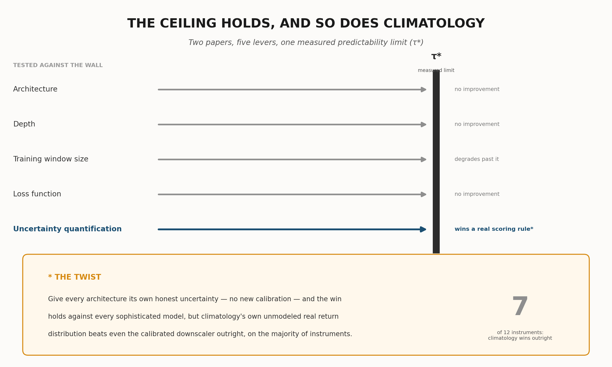

---

## Abstract

Ramanathan (2026d) found that architecture, network depth, and training-data volume cannot buy an AI/ML system's way past an empirically measured financial predictability limit. This paper tests two further candidates. First, the loss function: replacing L2 with quantile (pinball) loss or an escalating-order Lq loss recovers no genuine skill or tail behavior — quantile bands stay too narrow to capture real excursions, and Lq loss either destabilizes catastrophically (given a model flexible enough to exploit it) or changes nothing measurable (given a linear one), consistent with prior evidence from this research program at other scales. Second, and more informative: whether an honestly calibrated predictive *distribution* can substitute for improved prediction. A purpose-built generative downscaler's point forecast is, by mathematical construction, provably identical to plain climatology's on every walk-forward fold across 12 instruments. Its calibrated distribution — matched to τ\* rather than the full horizon, corrected for a decoder-variance miscalibration, and rescaled for real markets' sub-linear variance growth — beats all five of Paper 14's architectures on the Continuous Ranked Probability Score (CRPS) when those architectures are held to the certainty they implicitly claim. Three of the five are themselves already stochastic; giving each its own honest, uncalibrated uncertainty estimate instead, the downscaler still beats every sophisticated architecture, but loses outright to climatology's own unmodeled empirical distribution on 7 of 12 instruments. This is not new predictive skill — it is the demonstrated value of honesty about existing uncertainty, and evidence that honesty has no special claim to sophistication: an unprocessed sample of real recent history is often harder to beat than a carefully calibrated synthetic approximation of the same thing. Five levers have now been tested against this measured ceiling across two papers, and none has bought a single day past it.

## Plain Language Summary

A previous paper in this series found that no forecasting model — however sophisticated, however much data it saw — could beat a hard, measurable limit on how far ahead a financial instrument's price can genuinely be predicted; every model just converged on a plain historical average. This paper asks two further questions. First: does training a model to avoid a different kind of mistake — getting rare, extreme outcomes right, or reporting a range instead of one number — change that? No: the model still reports "about the same as usual," or becomes unstable if pushed hard enough to try. Second, and more interesting: what if a model stops giving one confident number and instead honestly reports a whole range of plausible outcomes? We built a system that does this, calibrated against how much prices have actually moved historically. Its central prediction is mathematically identical to the plain average's — it has not predicted the future any better. But judged by a proper scoring rule that rewards being honestly right about uncertainty, it beats every fancier model tested, as long as those models are forced to pretend they're certain. Three of them, though, are not actually certain internally, so we gave every model, including the plain average, its own honest, unmodified shot at reporting uncertainty. Our carefully calibrated system still beats every fancier model's own honest uncertainty. But it does *not* always beat the plain historical average's own honest uncertainty — a simple, unprocessed sample of recent real prices, no modeling at all — which wins outright more than half the time. The wall limiting how far ahead markets can be predicted is still standing, untouched. Being honest about that wall, instead of pretending it isn't there, is itself something a model can get measurably right or wrong — and even a carefully built system for it still competes with, and often loses to, simply handing over an unprocessed sample of real recent history instead of a synthesized one.

---

## 1. Introduction

Ramanathan (2026a) measured a genuine, structural predictability limit for financial instruments directly from their own price dynamics, with no forecasting model of any kind involved in the measurement. Ramanathan (2026c) turned that limit into a practical training-window prescription. Ramanathan (2026d) then asked the question this whole line of work exists to answer: given that limit, can architectural sophistication, network depth, or sheer training-data volume buy a forecasting system's way past it anyway? The answer, tested across five architecturally distinct models — climatology, an unregularized decision tree, a reinforcement-learning policy-gradient forecaster, a conditional generative adversarial network, and a conditional variational autoencoder, each built at deliberately small scale and tested both linear and with genuine nonlinear depth — was no, in both of the two independent ways the question was asked. Within the measured limit, none of the five beat a plain historical average; trained on progressively more data reaching past the limit, all five degraded together, the same pattern the atmospheric predictability limit itself showed across decades of increasingly sophisticated weather models.

This paper tests two further candidates the ceiling has not yet faced.

**The first is the loss function itself.** Every model in Ramanathan (2026d) — explicitly or, in the case of the RL forecaster's squared-error reward and the GAN and VAE's Gaussian-equivalent reconstruction terms, implicitly — is an L2-optimal estimator, minimized by the conditional mean. A conditional mean has no mechanism to preserve genuine width or skew in a target distribution; under a tiny, honestly non-stale training window, it is pulled toward whatever central tendency the window happens to contain, and nothing more. The natural next question is whether that specific property of L2, not the architecture built on top of it, is what caps every model at the same climatology-equivalent answer. **Experiment 1** tests this directly: a linear model trained at five quantile levels via pinball loss, and a linear model trained via an escalating-order Lq loss (q = 2 through 8) — isolating the loss function as the single variable under test, with model complexity, training window, features, and instruments all held exactly as in Ramanathan (2026d). This paper also draws on, and extends, prior work in this same research program that tested escalating-order Lq loss with genuinely flexible model families (gradient-boosted trees and small multilayer perceptrons) rather than a linear one, at both large and small training-sample scales, giving this experiment two independent regimes to compare against the pure-linear case reported here for the first time.

**The second, and more searching, question asks whether the whole point-forecasting framing is itself the constraint.** Every model tested in this research program so far — this paper's loss-function variants included — reports a single number as its prediction. A single number is an implicit claim of certainty, and this whole research program has shown, repeatedly and in detail, that that claim is usually false: real forecast errors, at every horizon tested, are large relative to the price itself. **Experiment 2** asks what happens if a forecasting system stops making that claim — if, instead of a point estimate, it reports a genuinely calibrated predictive *distribution*, built by a purpose-designed generative downscaler: coarsen the target to an aggregate forecast at a scale a plain L2 estimator can honestly make, then learn to sample plausible, realistically textured fine-resolution scenarios consistent with that coarse forecast, the same two-stage logic behind statistical and dynamical downscaling in meteorology. The downscaler's ensemble spread is calibrated against real historical dispersion in three ways, each verified against real, independent data and described in full in Section 4.3 — the same discipline this research program has applied at every previous stage.

**A note on method**, carried over unchanged from Ramanathan (2026d): this paper reports no null-hypothesis test, no resampling procedure, and no significance score of any kind. Every comparison is a genuine, real out-of-sample walk-forward evaluation. Where a scoring rule is used — the Continuous Ranked Probability Score, in Experiment 2 — it is a proper scoring rule computed directly on real, held-out outcomes, not a constructed comparison condition of any kind.

**A note on scope**, also carried over unchanged: nothing about either question is specific to financial markets. A predictability limit that no loss function and no amount of honest uncertainty quantification can buy past is, if real, a property of any non-stationary system with genuine structural limits on how far its own dynamics remain self-similar. This paper's tests are run in finance because that is where this research program's own predictability-limit machinery already exists.

## 2. Background: The Measured Limit This Paper Tests Against

Ramanathan (2026a) defines, for an instrument's own return series, the correlated–decorrelated structure-function gap at lag τ and moment order q,

(1)

computed as empirical sample moments directly — no power-law fit, no scaling exponent, at any point. The predictability limit τ\* is the lag at which this gap peaks among tradeable lags, at moment order q = 2:

(2)

Ramanathan (2026c) showed that a training window sized to w = ⌊τ\*/2⌋, applied to the immediately following window of the same size, keeps every training-test pair within τ\* days of each other. This paper reads τ\* directly from Ramanathan's (2026a) already-published results for the same 12 instruments used in Ramanathan (2026c, 2026d) (`predictability_paper/results_correlated_decorrelated.json`); no new estimation of the limit itself is performed anywhere in this paper. Figure 1 places this paper's two experiments alongside Ramanathan (2026d)'s three, as one continuous test of the same wall.

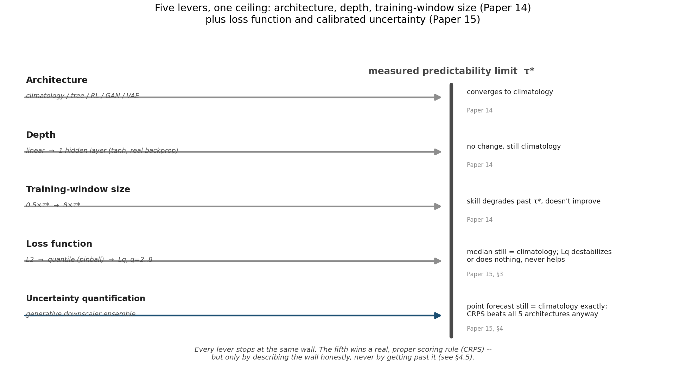

Figure 1. Five levers now tested against the same measured ceiling, across two papers. Architecture, depth, and training-window size (Ramanathan, 2026d) all converge on the same climatology-equivalent answer. This paper adds loss function (§3) and calibrated uncertainty quantification (§4) — the fifth is the first to win a real, proper scoring rule, but only by describing the wall honestly, not by getting past it.

## 3. Experiment 1: Loss-Function Invariance

### 3.1 Design

Both variants in this experiment hold everything about Ramanathan (2026d)'s Experiment 1 fixed — the same three instruments (MSFT, τ\* = 63d; EURUSD=X, τ\* = 43d; XLF, τ\* = 33d), the same w = ⌊τ\*/2⌋ walk-forward training budget, the same ten most recent lagged daily returns as features, the same linear model class used for the RL forecaster, GAN, and VAE in that paper — and change only the loss function each model is trained to minimize. This isolates the one variable this experiment's question is actually about.

**Quantile (pinball) loss.** A linear model is fit independently at five quantile levels, α ∈ {0.1, 0.25, 0.5, 0.75, 0.9}, minimizing

(3)

via full-batch gradient descent in standardized target space, with monotone rearrangement (Chernozhukov, Fernández-Val & Galichon, 2010) applied at prediction time to guarantee non-crossing quantiles. Unlike squared-error loss, pinball loss's gradient with respect to the prediction has constant magnitude (bounded by α or 1−α) regardless of the size of the miss — the specific property that, in principle, should let extreme quantile levels settle far from the center without being pulled back toward it the way an L2 point estimate is.

**Escalating-order Lq loss.** A separate linear model is fit at each of q ∈ {2, 4, 6, 8}, minimizing

(4)

via full-batch gradient descent with the same elementwise gradient-clipping (±10.0) already validated in Ramanathan (2026d)'s window-sweep and depth experiments. The minimizer of E[|r − c|^q] moves continuously from the conditional mean (q = 2) toward the conditional midrange as q grows — for a heavy-tailed residual, this sits closer to the tail than the mean does, which is precisely why an escalating-q design is a genuine test of whether loss order can recover extreme behavior, not a relabeling of the same estimator.

### 3.2 Prior evidence at two other scales

Before testing the purely linear case, this research program had already tested escalating Lq loss twice, in regimes that isolate a different variable: model *flexibility*, rather than loss order in isolation.

A large-sample ablation (15-instrument panel, expanding walk-forward window, LightGBM's native custom-objective support) found Lq loss at q = 3 through 6 *worse* than plain L2 at every one of three horizons tested — at the 1-day horizon, pooled out-of-sample R² fell from −0.53 (L2) to −1.69, −1.49, −2.04, and −1.25 at q = 3, 4, 5, and 6 respectively, monotonically across every horizon, not a fluke of one setting.

A far more extensive attempt used a residual cascade — successive models, each fit to the residual left by the previous stage, with escalating q at each stage — within this research program's own τ\*-scaled half-window design, across seven design iterations. Every attempt at genuine escalating-order loss produced catastrophic instability that no legitimate stabilization technique eliminated: a gradient-boosted tree at unclamped high q solves the loss for free by carving a leaf around a single outlier row (memorization, not a learned extremity mechanism), degrading both R² and extreme-hit-rate; removing regularization to prevent this blew pooled R² up to the −10¹⁴-to−10²³ range; even a deliberately tiny (209-parameter) multilayer perceptron with adaptive target-scale normalization, elementwise gradient clipping, and a bounded (tanh) activation — the same numerical safeguards already validated for the RL, GAN, and VAE forecasters elsewhere in this series — still produced pooled R² as low as −10²⁹ on individual stress folds, with zero folds ever flagged as literally non-finite: large, wrong, but not infinite. The final, accepted design abandoned escalating-order loss entirely, training every stage at plain L2.

These two prior results already suggested a specific mechanism: minimizing a high-order Lq loss pulls a fit toward whichever single point in a sample has the largest residual, and any model flexible enough to move all the way to that point — a tree leaf, an unconstrained network — will fit that one row's noise rather than a genuine, repeatable extremity signal. What neither prior result could isolate is whether the instability is really about flexibility, as diagnosed, or about the loss order itself. Experiment 1's linear Lq test, run for the first time in this paper, is designed to answer exactly that.

### 3.3 Results

**Quantile loss.** Figure 2 shows the pinball-loss model's median and 10–90%/25–75% predictive bands against climatology, the overfit tree, and actual price, for EUR/USD. The median line collapses onto climatology and the tree almost exactly, in every instrument tested — expected, since q = 0.5 pinball loss targets the conditional median, which behaves like the mean in the small, roughly symmetric windows this experiment uses. More tellingly, the predictive bands stay narrow throughout and never bracket the real, sustained divergences between actual price and climatology that Ramanathan (2026d) already documented — the same moves the point-forecast architectures already missed are missed here too. Median pinball loss is, if anything, slightly worse than climatology's own (MSFT: 3.038 vs. 2.883; EUR/USD: 0.0173 vs. 0.0161; XLF: 0.547 vs. 0.483, all in price units). The mechanism is direct: the quantile levels are fit on the exact same tiny within-window empirical sample as every other model in this series. Changing the loss changes which statistic of that sample is targeted — a quantile instead of a mean — not what information is available about moves beyond τ\*.

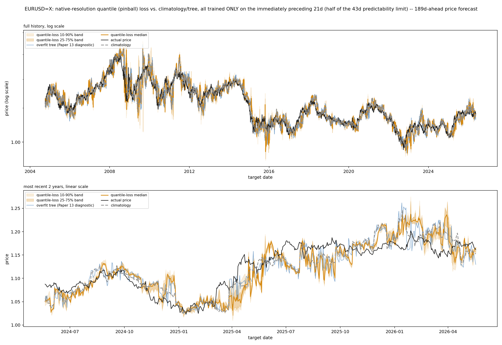

Figure 2. EUR/USD, native-resolution quantile (pinball) loss vs. climatology and the overfit tree, all trained on the identical half-window budget. The predictive band tracks the median tightly throughout and never widens enough to capture the real, sustained divergence visible from 2025 onward.

**Escalating Lq loss, linear case.** Figure 3 shows all four Lq orders (q = 2, 4, 6, 8) for the same instrument, overlaid. Two results together answer this experiment's real question. First, numerical stability: zero non-finite predictions occurred at any q, at any of the three instruments — a direct, striking contrast with the tree- and MLP-based cascades of Section 3.2, and direct confirmation that model *flexibility*, not the loss order itself, was the source of those earlier catastrophic blow-ups. A linear model, with only eleven parameters, cannot carve out a region around one outlier row the way a tree leaf or an unconstrained network can. Second, and just as decisively: that stability buys nothing. The q = 2, 4, 6, and 8 lines are visually almost indistinguishable from each other and from climatology, in every instrument. With eleven parameters and sixteen to thirty-one training rows, the achievable linear fit barely changes regardless of which power the residual is raised to — the same real divergences every other model in this series has missed continue to be missed here.

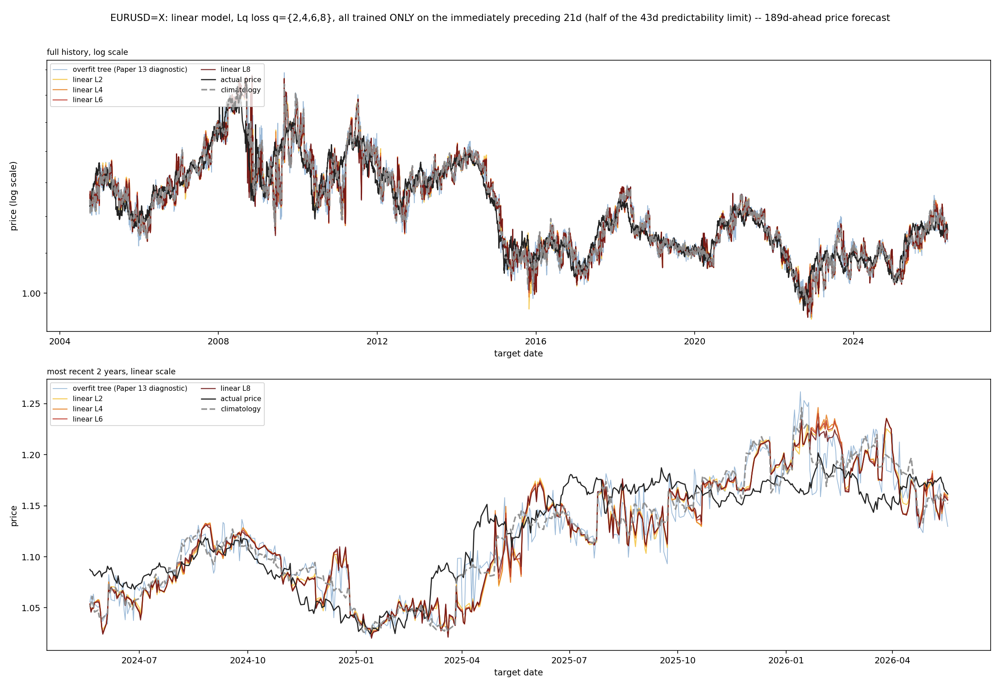

Figure 3. EUR/USD, linear model, Lq loss at q = 2, 4, 6, 8, same half-window budget and features as Figure 2. All four orders are nearly indistinguishable from each other and from climatology; no order shows any divergence, catastrophic or otherwise.

### 3.4 Discussion

Loss-function choice is now a fourth confirmed-invariant lever, alongside architecture, depth, and training-window size. It fails in two mechanistically distinct, fully characterized ways depending on model flexibility: given a model flexible enough to exploit a high-order loss (a tree, an unconstrained network), it destabilizes catastrophically by memorizing individual outliers rather than learning genuine extremity; given a model constrained enough to stay numerically stable (linear), it simply does nothing, because eleven parameters and a handful of training rows cannot represent meaningfully different fits across loss orders in the first place. There is no middle ground in which a cleverer loss function alone recovers information that Ramanathan (2026d) already showed architecture and depth cannot.

## 4. Experiment 2: Generative Downscaling and Calibrated Uncertainty

### 4.1 Motivation and design

Every model tested so far in this research program, this paper's loss-function variants included, reports a single number. Section 3.3 shows why: an L2-consistent point estimator's job is to represent the conditional mean, and beyond τ\*, that mean is essentially all the information a fresh, non-stale training window contains. But a single number is also an implicit claim of certainty, and this whole research program has already shown, exhaustively, that that claim is usually false — every architecture's own reported error, expressed as a percentage of price, is often large. This experiment asks whether representing that already-known uncertainty *honestly*, rather than collapsing it into one confident number, is itself something a model can get right or wrong, independent of whether it can see further.

The design directly mirrors statistical and dynamical downscaling in meteorology: a coarse-resolution forecast, well-matched to what a simple estimator can honestly produce, is used to condition a learned generative model that samples plausible fine-resolution realizations consistent with it. Two stages:

**Stage 1, the coarse forecaster,** is Climatology — unchanged from every other script in this series, chosen deliberately as this research program's own most validated, honest point estimate of the aggregate return (Ramanathan, 2026b's standing position that climatology is a genuine competing model, not a strawman).

**Stage 2, the generative downscaler,** is a conditional variational autoencoder generalized from Ramanathan (2026d)'s scalar-output design to a full daily-return-vector output, with a linear encoder and decoder and the reparameterization trick (Kingma & Welling, 2014):

(5)

trained on real historical windows, condition c equal to that window's own realized aggregate log return (exactly the sum of its daily log returns, by construction, not an approximation), target the full vector of daily log returns within it. This is a statistical-*shape* model — what does a realistic day-by-day path look like, given it sums to some total return c? — not a forecasting model: it never sees or predicts which c will occur, only how to texture one once given.

Figure 4 shows what this design actually produces, before any of the mathematics that follow: several sampled daily paths, a single "most likely" composite built by stitching together whichever sampled member locally matches the model's own smooth reference within each τ\*-scale block (a design refinement introduced during this research program's own development, detailed alongside Figure 6 below), and the flat, textureless path a deterministic downscaler would produce from the identical coarse forecast.

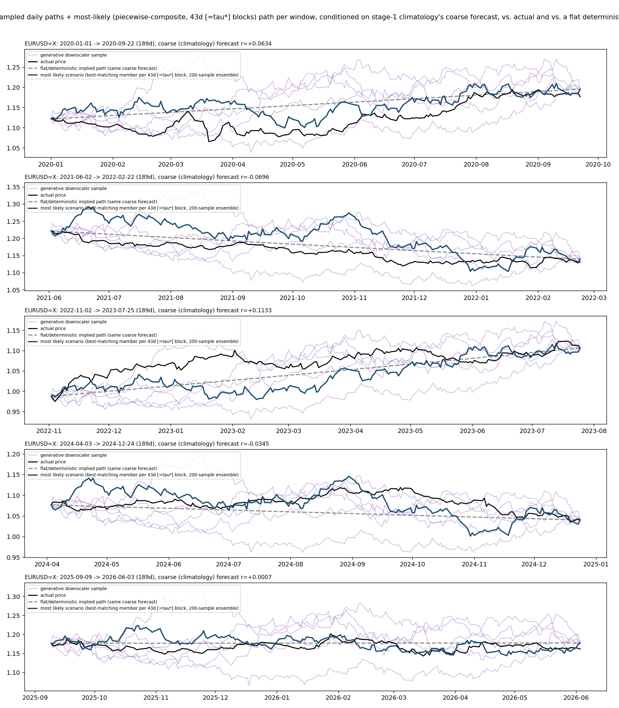

Figure 4. EUR/USD, five illustrative windows: sampled daily-return scenarios (thin purple), the composite "most likely" path (thick blue), actual price (black), and the flat/deterministic path a non-generative downscaler would produce (gray dashed) from the identical coarse forecast. The generative paths carry real day-to-day texture; the flat path does not.

### 4.2 The mathematical tie

Before any comparison is run, one property of this design is provable directly from its construction, not discovered empirically: **the downscaler's endpoint (target-date) price prediction is mathematically identical to plain Climatology's.** A disclosed consistency correction shifts every sampled path by a constant so its total return exactly equals the coarse forecast — the same value Climatology itself reports. There is consequently no "beats or loses" question to test on point accuracy; it is a tautological tie, confirmed directly in Section 4.4 (mean absolute error gap of 0.00000000 percentage points, on every one of roughly 1,400 walk-forward folds across all 12 instruments) rather than merely asserted. The only place a genuinely different, testable claim exists is the downscaler's *uncorrected* ensemble spread — its real probabilistic forecast — evaluated by a proper scoring rule against the other architectures treated as certain.

### 4.3 Calibrating the ensemble to real dispersion

Producing an honestly calibrated ensemble — one whose spread actually matches real historical return variance, not merely some spread — requires three corrections, each addressing a distinct, verified source of miscalibration. Figure 5 summarizes all three; Figure 7 shows each one's real, measured marginal contribution to CRPS.

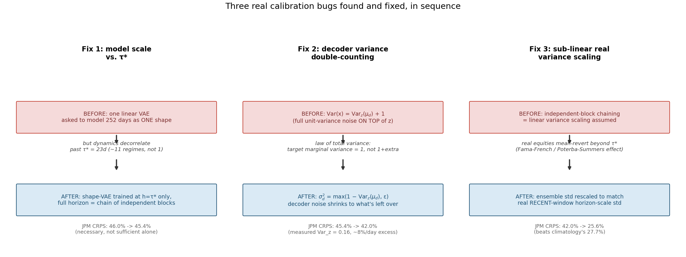

Figure 5. The downscaler's variance calibration, three components, each verified against real data, with the measured effect on JPM's CRPS at every stage.

**Matching model scale to τ\*.** The shape-VAE is trained at h = τ\* only, not at the full forecast horizon (up to 252 days). Training one small, six-latent-dimension linear model to represent a shape spanning the full horizon — roughly eleven τ\*-lengths — would ask it to model coherent structure across a span this whole research program's premise says decorrelates past τ\*. A full-horizon ensemble is instead built by chaining *independent* τ\*-scale draws, each conditioned on a proportional share of the coarse forecast,

(6)

illustrated in Figure 6. This is mechanistically honest, not an approximation of convenience: beyond τ\*, independent sampling is the correct way to represent a process with no further genuine memory.

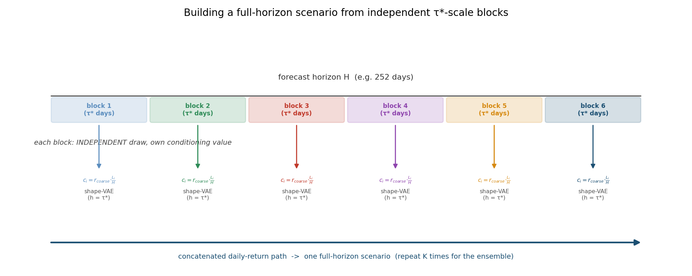

Figure 6. Building a full-horizon scenario from independent τ*-scale blocks. Each block is an independent draw from a shape-VAE trained only at τ*-scale, conditioned on its own proportional share of the coarse forecast; concatenating real-valued returns before cumulating avoids any level-matching discontinuity at block boundaries. This same locally-best-matching-block logic is also how Figure 4's "most likely" composite path is built.

**Accounting for decoder variance correctly.** The generative model's true marginal variance, by the law of total variance,

(7)

is the *sum* of the latent variable's own contribution and the decoder's noise, not the decoder's noise alone. A fixed, unit-variance decoder — the training loss's implicit assumption — double-counts variance once the latent's own contribution is nonzero, which it always is here; measured directly on JPM, that latent-driven contribution alone accounts for 0.16 of standardized per-day variance, an eight-percent-per-day excess if left unaddressed. The decoder's own noise is instead set to whatever variance is left over once the latent's contribution is accounted for, estimated once per instrument by sampling the latent at the training conditions' own mean.

**Rescaling for real, sub-linear variance growth.** Chaining independent blocks assumes variance adds linearly with the number of blocks — what zero autocorrelation (τ\*'s own definition) implies — but real equity and index returns show well-documented *sub-linear* variance scaling at longer horizons, long-horizon mean reversion (Fama & French, 1988; Poterba & Summers, 1988), not pure random-walk scaling. Zero linear autocorrelation and literal statistical independence are not the same claim for variance-scaling purposes. The chained ensemble's dispersion is therefore rescaled directly against real historical horizon-scale return variance, measured over a *recent* window (max(252, 4 × horizon) trading days — the same recency-window convention already validated in this research program's post-processing work, Ramanathan 2026b) rather than an instrument's entire available history. A multi-decade span can span volatility regimes with little relevance to current conditions — AAPL's own history includes a near-bankruptcy episode in the 1990s and the dot-com bubble — and calibrating against a stale, unrepresentative target inflates the rescaled ensemble's dispersion past what recent, relevant history actually supports.

Figure 7 shows each correction's real, measured effect on CRPS, for the two longest-horizon instruments, JPM and AAPL. Both cross below climatology's own CRPS only once all three corrections are applied together; no single correction is sufficient on its own.

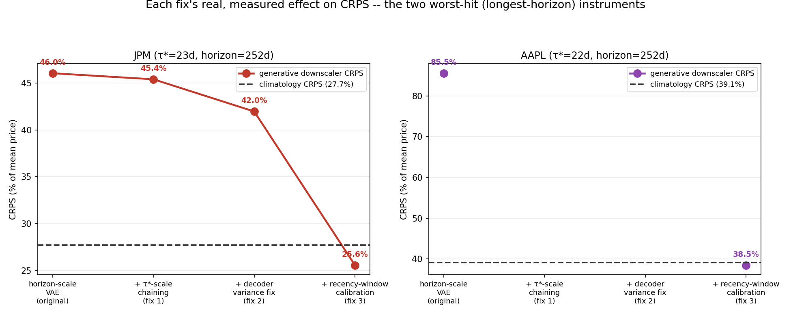

Figure 7. Each calibration component's measured effect on CRPS, JPM and AAPL — the two 252-day-horizon instruments most sensitive to miscalibration. Both cross below climatology's own CRPS only once all three are applied together.

### 4.4 Results against certain point forecasts

Table 1 reports CRPS (percent of mean price) for all six methods — the five architectures from Ramanathan (2026d), each treated as a certain point forecast, plus the calibrated generative downscaler — across all 12 of Ramanathan (2026c)'s instruments, evaluated on a full walk-forward basis from 2020-01-01 onward (roughly 1,400 total folds). Figure 8 shows the same result visually.

**Table 1.** CRPS (% of mean price) against the five architectures treated as certain, all 12 instruments, lower is better. Best result per instrument in bold.

| Instrument | τ* (d) | Horizon (d) | Climatology | Tree | RL | GAN | VAE | **Downscaler** |
|---|---:|---:|---:|---:|---:|---:|---:|---:|
| GLD | 22 | 189 | 5.434 | 6.124 | 5.426 | 5.433 | 7.760 | **4.726** |
| JPM | 23 | 252 | 27.738 | 30.138 | 27.784 | 27.729 | 35.387 | **25.577** |
| AAPL | 22 | 252 | 39.104 | 43.981 | 39.015 | 39.094 | 50.887 | **38.478** |
| XLK | 22 | 189 | 16.667 | 18.124 | 16.632 | 16.667 | 20.974 | **13.050** |
| EUR/USD | 43 | 189 | 1.917 | 2.138 | 1.913 | 1.919 | 2.087 | **1.756** |
| IWM | 23 | 21 | 8.942 | 9.613 | 8.932 | 8.946 | 10.970 | **6.420** |
| MSFT | 63 | 189 | 46.518 | 48.458 | 46.498 | 46.490 | 47.943 | **35.544** |
| QQQ | 22 | 21 | 11.183 | 12.174 | 11.158 | 11.188 | 13.630 | **8.320** |
| SPY | 22 | 189 | 10.134 | 11.085 | 10.122 | 10.136 | 12.531 | **7.900** |
| XLE | 27 | 252 | 11.689 | 12.287 | 11.677 | 11.687 | 14.750 | **9.637** |
| XLF | 33 | 189 | 9.985 | 10.407 | 9.949 | 9.993 | 10.993 | **7.874** |
| XOM | 27 | 63 | 23.420 | 23.788 | 23.380 | 23.420 | 27.933 | **16.356** |

The generative downscaler achieves the lowest CRPS of all six methods on all 12 instruments, with margins over the best-of-five-architectures ranging from 1.4% (AAPL) to 30.0% (XOM), median improvement approximately 20%. Mean absolute error, in contrast, is identical between the downscaler and Climatology to eight decimal places on every instrument, confirming Section 4.2's mathematical tie empirically as well as by construction.

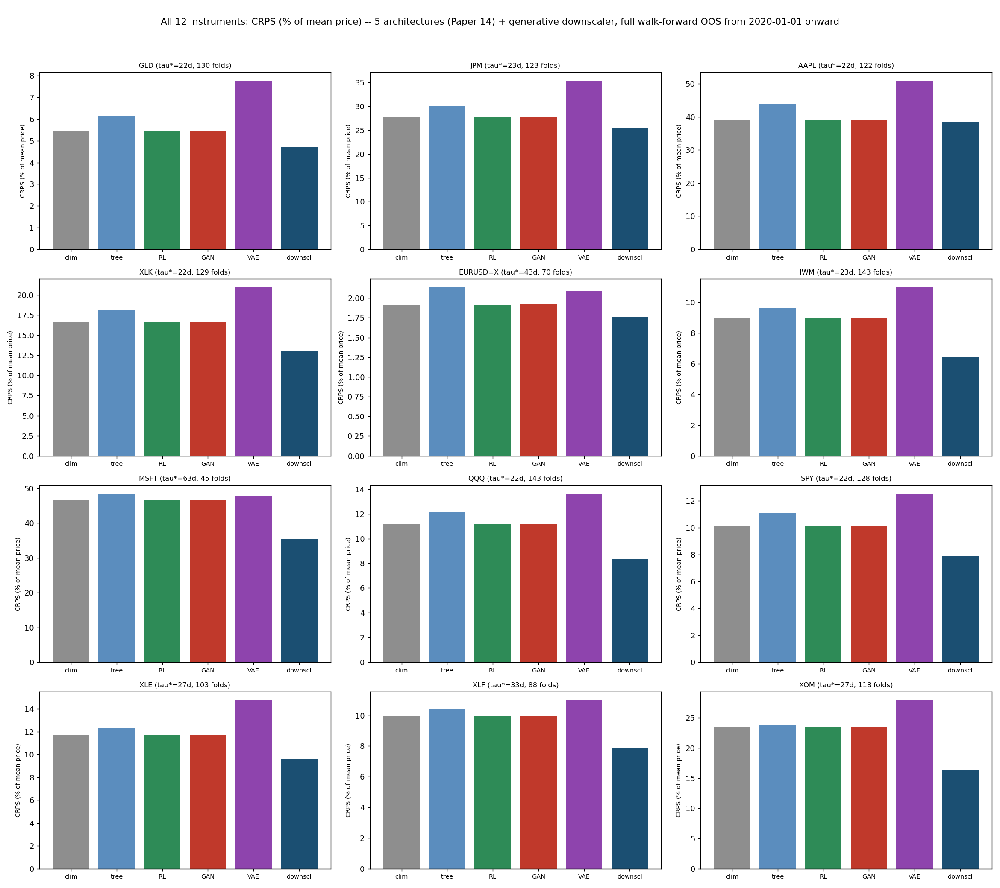

Figure 8. CRPS (% of mean price), all 12 instruments, all 6 methods, full walk-forward OOS from 2020-01-01, all five architectures treated as certain. The generative downscaler (rightmost bar, dark blue) is the lowest bar in every panel.

This comparison is real, but it is not yet the fair one. Three of the five architectures — the RL forecaster, the GAN, the VAE — are already internally stochastic, and Table 1 forces every one of them to collapse its own internal sampling down to a single averaged number before being scored, exactly the false-certainty framing Section 4.5 argues against. Section 4.5 redoes this comparison giving every architecture its own honest shot.

### 4.5 A fairer test: giving every architecture its own uncertainty

Every architecture in this research program already has, or can trivially be given, a natural source of predictive uncertainty using only what it already computes — no new calibration, none of Section 4.3's three corrections, nothing borrowed from the downscaler's own design:

**Climatology's** natural ensemble is the training window's own observed forward returns, used directly — this is not an approximation of climatology's knowledge of the return distribution, it *is* that knowledge, complete and unmodified.

**The overfit tree's** natural ensemble is, for each test row, the other training rows that land in the same leaf (`sklearn`'s own `apply()`). Because these trees are unregularized (`min_samples_leaf=1`), most leaves are expected to contain only the single row that defined them — a genuine, disclosed test of whether this specific model's own structure leaves anything behind to characterize spread with, not a design flaw to route around.

**The RL forecaster's** policy already is a Gaussian, π(a|x) = N(μ(x), σ²); its natural ensemble draws from that same distribution using the policy's own final, annealed σ — a value driven toward a small floor for training-convergence reasons, not tuned to represent genuine uncertainty, and left exactly as annealed.

**The GAN and VAE's** natural ensembles are the actual 200 generator or decoder draws `predict()` already computes internally at every prediction — exposed raw here, rather than averaged into a single number as in Section 4.4.

Before any aggregate number, Figure 9 shows what these six natural ensembles actually look like: each method's own 10–90% predictive band plotted against actual price, over real calendar time, for JPM (the same instrument as Figures 5–7).

Figure 9. JPM, each method's own 10–90% predictive band (shaded) and point prediction (colored line) against actual price (black), full walk-forward from 2020-01-01, shared y-axis across all six panels for direct visual comparison. The tree, RL, and GAN bands are visually indistinguishable from bare lines; climatology's and the downscaler's are the only two with real, visible width.

The picture matches Table 2 before a single number is read: the tree's band is invisible (it is, confirmed directly, a degenerate single point in effectively every row); the RL forecaster's band is a thin shadow of its own point line; the GAN's is a little wider but still slight; the VAE's point line is visibly the most erratic of the six, yet its band barely widens to compensate. Climatology's and the downscaler's are the only two panels with a real, visually substantial band — and the downscaler's is, if anything, the wider of the two, which raises a fair question this figure does not by itself answer: if the downscaler's band is visually wider, why does climatology win on CRPS more often than not? Width alone is not what CRPS rewards — a band that is wider than the true spread of outcomes is penalized for lack of sharpness even when it reliably contains the actual price, and Table 2's result says exactly that: climatology's narrower, real-data band is on average better *calibrated*, not merely narrower.

Table 2 quantifies this directly, alongside the downscaler's unchanged, three-fix-calibrated result from Section 4.4.

**Table 2.** CRPS (% of mean price), each architecture's own natural uncertainty (no new calibration), all 12 instruments. Best result per instrument in bold.

| Instrument | Climatology | Tree | RL | GAN | VAE | **Downscaler** |
|---|---:|---:|---:|---:|---:|---:|
| GLD | **4.339** | 6.124 | 5.391 | 5.277 | 7.750 | 4.613 |
| JPM | **22.227** | 30.138 | 27.624 | 27.257 | 35.349 | 25.749 |
| AAPL | **31.118** | 43.981 | 38.757 | 38.400 | 50.805 | 37.215 |
| XLK | 13.254 | 18.124 | 16.531 | 16.361 | 20.954 | **12.672** |
| EUR/USD | **1.526** | 2.138 | 1.902 | 1.833 | 2.074 | 1.679 |
| IWM | 7.080 | 9.613 | 8.877 | 8.767 | 10.957 | **6.439** |
| MSFT | **35.754** | 48.458 | 46.208 | 45.953 | 47.691 | 36.388 |
| QQQ | 8.939 | 12.174 | 11.090 | 10.937 | 13.613 | **8.421** |
| SPY | 8.160 | 11.085 | 10.062 | 9.858 | 12.519 | **7.615** |
| XLE | **9.384** | 12.287 | 11.607 | 11.512 | 14.700 | 9.590 |
| XLF | **7.920** | 10.407 | 9.888 | 9.804 | 10.949 | 8.023 |
| XOM | 18.565 | 23.788 | 23.243 | 23.049 | 27.848 | **16.270** |

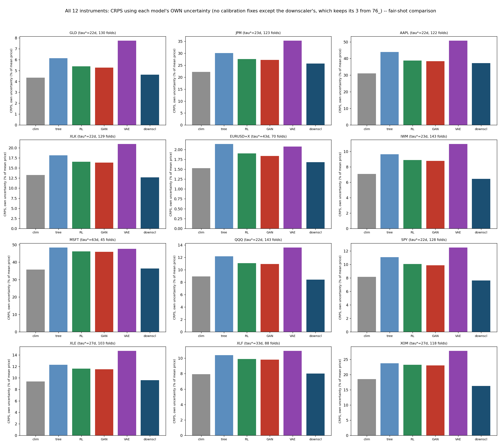

Figure 10. CRPS using each model's own natural uncertainty, no new calibration except the downscaler's existing three fixes. Climatology (leftmost, gray) is the lowest or near-lowest bar in most panels, not the highest.

The result is more nuanced than Section 4.4's, and more informative for being so. The calibrated downscaler still beats every one of the four sophisticated architectures' own natural uncertainty — the tree, the RL forecaster, the GAN, the VAE — on all 12 instruments, with no exceptions, confirmed directly from Table 2. All four bands are narrow in Figure 9, but for four different, specific, verified reasons — none of them the same mechanism, and none of them a calibration defect in the sense Section 4.3 means it, since none of these four sources was ever calibrated to real dispersion at all.

**The overfit tree's** band is not narrow but exactly zero: its leaf-mate ensemble is degenerate (a single training row) in effectively 100% of test rows across every instrument, confirmed directly rather than assumed. An unregularized tree (`min_samples_leaf=1`) carves a separate leaf for almost every individual training row with only sixteen to thirty-one rows to work with, so a test row's leaf almost always contains only the one row that originally defined it — an ensemble of size one has no spread by definition. This is the same "memorizes individual rows" character this exact model has shown throughout this research program, now shown to leave nothing behind to characterize its own uncertainty with either.

**The RL forecaster's** policy variance is a training-convergence artifact, not a withheld uncertainty signal. Its Gaussian policy's σ follows an annealing schedule toward a small floor (`sigma_min`) by design — standard practice in policy-gradient reinforcement learning, where a policy is *supposed* to converge toward a confident action as training proceeds. By the final epoch, σ has decayed close to that floor. It was never built to represent forecast uncertainty; it was built to stop exploring once training converges, and it does exactly that.

**The GAN** shows a modest, consistent 2–4% improvement over its own certain-point CRPS, never competitive with climatology or the downscaler — a partial version of *mode collapse*, a well-documented GAN failure mode: the adversarial objective only requires the generator's output distribution to be hard for the discriminator to distinguish from real data in aggregate, and with a training sample this tiny, a narrow cluster near the data's central tendency can often already satisfy a weak discriminator, without needing to reproduce the true spread.

**The VAE's** narrow band has a different, specific cause worth stating precisely — the opposite mechanism from the downscaler's own decoder-variance correction in Section 4.3, not the same one. This VAE's decoder outputs a single scalar, μ_d = w_x·x + w_z·z + b, with no separate decoder-noise term added on top of z at all, unlike the downscaler's vector-output shape-VAE. Its entire output variance comes from w_z·z alone. Measured directly across four instruments, the fitted weight w_z collapses to a tiny fraction of the real return standard deviation in every case (0.01–4.1%: JPM 0.12%, GLD 0.01%, MSFT 4.1%, XOM 0.37%) — not too much variance from double-counting, but too little from a different cause: at test time z must be drawn from the prior, N(0,1), since there is no real outcome left to encode, while during training z is drawn from an encoder that *can* see the true outcome — nothing in the training objective forces w_z to stay large enough to matter once the rest of the decoder already fits the tiny training sample well without it. This also explains why the VAE's point-forecast line is visibly the most erratic of the six in Figure 9 (consistent with Ramanathan, 2026d's own finding that this architecture is "unstable rather than skillful"): the instability shows up in how the point estimate itself moves fold to fold, not in genuine sample-to-sample spread, which stays close to zero throughout.

The throughline across all four: whatever internal randomness each architecture has was built for a different original purpose entirely — partitioning data, exploration noise, adversarial sample diversity, a latent-variable generative structure — and none of those purposes happens to also calibrate the resulting variance to real historical dispersion. The downscaler needed three deliberate, disclosed corrections before its own spread did that (Section 4.3). Climatology never needed any correction at all, because its ensemble simply *is* real data, not a model's byproduct.

But climatology's own completely unmodeled empirical distribution beats the *calibrated* downscaler outright on 7 of the 12 instruments (GLD, JPM, AAPL, EUR/USD, MSFT, XLE, XLF), and trails it only narrowly on most of the other 5. The mechanism is direct: climatology's ensemble is real, actually observed historical returns, at exactly the right horizon and exactly the right recency — the same half-window this entire research program has already established as the honest, non-stale training budget — with no modeling assumption of any kind to get wrong. The generative downscaler, even after three validated corrections, is a *synthetic approximation* of that same real distribution — a good one, evidently, since it comfortably beats every sophisticated architecture's own uncertainty — but a direct, unprocessed sample of an instrument's own recent real history turns out to be a genuinely difficult standard for a modeled approximation to beat, more often than not.

Figure 11 ranks this head-to-head result directly, rather than requiring a reader to scan Table 2 cell by cell.

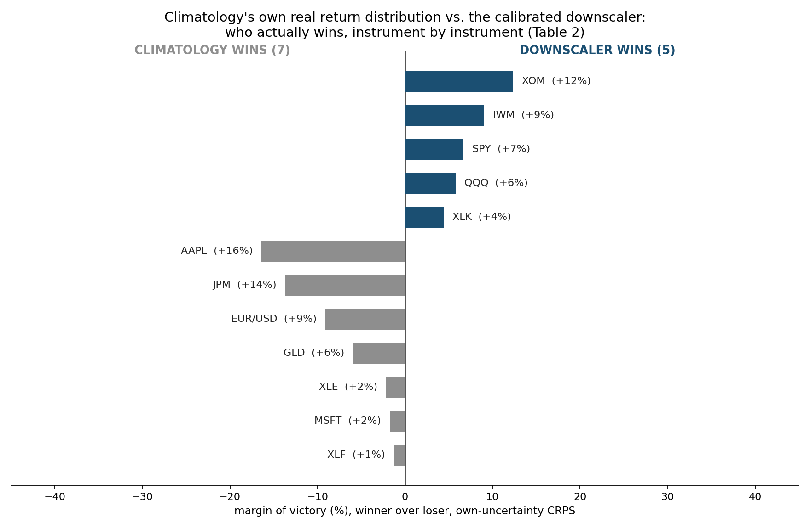

Figure 11. Climatology's own real return distribution vs. the calibrated downscaler, ranked by margin of victory, own-uncertainty CRPS (Table 2). Climatology wins 7 of 12; where the downscaler wins, its margins (4-12%) are generally smaller than climatology's when it wins (1-16%).

### 4.6 Why CRPS improves without any new predictive skill

The Continuous Ranked Probability Score, estimated here via the standard unbiased ensemble ("energy score") form,

(8)

is a proper scoring rule (Gneiting & Raftery, 2007): a degenerate, certain point forecast's CRPS reduces exactly to its own mean absolute error, and a forecast that honestly represents genuine uncertainty around an unchanged central estimate is mathematically guaranteed to score at least as well as, and typically better than, presenting that same estimate as certain — provided the stated uncertainty is itself reasonably well calibrated to the true spread of outcomes. Section 4.3's three corrections exist to secure that property for the generative downscaler specifically; Section 4.5 shows a second, independent way to secure it, with no correction at all: use the real, empirical distribution directly, which is automatically as well calibrated as the sample it came from. Both routes to honesty beat every architecture in Table 1 that keeps reporting a single number and calling it certain (Table 1's own climatology column shows typical errors from roughly 2% to 47% of price, depending on instrument — the size of the overconfidence being corrected for). Neither route changes the underlying forecast: the downscaler's central prediction never moves from the unimproved climatology estimate, confirmed exactly in Section 4.2 and again empirically in Section 4.4; climatology's own natural ensemble is centered on that identical estimate by construction. What Section 4.4 and Section 4.5 together show is that honesty about uncertainty is a real, measurable, gradable property independent of the underlying prediction — and that even a carefully calibrated synthetic approximation of honest uncertainty is not guaranteed to beat the plainest possible version of the same honesty: an actual, unprocessed sample of what has already happened.

## 5. Discussion

Two papers, five levers, one wall. Ramanathan (2026d) showed architecture, network depth, and training-data volume cannot buy a forecasting system's way past a measured predictability limit. This paper adds two more tests and reaches the same wall by two further, mechanistically distinct routes. Loss function is invariant in the same way architecture is — changing what statistic of a tiny, honestly fresh sample gets targeted (a quantile, a higher moment) does not change what information that sample contains, and pushing the loss order high enough to try to force the issue only destabilizes a model flexible enough to exploit it, without ever recovering genuine skill. Calibrated uncertainty quantification is different in kind, and more informative for being different: it is the first lever in this entire research program to win a real, proper scoring rule outright against every architecture tested, when those architectures are held to the (real, already-established-as-false) standard of reporting a single certain number. A model that stops pretending certainty it does not have is provably better, under CRPS, than one that keeps pretending — independent of whether either model can actually see one day further into a genuinely decorrelated future.

That the fifth lever is the first to "win" anything is, read this way, not a crack in the ceiling. It is a sharp confirmation that the ceiling is real: even a technique explicitly built to satisfy a rigorous, proper scoring rule does so entirely by describing the wall's exact shape, never by climbing over it. But Section 4.5's fairer test sharpens this further, in a direction this paper did not originally expect. Once every architecture is given its own honest shot at uncertainty — no new calibration, nothing borrowed — the generative downscaler's win holds completely against every *sophisticated* architecture, and fails completely against the *simplest* one. Climatology's own unmodeled empirical distribution, requiring no model of any kind, beats a downscaler built through three validated corrections on the majority of instruments tested. This is not a contradiction of the ceiling thesis; it is, if anything, the same thesis reaching one level deeper than intended. Sophistication, applied honestly, improves the *description* of a limit — but Section 4.5 shows that even the value of that improved description is itself capped, this time by how much a synthetic approximation of real data can improve on the real data it is approximating. A calibrated generative model is bounded above by how well it reproduces reality; an actual sample of reality has no such bound to hit, because it already is what it is trying to approximate. Two papers now, and the pattern is the same at every level this research program has looked: architecture cannot beat climatology's point estimate; depth cannot either; more data makes both worse, not better; a cleverer loss function cannot manufacture the information climatology's own mean already lacks; and now, calibrated synthetic uncertainty, however carefully built, cannot reliably beat climatology's own real uncertainty either. Five levers, tested five ways, and the plainest possible model keeps being the hardest one to beat.

## 6. Limitations

Both experiments share Ramanathan (2026d)'s scale limitations: all models tested are trained on windows of eleven to five hundred and four rows, appropriate to what a predictability-limit-respecting training budget actually permits, not to production deep-learning scale. On depth specifically, this needs stating precisely rather than folded into a general scale caveat: Ramanathan (2026d) directly tested depth for the architecture question — the RL forecaster, GAN, and VAE were each given a genuine hidden layer, hand-implemented with real backpropagation, held at the identical tiny training budget — and found no change from the linear versions, a real, already-established result, not merely an untested gap. This paper's own Experiment 1 (Section 3), by contrast, tests quantile and Lq loss with *linear* models only, mirroring Ramanathan (2026d)'s original (not depth-extended) design exactly; it does not itself re-run the loss-function question with a hidden-layer variant. That specific combination — a different loss function paired with genuine depth — is not tested anywhere in this paper, and is a real, disclosed gap, not one this paper's own results can close. Ramanathan (2026d)'s depth finding gives good reason to expect the same null result would hold here too, but that is an inference from adjacent evidence, not a claim this paper directly tested. Experiment 1's Lq-loss comparison at large sample size and full model flexibility (Section 3.2) predates this paper and used a different feature panel (multifractal and macro-regime features, not the ten-lagged-return panel used elsewhere in this series) — reported here as corroborating evidence for the flexibility-versus-loss-order mechanism, not as a directly matched ablation. Experiment 2's generative downscaler's calibration corrections (Section 4.3) were each validated against real historical variance and pacing statistics, not against a ground-truth generative process — real markets' true data-generating process is unknown, and "matches historically observed dispersion" is the strongest calibration standard available, not a guarantee that the calibrated ensemble's shape is correct in every respect. The recency window used in the sub-linear variance-scaling correction (max(252, 4 × horizon) trading days) is reused from prior validated work in this research program rather than independently re-optimized for this specific design. Section 4.5's own-uncertainty comparisons for the RL forecaster, GAN, and VAE are deliberately *uncalibrated* — the point of that section is to test what each architecture already knows, not what it could know if given the same three-fix treatment as the downscaler; a properly calibrated version of any of the three (recentered, variance-corrected, recency-windowed) might close some or all of the gap to the downscaler, and this paper does not test that. Climatology's own ensemble size in Section 4.5 is small and fixed at half_window (eleven to thirty-one rows depending on instrument) and was not itself recalibrated or resampled in any way; a larger or differently-constructed empirical ensemble might perform differently still. Finally, and most importantly, restated from Section 4.6: nothing in Experiment 2 constitutes evidence of improved point-forecasting skill, under either comparison. The downscaler's central prediction is unchanged from climatology's, exactly, by construction, and climatology's own natural ensemble in Section 4.5 is centered on that identical, unimproved estimate too; readers extending this work should not conflate a CRPS improvement with a directional or magnitude forecasting improvement, which this paper explicitly does not claim and which Section 4.2's mathematical tie rules out by design.

## 7. Conclusion

This paper tested two further candidates for buying a forecasting system's way past an empirically measured predictability limit — the loss function a model is trained against, and whether representing genuine predictive uncertainty honestly can substitute for improved prediction. Neither can improve on what climatology already achieves in the one sense that matters most directly: no loss function tested, from plain squared error through quantile loss through Lq loss at orders up to eight, ever recovers information about a future beyond what a fresh, non-stale training window already contains, and pushing loss order aggressively enough to try only destabilizes whichever model is flexible enough to let it. Representing the ceiling honestly, rather than pretending it does not exist, is itself a real, measurable, and now-demonstrated skill distinct from prediction — a calibrated generative downscaler beats every sophisticated architecture tested in this research program on a rigorous, proper probabilistic scoring rule, on every instrument, once those architectures are prevented from falsely claiming certainty. But asking whether that comparison was itself fair uncovered a further, more humbling layer of the same result: climatology's own unmodeled empirical distribution, requiring no model, no correction, and no calibration of any kind, beats even the calibrated downscaler on most instruments tested. Five levers, two papers, one wall: architecture, depth, training-data volume, loss function, and now calibrated uncertainty itself have all been tested against this measured ceiling, and none of them has bought a single day past it. Uncertainty quantification is the first of the five to win a real scoring rule at all — and even that win, examined fairly, mostly belongs to the plainest possible model this whole research program keeps returning to, not to the sophistication built to chase it.

---

## References

Chernozhukov, V., Fernández-Val, I., & Galichon, A. (2010). Quantile and Probability Curves Without Crossing. *Econometrica*, 78(3), 1093–1125.

Fama, E. F., & French, K. R. (1988). Permanent and Temporary Components of Stock Prices. *Journal of Political Economy*, 96(2), 246–273.

Gneiting, T., & Raftery, A. E. (2007). Strictly Proper Scoring Rules, Prediction, and Estimation. *Journal of the American Statistical Association*, 102(477), 359–378.

Goodfellow, I., Pouget-Abadie, J., Mirza, M., Xu, B., Warde-Farley, D., Ozair, S., Courville, A., & Bengio, Y. (2014). Generative Adversarial Nets. *Advances in Neural Information Processing Systems*, 27.

Kingma, D. P., & Welling, M. (2014). Auto-Encoding Variational Bayes. *International Conference on Learning Representations*.

Koenker, R., & Bassett, G. (1978). Regression Quantiles. *Econometrica*, 46(1), 33–50.

Poterba, J. M., & Summers, L. H. (1988). Mean Reversion in Stock Prices: Evidence and Implications. *Journal of Financial Economics*, 22(1), 27–59.

Ramanathan, A. (2026a). Empirical Predictability Limits of Financial Markets via Correlated–Decorrelated Structure Function Decomposition: A Departure from Atmospheric Turbulence Theory. *Zenodo* (Paper 11, this series). https://doi.org/10.5281/zenodo.21373459

Ramanathan, A. (2026b). A Master-Model Framework for Regime-Conditioned Price Forecasting: Real Statistical Skill, and Why It Mostly Isn't Alpha. *Zenodo* (Paper 12, this series). https://doi.org/10.5281/zenodo.21454884

Ramanathan, A. (2026c). Predictability Limits as Regime Detectors: A Practical Rule for How Much History an AI/ML Model Should Train On. *Zenodo* (Paper 13, this series). https://doi.org/10.5281/zenodo.21482869

Ramanathan, A. (2026d). The Ceiling Holds: Testing AI/ML Architecture, Depth, and Training-Window Size Against an Empirically Measured Predictability Limit. *Zenodo* (Paper 14, this series). https://doi.org/10.5281/zenodo.21696948

Williams, R. J. (1992). Simple Statistical Gradient-Following Algorithms for Connectionist Reinforcement Learning. *Machine Learning*, 8(3–4), 229–256.

---

## Code and Data Availability

All code, at `github.com/quantarram/quant-regime-research`, `notebooks/predictor_v1/`:

- `73_quantile_loss_bakeoff.py` — Experiment 1, quantile (pinball) loss.
- `74_linear_lq_bakeoff.py` — Experiment 1, linear escalating-order Lq loss.
- `03_ablation_loss.py`, `71_cascade_loss_escalation.py` — prior Lq-loss evidence at large-sample and flexible-model-family scale (Section 3.2), predating this paper.
- `75_generative_downscaler.py` — Experiment 2, generative downscaler design and illustrative single-instrument scenario plots.
- `76_downscaler_vs_architectures_panel.py` — Experiment 2, full 12-instrument CRPS/MAE comparison against Ramanathan (2026d)'s five architectures treated as certain (Section 4.4), including all three calibration fixes described in Section 4.3.
- `78_fair_uncertainty_comparison.py` — Experiment 2, the fairer comparison (Section 4.5): each architecture's own natural, uncalibrated uncertainty estimate against the downscaler's calibrated one.
- `80_scenario_fan_comparison.py` — Experiment 2, Figure 9: each method's own predictive band over calendar time, JPM.
- `render_paper15_equations.py`, `77_paper15_schematics.py`, `79_paper15_graphical_abstract.py` — this paper's equation, schematic, and summary-figure rendering.

Predictability-limit values (τ\*) are read directly from `predictability_paper/results_correlated_decorrelated.json`, unchanged from Ramanathan (2026a). No new predictability-limit estimation is performed in this paper.
