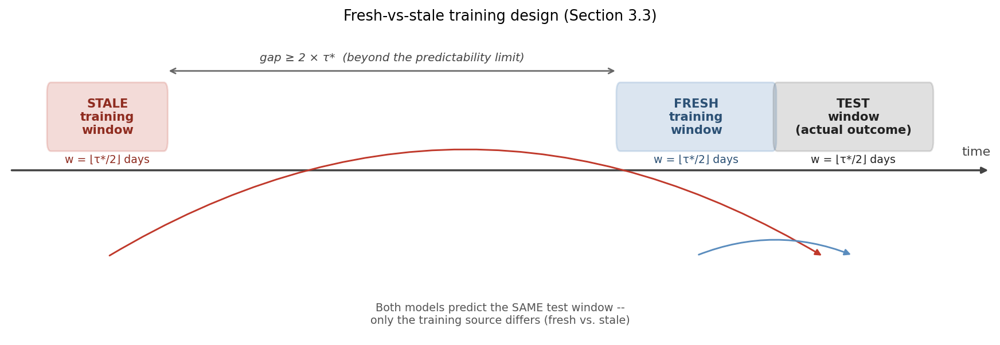

Before anyone tunes a single hyperparameter, every ML team answers a question they usually never write down: how much history should this model actually see? A year of data? Five? Whatever fit in the last training run? In my experience — across two very different fields now — that question gets answered by habit almost everywhere, and almost never by anything specific to the system being modeled.

I spent years of my PhD measuring how far ahead atmospheric turbulence stays predictable before it decorrelates into noise. Years later, in an unrelated line of quant research, I built the same measurement for financial markets — not by fitting a theory, but by directly, empirically clocking how many days ahead an instrument's own price dynamics stay genuinely connected to themselves before that connection fades. I reported that number as a finding. It sat in a paper for a while as a nice piece of market structure.

Then I did something with it I hadn't planned to: I deliberately built a model with zero regularization — designed to overfit its training window on purpose — and tested whether it still made sense of reality one window later. Trained on the most recent half of that predictability window, it tracked what actually happened, closely, across every instrument I could test it on. Trained on an equally-sized window of genuinely stale data, from well past that same limit, the same model visibly stopped making sense.

That's the whole paper: measure how long your own data stays self-similar, train on about half of it, and stop trusting anything trained from much further back. No p-values, no significance tests — just the prediction lines next to what actually happened, instrument by instrument, and you can see it yourself.

And here's the part I think is bigger than the finance angle: nothing in that mechanism refers to prices. It's a training-window rule for any AI/ML pipeline sitting on top of a non-stationary system — weather models, industrial sensors, recommender systems, epidemiological forecasts, anything where a team currently picks a lookback window because it's convention, not because they measured it. The idea already crossed one field boundary, from atmospheric science into markets. I don't see why it has to stop there.

Full preprint: https://zenodo.org/records/21482869
Code and all 12 instruments' curves: https://github.com/quantarram/quant-regime-research

Independent quantitative research. Not investment advice.
