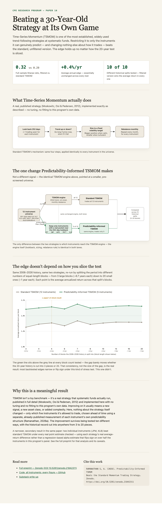

Most backtested edges don't survive being tested a different way — they narrow, or flip sign entirely, once you change how you're slicing the data. So I went back to last week's piece and stress-tested the headline result myself.

The paper's central claim: restrict Time-Series Momentum to only the instruments it can actually predict well, and it beats the standard version — full-sample Sharpe up from 0.29 to 0.32, winning 3 of 5 real historical blocks. That "3 of 5" is real, but it's also just one specific way of cutting 20 years of data into pieces. So I re-ran the whole comparison at 10 different block counts instead, from 3 large blocks down to 20 small ones. The win-count framing moved around a lot, sometimes above 50%, sometimes below. The actual size of the average edge didn't: Predictability-Informed TSMOM beat standard TSMOM's average annual return at every single split tested — 10 of 10 — and the gap barely changed size.

Interactive version + full methodology: https://quantarram.github.io/quant-regime-research/notebooks/paper16_pitsmom_infographic.html

Full piece: https://arunramanathans.substack.com/p/predictability-informed-momentum
