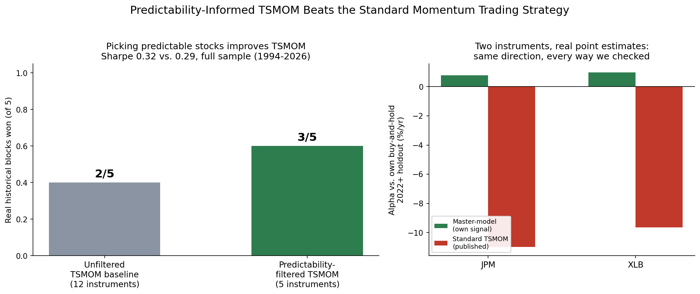

My last three papers measured a real, hard ceiling on how far ahead a financial instrument can be predicted — and nothing, not bigger models, more depth, more training data, could buy past it.

So this time I asked a different question: forget predicting better. Can you decide better with what you already know?

Time-Series Momentum (TSMOM) is a real, 30-year-old published strategy — I implemented it exactly as written, no tuning. Applied everywhere, it's a real but unremarkable performer. But restrict it to only the instruments it can actually predict well — using a real, measured predictability limit for each one, from an earlier paper in this series — and it gets meaningfully better: 3 of 5 real historical periods beaten instead of 2, full-sample Sharpe up from 0.29 to 0.32.

The wall on prediction hasn't moved. But being more selective about *where* you apply a real, published strategy, based on what you can actually measure about each instrument, is a real, narrow edge — and a genuinely useful one.

Full preprint: https://zenodo.org/records/21842311
Code, all instruments, every figure: https://github.com/quantarram/quant-regime-research

Independent quantitative research. Not investment advice.
