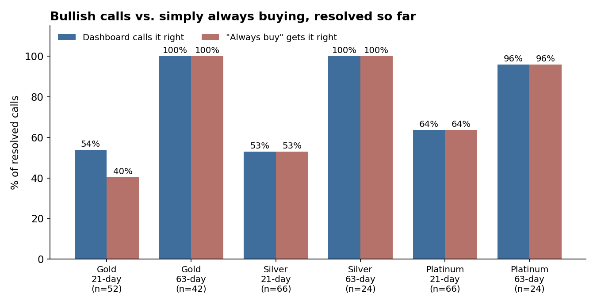
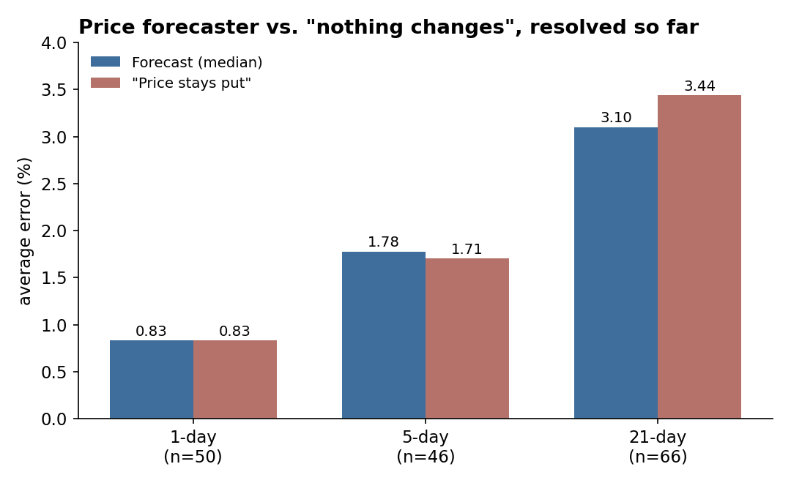
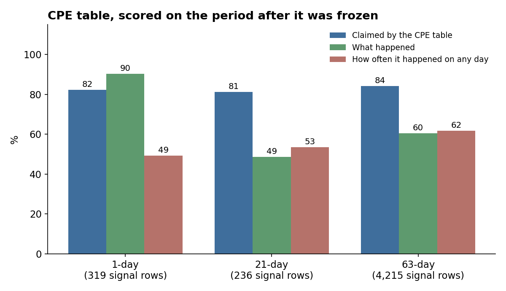

# I Built a Scorecard for My Own Dashboards. The Baselines Were the Interesting Part

My gold dashboard is 42 for 42 on its 63-day calls. I was ready to be insufferable about it.

Then I built a page that grades every dashboard I run, and it did the one rude thing a good grader does: it printed a baseline next to the number. The price of gold rose in all 47 of the 63-day windows that have resolved so far. "Always buy" scores 47 for 47. My signal's contribution to that perfect record was, charitably, moral support.

That is the whole idea of the page, and it changed how I read everything else I'd built. Here is what it shows, as of 7 October.

[Performance monitor: https://quantarram.github.io/quant-regime-research/notebooks/performance_monitor.html]

## Why a scorecard at all

I run six live dashboards: gold, precious metals, a multi-asset portfolio tilt, a 22-instrument price forecaster, a football checklist, and the CPE signal table that sits underneath most of them. Four of them already logged their calls and scored them when the time came. Then I realised the price forecaster was publishing forecasts every day and keeping none of them, and the CPE table had never been scored on anything it hadn't already seen.

So I fixed both. The forecaster's record is rebuilt from the archive of its own published pages, 1,120 forecasts since 17 July. The CPE table is scored on the period after it was frozen on 5 June. Then I put all six on one page, rebuilt every day, each next to the baseline that gives its number meaning: always buying, the neutral portfolio, a forecast that says the price stays put, the win rate the odds already imply.

## Gold and metals: the market did most of the work

For the gold dashboard, the 21-day bullish calls are right 54% of the time against 40% for always buying. That is the one place in this chart where the dashboard's calls clearly do something the drift doesn't. At 63 days, the price simply rose every time, so both columns say 100%.

The metals dashboard is more awkward. Silver and platinum have only ever called bullish, so their hit rates equal the share of windows where the price rose, by construction. The two bars in each pair are the same bar. Until the metals dashboard says something other than "buy", this page cannot tell it apart from a brick with BUY painted on it, and it says so.

## The forecaster and the tilt: small, and not nothing

Of the forecaster's 1,120 forecasts, 162 have resolved, covering four of its 22 instruments. At one and five days it is a tie with "the price stays put" (0.83% against 0.83%, 1.78% against 1.71%). At 21 days it is a little ahead, 3.1% against 3.4%, and its 80% bands caught 94% of outcomes, so they are a bit wider than they need to be. The other instruments are forecast 126 to 252 days out, so most of the forecaster's record doesn't exist yet. It will start arriving in January.

The portfolio tilt has resolved 49 windows. Averaged over them it made +7.01% against +6.83% for the neutral weights: ahead in 47 of the 49, by about 0.18 points on average. Winning almost every window by a hair is a very different claim from winning by a lot, and the page shows both numbers.

The football checklist is 7 for 7, at odds between 1.05 and 1.65, where the odds already imply winning about 85% of the time. Seven is too small a number to say anything with, and the page prints that too.

## CPE: claimed 84%, delivered 60%

This is the one I was most curious about. The CPE table says, for each pairing, "when predictor X is in its tail, the chance that target Y makes a big move over the next N days is about this much." The table only keeps claims of 80% or better. I log every time a predictor newly enters its tail after 5 June, which gives 23,332 events and 302,556 claims to score, and I count a claim as resolved once its horizon has passed.

At 63 days, 4,215 claims have resolved. The table claimed 84%. The big move happened 60% of the time. That sounds like a miss, but the bar on the right is the fair comparison: on any ordinary day in the same window, those same big moves were happening 62% of the time, because markets mostly rose. So at 63 days there is no edge over the period's own drift yet, in either direction (bullish 85% against an 87% base rate, bearish 44% against 44%). At 21 days it is 49% against 53%. The 1-day rows look great (90% against 49%), but 1-day claims are only 76 of the table's 169,357 rows, so I'm not reading anything into them.

What I can't tell you yet is whether the table works, because 96% of its claims run 126 to 300 days. The first of those close around 1 December, and most of the rest through 2027. This is the first test the table has ever faced on data it hadn't seen, and so far it has taken a small slice of the exam.

## What the page changed

I came away trusting the hit rates I'd quoted less, and the baselines more. A hit rate is only a number until you know what a coin, or a brick, or the market itself would have scored. Every panel on the page now has one, and the sample size next to it.

The page rebuilds every day, so the pending claims fill in as they come due, whichever way they go. Next check-in: December.

Full page: https://quantarram.github.io/quant-regime-research/notebooks/performance_monitor.html
Code and all the underlying data: https://github.com/quantarram/quant-regime-research

*Independent quantitative research. Not investment advice.*
