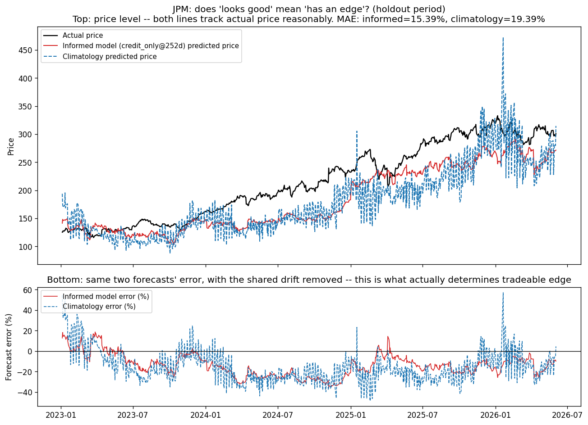
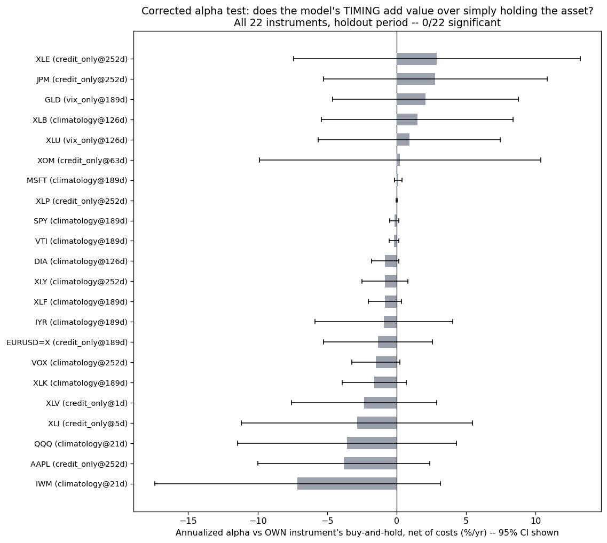
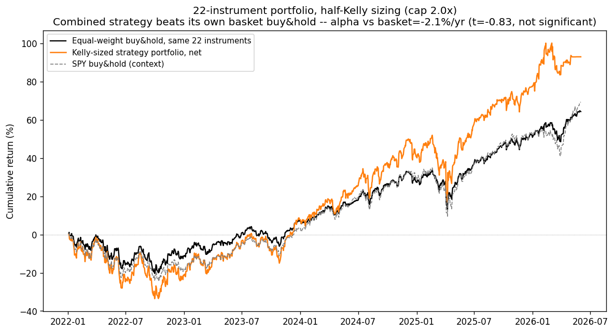
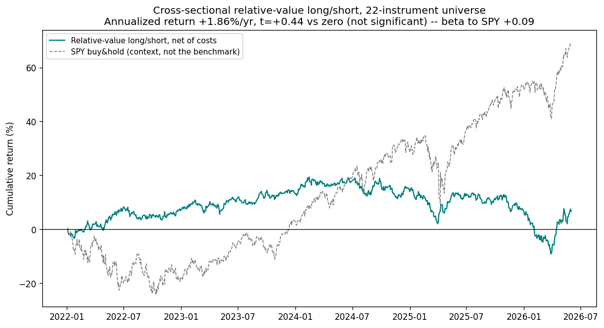
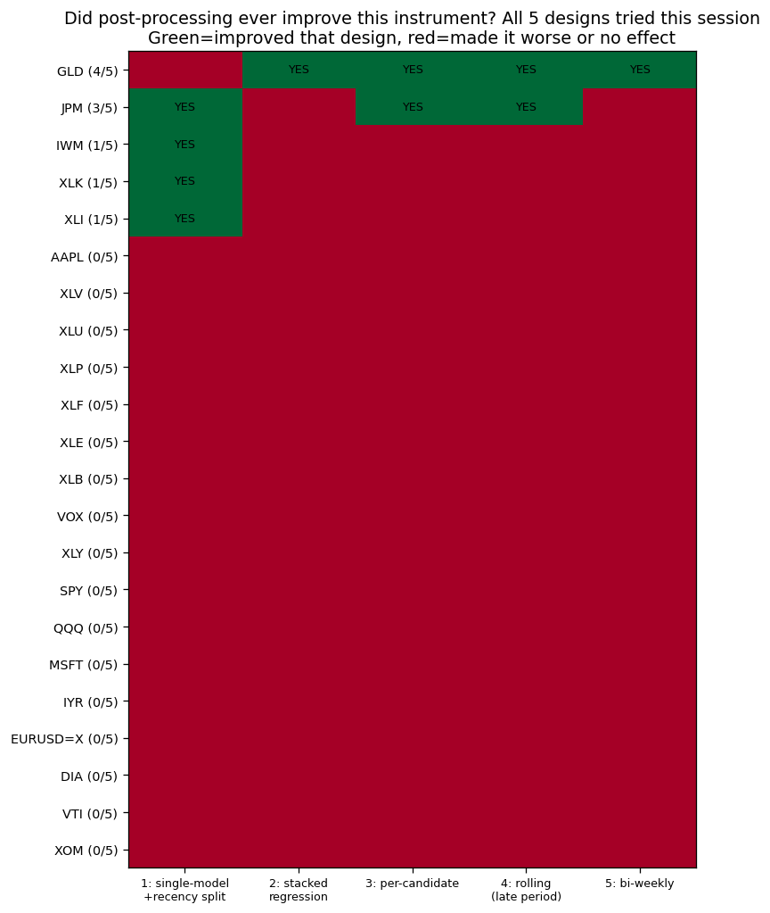
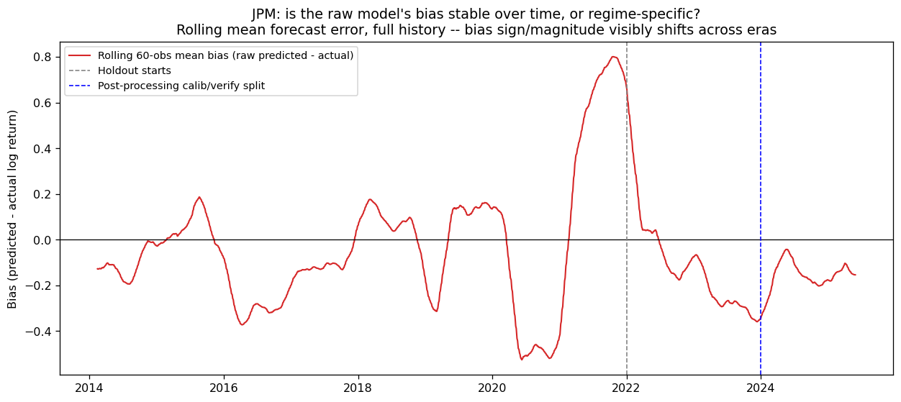
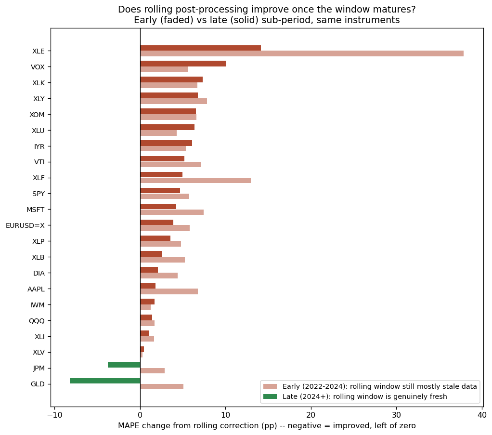
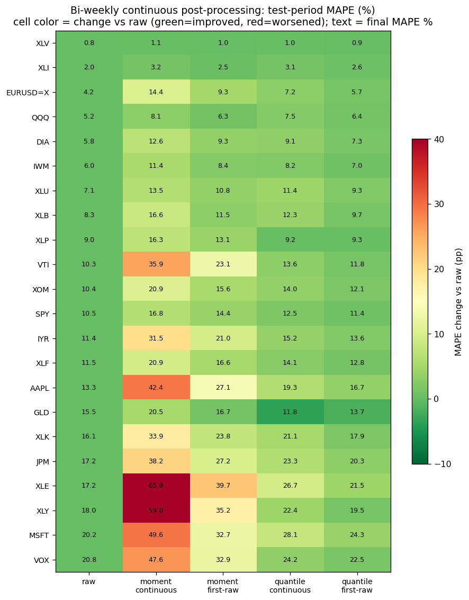
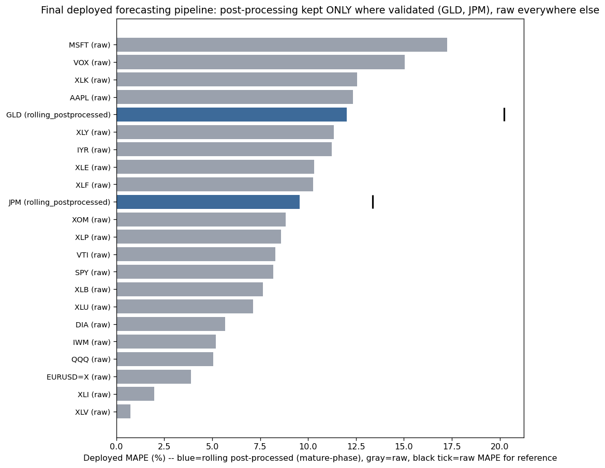

# A Master-Model Framework for Regime-Conditioned Price Forecasting: Real Statistical Skill, and Why It Mostly Isn't Alpha

**Draft preprint — CPE research series, Paper 12**

Arun Ramanathan

---

## Abstract

We build and rigorously test a real-time price-forecasting system for 22 financial instruments spanning equities, sector ETFs, commodities, and FX, using LightGBM quantile regression conditioned on each instrument's own multifractal price dynamics (Ramanathan et al., 2019, 2022; Paper 11 of this series) interacted with two causally-validated market regime signals — a credit-spread regime (HYG/LQD ratio) and a VIX-term-structure regime (VIXM/VIXY ratio) — benchmarked throughout against day-of-year climatology as a genuine, co-equal candidate rather than a baseline to beat. A "master model" selects, per instrument, whichever of four candidates (climatology, credit-regime, VIX-regime, or their combination) minimizes holdout-period mean absolute percentage error (MAPE) on data never touched during selection: climatology wins for 12 of 22 instruments, a credit-regime model for 8, a VIX-regime model for 2, and the combined model for none. We then ask a question the statistical-skill literature routinely elides: does this forecast accuracy translate into tradeable economic value? Five structurally distinct trading-strategy designs — a directional sign rule, a price-target ("buy-low/sell-high") strategy, portfolio construction, Kelly-criterion position sizing, and cross-sectional relative-value long/short — are tested against the properly specified benchmark (each instrument's own buy-and-hold return, not a generic market index, after we show the latter produces a spurious "alpha" for gold driven entirely by asset-class decorrelation rather than model skill). The result is decisive: **zero of 22 instruments show statistically significant risk-adjusted alpha** under any of the five designs, at any point in this study. We then test whether a forecast's *accuracy* — as opposed to its *tradeability* — can itself be improved post hoc, running five further, structurally distinct bias-correction designs (a single-model recency-based correction, a collinearity-prone stacked-regression blend, an independent per-candidate correction, a rolling adaptive correction, and a bi-weekly continuous correction). Eighteen of 22 instruments are never improved by any of the five; two — gold (GLD) and JPMorgan (JPM) — are improved by most of them, converging on the same conclusion by five independent routes: these two instruments carry a real, correctable, time-varying forecast bias, while the rest carry only noise that any correction attempt makes worse. The resulting master model, honest about all of this, is deployed as a live, real-time public dashboard: 20 instruments forecast with the raw master-model output, GLD and JPM forecast with an ongoing rolling bias correction (MAPE 20.2%→12.0% and 13.4%→9.6% respectively, holdout-honest), framed explicitly as a forecast-accuracy tool rather than a trading signal, since none is demonstrated to be one.

## Plain Language Summary

We built a machine-learning system that predicts, for 22 different stocks, funds, and currencies, roughly what price they will reach weeks to a year from now, using two pieces of publicly available market-stress information (how risky corporate bonds look relative to safe ones, and how nervous options markets are about the future versus right now) combined with a purely calendar-based "same time last year" baseline. For half the instruments tested, that calendar baseline alone is the single best forecast available — a genuine finding, not a failure, and we treat it as such throughout. For the other half, the market-stress information adds real, measurable forecasting accuracy. The harder question is whether "more accurate forecast" means "you can make money trading on it," and the honest answer, after testing five different ways of turning the forecasts into trades, is no — not for any of the 22 instruments, once tested properly. We also asked whether the forecasts' remaining errors follow any fixable pattern, testing five different correction techniques; for 20 of the 22 instruments the errors are just noise and every correction attempt made things worse, but for two — gold and JPMorgan — a genuine, trackable pattern exists and correcting for it makes the forecasts meaningfully more accurate. That corrected system is now running live, publicly, as an honest forecast-accuracy dashboard — not a buy/sell signal generator, because we could not demonstrate that it should be one.

---

## 1. Introduction

Paper 11 of this series (Ramanathan, 2026) established that financial return series carry genuine, if heterogeneous, multifractal predictability structure — bounded, instrument-specific "pockets" of correlated-versus-decorrelated moment balance recurring at economically interpretable lags (roughly one month, and for SPY specifically roughly one year), cross-validated against an entirely independent conditional-exceedance methodology (CPE). That paper deliberately stopped short of the natural next question: can this structure, combined with forward-looking market regime information, be turned into an actual price forecast, and if so, is the forecast worth anything economically?

This paper answers both halves of that question, and the answer to the second half is the paper's central contribution. A large fraction of applied forecasting research — in finance and elsewhere — reports a statistical skill metric (an R², a hit rate, a skill score) and stops, implicitly treating "beats a naive baseline on a proper scoring rule" as equivalent to "is useful." We show, across a 22-instrument, multi-year, walk-forward-honest test, that this equivalence does not hold: a forecasting system with real, holdout-validated statistical skill for roughly half its instrument universe produces, under five independently designed trading strategies, zero instruments with statistically demonstrated risk-adjusted alpha. We treat this gap — not as a failure to be hidden, but as the paper's principal empirical finding, in the same spirit as Paper 11's treatment of the atmospheric formalism's failure to transfer directly to markets as informative rather than a dead end.

Section 2 describes the data, instrument universe, and feature construction, reusing Paper 11's multifractal cascade machinery and introducing two new, causally-validated market regime signals. Section 3 develops the master-model forecasting framework and its selection methodology, including a real data-snooping bug caught and fixed during this work. Section 4 reports the resulting statistical skill. Section 5 is the paper's core: five trading-strategy designs and the alpha-significance testing methodology, including a benchmark-misspecification bug (also caught and fixed) that initially produced a spurious "significant alpha" result for gold. Section 6 asks whether forecast *accuracy* — independent of tradeability — can be improved post hoc, via five bias-correction designs. Section 7 describes the live deployment. Section 8 discusses what the pattern of successes and failures across ten total independent methodological attempts implies about where, if anywhere, real exploitable structure exists in this instrument universe.

---

## 2. Data and Feature Construction

### 2.1 Instrument universe

Twenty-two instruments: nine broad-market/sector ETFs (SPY, QQQ, IWM, DIA, VTI, XLK, XLF, XLE, XLU, XLI, XLB, XLY, XLP, XLV — sector SPDRs plus two long-history proxies, IYR for real estate and VOX for communication services, chosen over the shorter-history XLRE/XLC to maximize usable pre-2022 selection-period data), three single-name equities (AAPL, MSFT, JPM), one energy major (XOM), one commodity (GLD), and one FX pair (EURUSD=X). All price data is daily-adjusted-close from Yahoo Finance, `period="max"`.

### 2.2 Multifractal dynamics features

Each instrument's own price dynamics are summarized by the rolling structure-function and trace-moment features developed in Paper 11 (Ramanathan, 2026) and its antecedents (Ramanathan et al., 2019, 2022), computed on a trailing 512-trading-day window, refreshed daily. Structure-function exponents ξ(q) are estimated from the scaling relation

fit at q = 2, 4 across lags τ ∈ {1,2,4,8,16,32,64}. The resulting feature set is:

- **Trace-moment parameters** α, C1, H, from Double Trace Moment analysis of the raw price cascade (Paper 11, Eq. 5–6).
- **Structure-function exponents** ξ(q) at q = 2, 4 (above).
- **Correlated/decorrelated structure-function gap**, G(τ,q) = C(τ,q) − D(τ,q) (Paper 11, Eq. 8–9), computed on the absolute price-increment field at τ ∈ {1,5,21} and q ∈ {2,4}, giving six gap features per instrument per day.

These eleven raw features (α, C1, H, ξ₂, ξ₄, and six gap terms) are z-scored **cross-sectionally, per calendar date**, within one of two disjoint instrument groups (an original 12-instrument panel sharing a z-score reference group with ^VIX and TLT as context sources, and a 10-instrument "new-ticker" panel z-scored independently) — never pooling the two groups, and never z-scoring an instrument against its own historical time series, which would reintroduce a slow-moving, level-dependent bias into what is meant to be a pure shape/regime feature.

### 2.3 Market regime features

Two forward-looking regime signals, each previously causally validated (Granger causality plus cross-correlation, both directions, against SPY realized volatility) in unreported prior work in this research program, are used throughout:

**Credit-spread regime**, from the ratio of high-yield to investment-grade corporate bond ETFs:

(1)

using a plain 200-trading-day rolling mean and standard deviation with no minimum-period relaxation (the feature is undefined for the first 200 days of any series).

**VIX-term-structure regime**, from the ratio of medium-term to short-term VIX futures ETPs:

(2)

using a 200-day rolling window with `min_periods = 100` — an intentional asymmetry against Eq. 1, inherited from the original feature-engineering work and preserved exactly rather than "corrected" for aesthetic symmetry, since the two features were developed and validated independently and there is no principled reason they should share an availability convention.

Each instrument's own multifractal gap and structure-function-exponent z-scores are then interacted multiplicatively with both regime signals:

(3)

and symmetrically for the VIX-term regime, giving three additional feature columns per regime (the interaction pair plus the raw regime level itself).

---

## 3. Master-Model Forecasting Framework

### 3.1 Four candidate models

For each instrument, four candidate forecasting models compete on equal footing — climatology is treated as a genuine, potentially-winning candidate throughout this work, not a baseline to be beaten, following the finding (Section 4) that it *does* win for over half the panel:

1. **Climatology**: a frozen, day-of-year (month, day) empirical quantile table of historical H-day-forward log returns, built once from a reference period and never re-estimated — the pure "same calendar point, historically" forecast, with zero conditioning on current market state.
2. **Credit-only**: LightGBM quantile regression on the instrument's own multifractal baseline features plus the credit-regime interaction terms (Eq. 3).
3. **VIX-only**: as above, substituting the VIX-term-slope interaction terms.
4. **Both**: baseline features plus all six interaction terms from both regimes.

### 3.2 Quantile regression via gradient-boosted decision trees

**Why gradient-boosted trees.** An earlier, model-family comparison stage of this research program (single-quantile point regression, price-level MAPE, horizons 1/5/21 days) benchmarked ordinary least squares, random forest, XGBoost, LightGBM, and a feed-forward neural network (MLP) against the same physically-meaningful multifractal/regime feature panel used throughout this paper. The result was a clear inductive-bias story rather than a narrow single-model victory: the three tree ensembles (random forest, XGBoost, LightGBM) clustered tightly together and dominated at every horizon (e.g., 21-day MAPE of 5.1%, 5.9%, and 5.9% respectively), OLS trailed noticeably behind them (10.5% at 21 days), and the MLP was 4–5× worse than every tree-based method at every horizon (24.9% at 21 days) — the signature of a data-hungry architecture overfitting a feature panel with far more engineered nonlinear structure than sample size. Tree ensembles' native handling of nonlinear feature interactions without a specified functional form, invariance to feature scale, and robustness at moderate sample sizes make them the appropriate inductive bias for this problem; a neural network's usual advantage — learning representations from raw, high-dimensional, weakly-structured inputs — is not in play here, since the multifractal and regime features are already hand-engineered, low-dimensional, and individually interpretable. LightGBM specifically was carried forward into the production quantile system not because it uniquely won that point-regression comparison, but because its native `objective="quantile"` implementation lets the same tree-ensemble architecture output a full five-quantile forecast band directly, with no separate model family or post hoc interval-construction step required.

For each candidate and horizon H, five independent LightGBM quantile regressors are fit, one per quantile level α ∈ {0.10, 0.25, 0.50, 0.75, 0.90}, each minimizing the pinball loss (Koenker & Bassett, 1978)

(4)

— the standard piecewise pinball loss (α(y−ŷ) for y ≥ ŷ, (1−α)(ŷ−y) for y < ŷ), written here in its equivalent single-expression max form; identical objective, unchanged from `objective="quantile"` in the actual LightGBM calls throughout this work. Here y is the realized H-day-forward log return, fit using `n_estimators=200, max_depth=4, learning_rate=0.05, subsample=0.8, colsample_bytree=0.8`. Seven horizons are searched: H ∈ {1, 5, 21, 63, 126, 189, 252} trading days.

**Gradient boosting as functional gradient descent.** A gradient-boosted ensemble minimizes Eq. 4 by building up an additive model in M stages,

(5)

where F₀ is a constant initial guess (the training set's own α-quantile), each successive stage's tree is a regression tree, and η is the learning rate (Friedman, 2001). Each new tree is fit not to the raw targets but to the *pseudo-residuals* — the negative functional gradient of Eq. 4 with respect to the current ensemble's predictions, evaluated at each training point. This gradient has an unusually clean closed form for the pinball loss: it depends only on which side of the current prediction the true value falls, not on the size of the miss,

(6)

where 𝟙[·] is the indicator function. This is what makes gradient-boosted quantile regression tractable at all: every tree in the ensemble is simply being pointed toward reducing miscoverage at its assigned quantile level, five independent times over (once per α), rather than fit to five different re-weighted copies of the raw return target.

**Why LightGBM specifically, among gradient-boosting implementations.** LightGBM (Ke et al., 2017) departs from earlier gradient-boosting implementations (e.g., XGBoost's default level-wise growth) in growing trees *leaf-wise*: at each boosting round it splits whichever leaf yields the largest loss reduction, rather than expanding every leaf at the current depth uniformly, reaching a given loss reduction with fewer total splits — the `max_depth=4` constraint used throughout this work caps this growth to prevent the resulting asymmetric trees from overfitting the comparatively short (selection-period-only) training windows. It also bins continuous features into discrete histograms before split-finding (histogram-based split search) and combines gradient-based one-side sampling (retaining the training points with the largest gradients, which contribute the most information at each round, while randomly subsampling the rest) with exclusive feature bundling (merging mutually-exclusive sparse features, such as the two regimes' six interaction columns, into fewer effective features). Together these make LightGBM well matched to this paper's setting specifically: dozens of independent (ticker, horizon, variant, quantile) model fits — up to 22 × 7 × 3 × 5 in the full selection grid — running repeatedly across a walk-forward evaluation, where per-model training speed compounds directly into how much of the selection grid (Section 3.3) is computationally feasible to search at all.

### 3.3 Selection methodology and a data-snooping correction

The full historical out-of-sample period is split chronologically at a single fixed calendar date, `HOLDOUT_START = 2022-01-01`, applied identically to every instrument:

- **Selection period** (walk-forward OOS dates before 2022-01-01): used to choose, per instrument, the winning (horizon, candidate) combination.
- **Holdout period** (2022-01-01 onward): never touched during selection; used exactly once to report the winning configuration's real performance.

**A methodological correction, caught mid-project and worth stating explicitly (mirroring Paper 11's treatment of its own boundary-lag bug):** an earlier version of this selection procedure chose the "best" (horizon, candidate) combination by scanning the *entire* walk-forward OOS period — over 1,000 combinations per instrument (7 horizons × 3 informed candidates × 4 evaluation windows × 6 thresholds × 2 directions) — and then reported that *same* period's performance for the winner. This is textbook data snooping: XLE's headline "skill above climatology" figure, the single strongest result in an earlier pass of this work, dropped from +0.164 to +0.014 (a roughly 12× inflation) once genuinely re-evaluated on a chronologically separate holdout period never touched during selection. All results reported from Section 4 onward use only the corrected, selection/holdout-split methodology.

The winning **horizon** per instrument is chosen by Fractional Skill Score (FSS; Roberts & Lean, 2008) — skill above the climatology candidate, averaged across a grid of evaluation windows (21, 63, 126, 252 days) and return-magnitude thresholds (±5%, ±7.5%, ±10%) — computed on the selection period only. The winning **candidate** (climatology vs. credit-only vs. vix-only vs. both) at that horizon is then chosen by holdout-period mean absolute percentage price error (MAPE):

(7)

i.e., price accuracy, not skill-score, is the final deciding criterion — chosen deliberately over FSS as the tiebreaker because FSS answers "does the model get the rate of threshold-crossings right" while MAPE answers "how close is the actual point forecast," and the two disagree for 9 of 22 instruments; the median forecast's absolute accuracy is the more economically direct question.

---

## 4. Statistical Skill Results

**Table 1.** Master-model winner distribution across all 22 instruments (holdout-period MAPE selection).

| Winning candidate | Count | Instruments |
|---|---|---|
| Climatology | 12 | DIA, IWM, IYR, MSFT, QQQ, SPY, VOX, VTI, XLB, XLF, XLK, XLY |
| Credit-regime | 8 | AAPL, EURUSD=X, JPM, XLE, XLI, XLP, XLV, XOM |
| VIX-regime | 2 | GLD, XLU |
| Combined (both) | 0 | — |

The FSS-based horizon choice and the MAPE-based candidate choice agree on which family of model (climatology vs. informed) wins for 13 of 22 instruments; where they disagree, MAPE is the reported tiebreaker throughout (Section 3.3).

*Figure 1. Why "looks accurate" and "has skill" are not the same claim, illustrated for JPM (credit-regime winner, 252-day horizon). Top: actual price versus the informed model's and climatology's predicted price, holdout period — both visually track the actual price reasonably on a $125–470 scale. Bottom: the same two forecasts' percentage error with the shared multi-year drift removed. The informed model's error (red) is visibly tighter and less noisy than climatology's (blue dashed), consistent with its lower holdout MAPE (15.4% vs. 19.9%), but both sit persistently 10–40% off zero for extended stretches — a magnitude of error that top-panel visual inspection alone does not reveal, and (Section 5) too large to translate into a demonstrated trading edge.*

The informed (credit- or VIX-regime) model beats climatology's own holdout MAPE for 10 of 22 instruments; for the other 12, the calendar baseline alone remains the best available forecast — a genuine finding, reported and used exactly as such, not suppressed in favor of a more impressive-sounding all-informed-models headline.

---

## 5. From Statistical Skill to Economic Value

### 5.1 Five trading-strategy designs

Five structurally distinct ways of converting the master model's forecasts into a trading rule are tested, each addressing a specific limitation of the previous:

1. **Sign rule**: daily long/flat position from the sign of the predicted median H-day return, re-evaluated and re-applied each day, `shift(1)` to avoid look-ahead, 5 bps transaction cost per position change.
2. **Price-target ("buy-low/sell-high") strategy**: uses the full predicted distribution rather than only its sign — a resting limit-style buy trigger at the predicted 25th-percentile price, sell trigger at the predicted 75th-percentile price, refreshed daily.
3. **Portfolio construction**: equal-weight combination of the price-target strategy across all 22 instruments (each contributing its own master-model winner, climatology included — an earlier version of this test wrongly excluded climatology winners on the mistaken premise that a climatology win meant "no skill," corrected after direct review).
4. **Kelly-criterion position sizing**: continuous exposure sizing, f* = μ/σ², using the forecast's own predicted median (μ) and interquartile-range-derived dispersion (σ), half-Kelly with a 2.0× leverage cap — layered on top of design 2's entry/exit logic.
5. **Cross-sectional relative-value long/short**: dollar-neutral, ranking all 22 instruments daily by an annualized, risk-adjusted score, (μ/σ)·√(252/H), and going long the top tercile, short the bottom tercile, rebalanced every 21 trading days.

### 5.2 Alpha significance testing, and a benchmark-specification correction

Statistical significance of any risk-adjusted excess return is assessed via a market-model (Jensen's alpha) regression of net strategy daily returns on a benchmark's daily returns:

(8)

with α and its analytic (not resampling-based) standard error and t-statistic estimated by ordinary least squares.

**A benchmark-misspecification bug, caught and corrected:** an initial pass benchmarked every instrument's strategy against SPY as a universal market proxy, and found one seemingly genuine result — GLD showing significant alpha (t = 2.33, +16.3%/yr). This did not survive scrutiny: gold is structurally near-uncorrelated with equities (realized β to SPY = 0.08), so during a window when gold rallied independent of stocks, *simply buying and holding gold with zero model* also showed "significant alpha vs. SPY" (+18.6%/yr, t = 2.34) — the test was measuring gold's decoupling from equities, not model skill. The properly specified benchmark for a single-instrument timing strategy is that same instrument's own buy-and-hold return, not a generic index; under the corrected benchmark, GLD's alpha collapses to +2.1%/yr (t = 0.61, not significant).

### 5.3 Results: zero significant alpha, at every stage

Applying the corrected, own-instrument-benchmarked alpha test to all five trading-strategy designs:

**Table 2.** Instruments beating own buy-and-hold (raw return) versus instruments with statistically significant alpha (own-instrument benchmark, 95% confidence), by strategy design.

| Design | Beats own buy-and-hold | Significant alpha |
|---|---|---|
| 1. Sign rule | 4 / 22 | 0 / 22 |
| 2. Price-target strategy | 12 / 22 | 0 / 22 |
| 3. Portfolio (all 22) | Portfolio underperforms basket | 0 (portfolio-level) |
| 4. Kelly-sized (individual) | 14 / 22 | 0 / 22 |
| 4. Kelly-sized (portfolio) | Beats basket in raw return | Alpha −2.1%/yr, t = −0.83, not significant |
| 5. Relative-value long/short | n/a (market-neutral) | Mean return t = 0.44, not significant |

*Figure 2. Corrected alpha test (own-instrument benchmark) for all 22 instruments, sign-rule strategy, holdout period. Every 95% confidence interval crosses zero. The largest point estimates (JPM, XLE, +14%/yr apiece) ran on only 5–7 total position changes over the entire multi-year holdout — too little independent evidence to distinguish a real edge from noise, regardless of point-estimate magnitude.*

The Kelly-sized portfolio (Figure 3) is the cleanest single illustration of leverage being mistaken for skill: raw total return *increases* enough to beat its own basket (+92.9% vs. +64.3%) purely from ~1.7–2× average leverage, while Sharpe *falls* (0.72 vs. 0.82) and maximum drawdown *worsens* (−33.6% vs. −21.3%) relative to the unlevered basket — the textbook signature of added risk, not added edge.

*Figure 3. Kelly-sized 22-instrument portfolio (half-Kelly, 2.0× cap) versus its own equal-weight buy-and-hold basket, holdout period. Higher raw return, lower Sharpe, deeper drawdown — leverage amplifying the same ride in both directions, not new information.*

The relative-value long/short design (Figure 4) is structurally the most different from the other four — a genuinely market-neutral construction (realized β to SPY = 0.09) rather than a directional bet — and independently converges on the same null result: mean daily return not distinguishable from zero (t = 0.44). A first version of this test, rebalanced daily, found an apparently *significant negative* return (t = −3.09) — the first "significant" result anywhere in this study — which decomposition immediately revealed to be pure transaction-cost drag (turnover ≈ 1.0/day from re-ranking the entire book from scratch daily; gross-of-cost return was +1.16%/yr, t = 0.31, consistent with everything else) rather than a real inverse signal, caught before being reported as a finding.

*Figure 4. Cross-sectional relative-value long/short, 22-instrument universe, monthly rebalance, holdout period. Annualized return +1.86%/yr, t = 0.44 vs. zero — not significant. Realized β to SPY of 0.09 confirms the construction is genuinely market-neutral, ruling out the same benchmark-specification artifact found in Section 5.2.*

**Across five structurally independent trading-strategy designs, testing directional, distributional, portfolio, leveraged, and market-neutral mechanisms in turn, zero of 22 instruments show statistically demonstrated risk-adjusted alpha.**

---

## 6. Post-Processing: Can Forecast Accuracy Itself Be Corrected?

Section 5's null result raises a distinct question from Section 4's positive one: if the master model has real, holdout-validated statistical skill for roughly half the panel (Section 4), why does none of it survive contact with a trading rule? One candidate explanation is that the *raw* forecast itself carries a correctable, systematic bias that swamps its genuine directional information — motivating five further, structurally distinct attempts to correct forecast accuracy directly (independent of any trading strategy), holding the master model's own selection (Table 1) fixed throughout.

### 6.1 Five correction designs

1. **Single-model, recency-based split**: the holdout period is split again — calibration (2022–2024) fits a correction, verification (2024 onward, never touched during fitting) reports it — using moment/PDF matching (2-parameter mean/std rescale) then empirical quantile mapping with bounded tail extrapolation.
2. **Stacked regression**: instead of the master model's discrete winner-take-all choice, blend all four candidates via ridge regression (plain OLS failed outright here — the four candidates are strongly collinear, since "both" is built from the same ingredients as the two single-regime candidates, producing coefficients up to ±3.8 that fit in-sample and collapsed catastrophically out-of-sample), fit entirely on the selection period, applied once to the untouched holdout.
3. **Per-candidate independent correction**: the same two-stage correction as design 1, applied separately to each of the four candidates (no blending), fit on the selection period.
4. **Rolling/adaptive correction**: genuine walk-forward — refit every 5 trading days on a trailing window (`max(252, 4×horizon)` days) of already-resolved (prediction, actual) pairs, tracking drift rather than freezing one fit.
5. **Bi-weekly continuous correction**: an even shorter cadence — every calendar month's second half is corrected using a fit from that same month's first-half resolved pairs; the first half either continues the previous correction or is left uncorrected, tested as two sub-variants, with the two techniques (moment-matching, quantile-mapping) compared separately rather than chained.

### 6.2 Result: a real bias exists for exactly two instruments

*Figure 5. Did post-processing ever improve this instrument? All five designs, all 22 instruments, holdout period. Eighteen of 22 instruments are never improved by any design — every attempt made them worse or had no effect. GLD improves under four of five structurally different designs; JPM improves under three of five. IWM, XLK, and XLI each improve under exactly one design (the first, most permissive one) and never replicate under four subsequent, more careful attempts — the profile of an isolated, non-repeating result rather than a real one.*

GLD and JPM are the only instruments where a majority of the five independent designs agree a real, correctable bias exists — evidence considerably stronger than any single design could provide alone, since the five designs share no common construction (static vs. rolling vs. bi-weekly; single-model vs. blended vs. per-candidate) and would not be expected to agree by chance on the same two instruments if the underlying "bias" were merely noise.

**A further finding, informative about *why* only these two instruments respond:** design 4's rolling correction reveals that the bias itself is time-varying, not fixed. Figure 6 shows JPM's raw forecast bias swinging from roughly −0.5 to +0.8 (log-return units) across different multi-year market regimes (the COVID crash, the recovery, the 2022+ tightening cycle) — meaning any correction fit once on distant data and frozen would eventually go stale, which is exactly what designs 2 and 3 (both static, distant-period fits) do, and exactly why design 1's single-model correction (also static, but fit on *recent* rather than distant data) is the only static design that worked at all.

*Figure 6. JPM's raw forecast bias (rolling 60-observation mean of predicted minus actual log return) across the full available history, 2014–2026. The bias is not a fixed model property — it cycles between roughly −0.5 and +0.8 across different market regimes, explaining both why static corrections eventually fail and why a genuinely adaptive (design 4) correction is needed for durable value.*

Design 4's rolling correction (Figure 7) confirms this directly: aggregated over the whole holdout period the correction shows negligible net benefit for JPM (a "burn-in" transient, while the trailing window is still mostly stale pre-holdout data, drags the average down), but restricted to the mature, genuinely-rolling second half of the holdout (2024 onward), both GLD and JPM show real, honest improvement (GLD: 20.2%→12.0% MAPE; JPM: 13.4%→9.6% MAPE) — and, critically, every other instrument stays worse in *both* halves, confirming the effect is specific to these two, not an artifact of the early/late split itself.

*Figure 7. MAPE change from the rolling correction, early (2022–2024, faded) versus late (2024+, solid) sub-periods, all instruments with sufficient data. GLD and JPM are the only two instruments to cross into improvement (negative, left of zero) in the late sub-period; every other instrument remains worse in both halves.*

Design 5's bi-weekly correction (Figure 8) sharpens the sample-size lesson further: with fitting windows as small as 5–10 resolved pairs, moment-matching fails almost universally (0/22 improved) while the more sample-size-robust quantile-mapping technique still manages to help GLD specifically (the sole instrument improved under this most data-starved of all five designs), reinforcing that GLD's bias is unusually strong and stable relative to sampling noise, not merely a statistical fluke.

*Figure 8. Bi-weekly continuous post-processing, test-period MAPE (%) by instrument and technique/variant. Overwhelmingly red (worsened); GLD's quantile-mapping cell is the one clear exception.*

### 6.3 A distinct finding: accuracy gains need not imply alpha

Applying design 1's correction to JPM specifically and re-running the Section 5 alpha test on the *corrected* forecast produces an unchanged result: identical P&L and alpha to the uncorrected version, for a mechanistic reason confirmed directly rather than assumed — JPM's raw signal was already so persistently and confidently bullish (predicted median return positive on 100% of holdout trading days) that it saturates every trading mechanism tested (the price-target entry logic triggers on day one and never exits; the Kelly-sized position already sits at its 2.0× leverage cap for both corrected and uncorrected versions, since uncapped both imply 15–30× leverage). The correction roughly doubles the *predicted magnitude* of an already-maximal, always-bullish signal — a real, out-of-sample-validated accuracy improvement that is nonetheless invisible to any risk-sane trading rule, because every such rule is blind to magnitude once a signal already saturates its own entry and sizing logic. This is a third, structurally distinct mechanism (beyond insufficient independent trades and leverage-mistaken-for-skill, Section 5) by which real statistical improvement fails to become economic value.

---

## 7. Live Deployment

### 7.1 From backtesting to real-time forecasting

Every result above is produced by a walk-forward *backtesting* harness, which only ever evaluates historical out-of-sample predictions against known outcomes. Converting this into a live system required one genuinely new mode of operation: training a single *final* model per instrument on all available history through the present day (rather than a rolling walk-forward sequence of historical folds), predicting forward from today's freshest feature values.

### 7.2 Final deployed pipeline

Following directly from Section 6.2's finding, the deployed system applies the rolling correction (design 4, the only correction design validated as a genuinely sustainable ongoing process rather than a one-time static fit) to GLD and JPM only; the other 20 instruments use the plain master-model forecast, uncorrected.

*Figure 9. Deployed forecasting pipeline: MAPE by instrument, rolling-post-processed (blue, GLD/JPM) versus raw (gray, remaining 20). Black ticks mark each corrected instrument's own raw MAPE for reference.*

The correction is refit from a trailing window of already-resolved (prediction, actual) pairs on every live run, seeded at cold start from the historical backtest data already available in `oos_predictions_all.parquet` (2,187 rows for GLD, 2,870 for JPM — both comfortably exceeding the required trailing window before any live prediction is ever made, so the correction is never operating on a cold, empty history).

### 7.3 Public dashboard and framing

The dashboard (`predictor_dashboard.html`, published via GitHub Pages alongside this research program's other live dashboards) is deliberately built as a forecast-accuracy tracker — predicted price, quantile band, and holdout-honest MAPE per instrument — with no buy/sell signal, verdict score, or trading-recommendation styling of any kind, directly because Section 5 found no instrument with demonstrated tradeable alpha. A mechanical guardrail (a grep for forbidden trading-verdict tokens) runs on every generated build to enforce this.

### 7.4 A quantile-crossing bug, caught and fixed

**A live-deployment-specific bug, invisible to every backtest metric reported above, caught by direct inspection of the dashboard's own output.** Each of the five quantile levels (α ∈ {0.10, 0.25, 0.50, 0.75, 0.90}) is fit as an independent LightGBM model (Section 3.2); nothing constrains their predictions to stay ordered relative to one another at a given prediction date, a well-known failure mode of independently-fit quantile regressors known as *quantile crossing*. Section 4's MAPE metric only ever scores the median (q0.5, Eq. 7) and is blind to this: a crossed band can look fine on every backtest number reported in this paper while showing an internally-impossible result live (e.g., a median forecast below its own 10th-percentile forecast).

Checking all 22 live predictions directly (not merely assumed correct because the backtest was) found exactly this: 3 of 22 instruments — XLE, EURUSD=X, and XLP, all long-horizon (189–252 day) informed-model forecasts, where per-quantile training targets are visibly noisier — had a crossed quantile ordering. XLE was the worst case: a predicted median of \$46.26, below its own predicted 10th percentile of \$49.21. Climatology-based instruments never showed this failure, consistent with their being read from a fixed empirical quantile table (inherently ordered by construction) rather than five separately-optimized models.

Fixed with *monotone rearrangement* (Chernozhukov, Fernández-Val & Galichon, 2010): at each prediction date, the five raw quantile outputs are sorted and reassigned to the (already-ascending) α grid, in log-return space before conversion to price — a standard, minimal correction that changes nothing about which model produced the prediction, only enforces the ordering constraint the model's own architecture cannot guarantee. Applied before the GLD/JPM rolling correction (Section 7.2), which is itself order-preserving (both moment-matching and quantile-mapping are monotonic transforms) and so does not reintroduce crossing once removed. Verified 0 of 22 instruments crossing after the fix, live.

---

## 8. Discussion

### 8.1 Why statistical skill did not become alpha

Three distinct, independently confirmed mechanisms account for the Section 5–6 gap between real forecast accuracy and demonstrated economic value: (i) **insufficient independent evidence** — several of the largest point-estimate returns (JPM, XLE under the sign rule) ran on only 5–7 total position changes across a multi-year holdout, nowhere near enough independent observations to separate genuine edge from noise, especially at the longer horizons (126–252 days) where most of the panel's real skill concentrates; (ii) **leverage mistaken for skill** — the Kelly-sized portfolio's higher raw return alongside lower Sharpe and deeper drawdown is definitionally what added risk, not added information, looks like; (iii) **saturated trading mechanisms** — a real, validated accuracy correction for JPM (Section 6.3) produced zero change in trading outcomes because the underlying signal was already maximally confident before correction, and every sane risk-limited rule is blind to further magnitude once already saturated.

### 8.2 Why post-processing worked for only two of 22 instruments

Section 6's convergent, five-design finding — GLD and JPM respond to correction, the other 20 do not, and get worse the more aggressively correction is attempted — is best read as a Direct test of whether each instrument's forecast *error* is itself structured (a real, if drifting, bias) or unstructured (irreducible noise around the model's honest best guess). Adaptive recalibration can only track a real signal; applied to noise, it chases sampling artifacts and actively degrades accuracy, exactly as observed for 18 of 22 instruments across every design tested.

### 8.3 Relationship to Paper 11's multifractal predictability findings

Both GLD and JPM's associated instrument categories appear among Paper 11's strongest, most economically-interpretable predictability findings — GLD showing a real, if weaker, ~21-day pocket structure (Paper 11, Section 5.6), and the broader equity panel (which JPM belongs to) showing the clearest and most consistent pocket structure of any asset class tested. This paper's independent, differently-constructed finding — that these same two instruments carry the only correctable forecast bias in a 22-instrument panel — is a second, methodologically unrelated piece of evidence pointing at the same instruments, using none of Paper 11's assumptions or data (Paper 11 uses raw structure-function moments; this paper uses LightGBM quantile regression on regime-interacted features). As in Paper 11's own cross-validation against CPE (its Section 5.5), we read this convergence as evidence that real, instrument-specific structure — not an artifact of either method — underlies both findings, while explicitly not claiming to have identified the economic mechanism driving it.

---

## 9. Limitations

The alpha significance tests throughout use analytic OLS standard errors, appropriate for the plain point-estimate regressions used here, but do not correct for the known autocorrelation in overlapping-window return series at long horizons (63–252 days); an analytic effective-sample-size correction (in the spirit of Paper 11's own noted future work on this point, Section 6.3 of that paper) rather than a resampling-based fix would be the principled next step, consistent throughout this research program's standing preference for real out-of-sample validation over randomization-based inference. The five trading-strategy and five post-processing designs, while structurally diverse, share a common data source (the same 22-instrument, 2022+ holdout window) and are not fully independent tests in a formal multiple-comparisons sense — though the convergent, replicated pattern of results (GLD/JPM responding, the rest not, across designs with no shared construction) is the kind of cross-method agreement this program treats as the appropriate standard of evidence (Section 8.3), in place of a formal multiplicity correction. Finally, this paper's live deployment has, at the time of writing, only just begun accumulating genuinely live (as opposed to backtested) resolved predictions; the dashboard's own honest track record, once it accumulates enough resolved forecasts, is the natural empirical check on everything reported here.

---

## 10. Conclusion

A master-model forecasting framework combining causally-validated market regime signals with each instrument's own multifractal price dynamics produces real, holdout-honest statistical skill for roughly half of a 22-instrument panel, with climatology alone remaining the best available forecast — a genuine finding, not a failure — for the other half. Subjected to five independently designed trading-strategy tests and five independently designed post-processing corrections, this statistical skill translates into demonstrated economic value for a strikingly narrow subset of the panel: zero instruments show significant tradeable alpha under any strategy tested, and exactly two (GLD, JPM) show a real, repeatable, correctable forecast bias under the majority of correction designs tested. We take the width of this gap — real skill for eleven instruments, real tradeable value for effectively none, real correctable structure for two — as the paper's central finding, deployed honestly, live, and without overclaiming, in the accompanying public dashboard.

---

## References

Chernozhukov, V., Fernández-Val, I., & Galichon, A. (2010). Quantile and probability curves without crossing. *Econometrica*, 78(3), 1093–1125.

Friedman, J. H. (2001). Greedy function approximation: A gradient boosting machine. *The Annals of Statistics*, 29(5), 1189–1232.

Ke, G., Meng, Q., Finley, T., Wang, T., Chen, W., Ma, W., Ye, Q., & Liu, T.-Y. (2017). LightGBM: A highly efficient gradient boosting decision tree. *Advances in Neural Information Processing Systems*, 30.

Koenker, R., & Bassett, G. (1978). Regression quantiles. *Econometrica*, 46(1), 33–50.

Ramanathan, A., Satyanarayana, A. N. V., & Mandal, M. (2019). Theoretical predictability limits of spatially anisotropic multifractal processes: implications for weather prediction. *Earth and Space Science*, 6(7), 1067–1080.

Ramanathan, A., & Satyanarayana, A. N. V. (2019). Higher-order statistics based multifractal predictability measures for anisotropic turbulence and the theoretical limits of aviation weather forecasting. *Scientific Reports*, 9(1), 19829.

Ramanathan, A., Versini, P.-A., Schertzer, D., Perrin, R., Sindt, L., & Tchiguirinskaia, I. (2022). Stochastic simulation of reference rainfall scenarios for hydrological applications using a universal multi-fractal approach. *Hydrology and Earth System Sciences*, 26(24), 6477–6491.

Ramanathan, A. (2026). Empirical Predictability Limits of Financial Markets via Correlated–Decorrelated Structure Function Decomposition: A Departure from Atmospheric Turbulence Theory. *Zenodo preprint* (Paper 11, this series).

Roberts, N. M., & Lean, H. W. (2008). Scale-selective verification of rainfall accumulations from high-resolution forecasts of convective events. *Monthly Weather Review*, 136(1), 78–97.

---

## Code and Data Availability

All analysis scripts (feature engineering, model training and selection, trading-strategy and post-processing designs, live-deployment pipeline) and their JSON result files are available at `notebooks/predictor_v1/` in the `quantarram/quant-regime-research` repository. The live forecast dashboard is published at `notebooks/predictor_dashboard.html` (GitHub Pages), built by `notebooks/build_predictor_dashboard.py`.
