# Predictability Limits as Regime Detectors: A Practical Rule for How Much History an AI/ML Model Should Train On

Draft preprint — CPE research series, Paper 13

By Arun Ramanathan

---

## Abstract

Every practitioner who fits a machine learning model to financial time series faces the same underexamined question before any hyperparameter is tuned: how much historical data should the model train on, and how far into the future can that trained model be trusted before it needs retraining? In practice this is almost always answered by convention — a fixed lookback window, a fixed retraining cadence — rather than by a principled, instrument-specific rule. This paper proposes and directly demonstrates such a rule, built entirely from machinery this research program had already published: the empirical, fully non-parametric predictability limit derived in Paper 11 from an instrument's own correlated/decorrelated structure-function decomposition. We show, across all 12 instruments for which this predictability limit is available, that a deliberately unregularized ("overfit") model trained on a window sized to half that limit and applied to the immediately following window of the same size tracks the instrument's actual subsequent behavior closely — while the identical model trained on an equally-sized window drawn from more than twice the predictability limit in the past visibly fails to do so. This paper deliberately reports that finding through direct, side-by-side curve comparisons rather than through null-hypothesis significance testing, resampling-based inference, or multiplicity-corrected p-values — a considered choice, not an omission, consistent with this research program's standing view that genuine out-of-sample demonstration is the more decisive standard of evidence for a question this practical. The result: an instrument's own predictability limit is not just a descriptive statistic from a prior paper, but a working prescription for how much data a live AI/ML system should train on, and the point beyond which its training data should be considered stale. Although demonstrated here on financial instruments, the mechanism itself — measure how long a system's own data stays self-similar, and size a training window to that — refers to nothing specific to markets, and the same rule should apply to any AI/ML pipeline built on non-stationary, temporally structured data, in any field.

## Plain Language Summary

Before anyone tunes a single hyperparameter, every quant using machine learning on financial data has to answer a much more basic question: how much past data should the model actually look at, and when does that past data stop being relevant? Most of the time this is decided by habit — "use the last year," "use the last five years" — not by anything specific to the instrument being modeled. This paper uses a number this research program already calculated in an earlier paper — how many days ahead an instrument's own price movements stay genuinely connected to each other before that connection fades — and turns it into a direct, practical rule: train your model on about half that many days, and don't trust a model trained on data from much further back than that. We test this the most direct way possible: we deliberately build a model that overfits its training data on purpose, then watch whether its predictions still resemble reality when applied just after that window (they do) versus when the same kind of model is trained on genuinely old, stale data from well before that window (it doesn't). We show this as plots of predicted-versus-actual behavior for every instrument we could test it on, rather than statistical test scores, because seeing it directly is the more honest and more convincing way to make this case.

---

## 1. Introduction

Every one of this research program's prior papers has asked some version of "is there real predictive structure here." This paper asks a different, more practical question that sits underneath all of them: once real structure is found, how much data should a model actually be trained on to capture it, and at what point does previously-collected training data stop describing the market the model is now being asked to predict? This is, in the author's view, one of the most consequential and most underrated questions in applied quantitative finance — every team running a sophisticated AI/ML pipeline has to answer it somehow, and in the author's experience it is usually answered by convention rather than by anything specific to the instrument or the model.

This paper's proposal is that the answer was already sitting in this research program's own prior work. Paper 11 derived, for a 15-instrument sample, a fully empirical measure of how far ahead in time an instrument's own price dynamics remain genuinely correlated with themselves — what that paper called a predictability limit. That number was reported there as a descriptive finding about market structure. This paper repurposes it as a prescription: train a model on a window sized to that limit (more precisely, half of it, for reasons Section 3.1 derives), and treat data from much further back as belonging to a different, no-longer-current regime.

**A note on scope: nothing about this mechanism is specific to financial markets.** This research program's own history already demonstrates as much — the predictability-limit concept used throughout this paper did not originate in finance at all; it migrated from atmospheric turbulence theory — the author's own doctoral work in mesoscale atmospheric predictability — into financial return series in Paper 11 (this series), which established its fully empirical, non-parametric form after finding that the original atmospheric formula does not transfer directly. The prescription this paper builds on top of that number — measure how long your own data stays genuinely self-similar, size a training window to roughly half that, and treat data from much further back as belonging to a different regime — never once refers to prices, returns, or markets in its own construction (Section 3). It is, at bottom, a concrete answer to the training-window-selection and concept-drift problem that confronts any AI/ML pipeline built on non-stationary, temporally structured data — weather and climate models, physical or biological simulation surrogates, sensor and industrial-control systems, epidemiological forecasting, recommender systems facing shifting user behavior — anywhere a practitioner currently picks a lookback window by convention rather than by measuring the system's own memory. This paper demonstrates the mechanism in financial markets specifically because that is where this research program's own predictability-limit machinery already existed to build on, not because the underlying idea is bounded by that domain. No claim is made here to have tested it outside finance; the claim is narrower and, the author believes, still worth making plainly: the mechanism itself carries no domain-specific assumption that would prevent it from working elsewhere.

**A note on method, stated plainly and up front.** This paper does not report a single null-hypothesis test, resampling procedure, or multiplicity-corrected p-value. This is a deliberate choice, not an oversight. Whether a trained model's predictions track subsequent reality is something that can be looked at directly, instrument by instrument, curve by curve — and this research program has held throughout that genuine out-of-sample demonstration is more informative, for a question this practical, than a significance framework that answers a narrower question ("is this pattern distinguishable from chance in the sample already used to find it") than the one that actually matters to a practitioner ("would I have trusted this model, and would that trust have been rewarded"). Section 4 accordingly consists almost entirely of figures: the same predicted-versus-actual comparison, repeated for every instrument this paper can test it on, with the reader invited to judge each one directly.

## 2. Background: An Instrument's Own Empirical Predictability Limit

Paper 11 decomposed an instrument's structure function at lag τ and moment order q into a correlated component and a decorrelated component,

(1)

computed directly as empirical sample moments at each lag — no power-law fit, no scaling exponent extracted at any point in this construction. This is worth stating unambiguously, because an earlier internal draft of this research program's own follow-on work briefly and mistakenly reached for Paper 11's theoretical universal-multifractal exponents (α, C1, H, from that paper's Double Trace Moment analysis) as if they were the relevant machinery here. They are not: those exponents belong to Paper 11's earlier section showing that the atmospheric predictability formula does *not* transfer to financial markets — a different, unrelated part of that paper. G(τ,q) is the fully empirical construction Paper 11 actually used for its reported predictability findings, and it is the only thing this paper builds on.

For a given instrument and moment order, the predictability limit is the lag at which this empirical gap peaks among lags not already excluded as trivially short-range,

(2)

using q = 2 specifically, since Paper 11 itself flags its q = 4 estimates as markedly noisier (fewer effective extreme-event observations at the higher moment order) and cautions against relying on them alone. This paper reads τ\* directly from Paper 11's already-published results (`predictability_paper/results_correlated_decorrelated.json`) — no new estimation is performed anywhere in this paper.

## 3. From Predictability Limit to a Training-Window Prescription

### 3.1 A naive design's flaw, and its correction

The obvious way to use τ\* is to train a model on the first τ\* days of a window and apply it to the next τ\* days. This turns out to be wrong in a specific, fixable way. With a training window of length w_train immediately followed by a test window of length w_test, the maximum possible temporal separation between any training observation and any test observation is

(3)

With w_train = w_test = τ\*, that maximum gap is nearly 2τ\* — already twice the very limit the window is supposed to respect, for a substantial part of the comparison (the gap between the *first* training observation and the *last* test observation). Only halving both windows keeps every training-test pair within τ\* days of each other, which is what "respecting the predictability limit" actually requires. Every result in this paper uses w = ⌊τ\*/2⌋ for both the training and the test window.

### 3.2 The overfit-transfer diagnostic

To test whether a window this size still describes the instrument's dynamics one window later, this paper fits a deliberately unregularized model — an unconstrained-depth decision tree (`max_depth=None, min_samples_leaf=1`; Breiman et al., 1984), which achieves exactly zero training error by construction, one leaf per training row — on the w-day training window, and evaluates its predictions on the immediately following w-day test window. The logic: a model with no regularization memorizes the fine-grained idiosyncrasies of its training window rather than learning anything that generalizes on purpose. If the next window genuinely belongs to the same regime, those idiosyncrasies should still carry some real information forward. If the regime has changed, they should not — and unlike a well-regularized model (which is built to generalize and can mask a real regime change behind uniformly mediocre performance everywhere), an overfit model has no such safety net, making it a more sensitive probe for exactly this question.

Two independent feature variants are tested, separately, for every instrument:

- **Features-based** — the same multifractal cascade features and credit-spread/VIX-term-structure regime-interaction terms this research program's own live forecasting system uses (Paper 12), fit with zero regularization instead of the production hyperparameters.
- **Price-only** — only the instrument's own ten most recent lagged daily returns, with no exogenous information at all, testing whether the instrument's raw price behavior alone still resembles what was memorized from the prior window.

### 3.3 Fresh versus stale training

The central comparison of this paper contrasts two training sources for the identical test window:

- **Fresh**: trained on the immediately preceding w-day window (Section 3.1).
- **Stale**: trained on an equally-sized w-day window drawn from at least

(4)

days before the test window begins — comfortably beyond the predictability limit, by construction. Both models are applied to the same test window, and both sets of predictions are plotted directly against the same realized outcome curve. No summary statistic stands between the reader and the comparison.

## 4. Results

**Scope.** Paper 11's predictability-limit analysis covers a 15-instrument sample; of this research program's 22-instrument live forecasting panel (Paper 12), 12 instruments have both a master-model decision and a real, already-published predictability limit: AAPL, EURUSD=X, GLD, IWM, JPM, MSFT, QQQ, SPY, XLE, XLF, XLK, XOM. The other 10 are not included here — estimating a predictability limit for them would mean producing a number Paper 11 itself never calculated, which this paper does not do. Table 1 lists each instrument's predictability limit and the resulting half-window used throughout.

**Table 1.** Predictability limit (q = 2, empirical peak among tradeable lags) and half-window used for training/testing, per instrument.

| Ticker | Master-model winner | Horizon (days) | τ\* (days) | w = ⌊τ\*/2⌋ (days) |
|---|---|---|---|---|
| GLD | vix_only | 189 | 22 | 11 |
| JPM | credit_only | 252 | 23 | 11 |
| AAPL | credit_only | 252 | 22 | 11 |
| XLK | climatology | 189 | 22 | 11 |
| EURUSD=X | credit_only | 189 | 43 | 21 |
| IWM | climatology | 21 | 23 | 11 |
| MSFT | climatology | 189 | 63 | 31 |
| QQQ | climatology | 21 | 22 | 11 |
| SPY | climatology | 189 | 22 | 11 |
| XLE | credit_only | 252 | 27 | 13 |
| XLF | climatology | 189 | 33 | 16 |
| XOM | credit_only | 63 | 27 | 13 |

Each figure below shows, for one instrument, the actual forward return (black), the fresh-trained model's predictions (blue), and the stale-trained model's predictions (red), for both the features-based (top) and price-only (bottom) variants, running continuously across every test window available for that instrument (sequential position on the x-axis, not calendar date — the comparison is between adjacent windows, not between historical eras).

### 4.1 Ten instruments with a clear, directly visible effect

GLD, JPM, AAPL, XLK, EURUSD=X, MSFT, SPY, XLE, XLF, and XOM all span horizons of 63–252 days, giving a comparatively smooth underlying target. In every one of these ten, the features-based panel shows the stale-trained (red) predictions visibly and repeatedly pulling away from the actual (black) curve, while the fresh-trained (blue) predictions track it closely throughout — including through sharp reversals. The price-only panel shows the same direction of effect in every case, smaller in magnitude for some instruments (JPM, AAPL, SPY, XOM) than others (EURUSD=X, MSFT show it clearly at full scale; GLD, XLE, XLF at an intermediate scale) but present, on direct inspection, in all ten.

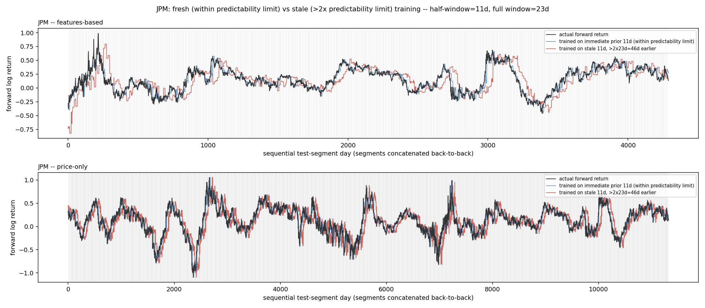
*Figure 1. JPM (τ\* = 23d, w = 11d). Stale-trained predictions (red) diverge sharply from actual (black) at multiple points in the features-based panel (top); fresh-trained predictions (blue) track closely throughout. The price-only panel (bottom) shows the same direction of effect at smaller magnitude — blue consistently sits closer to black than red does, most visibly around the sharp moves near sequential-day ~2700 and ~7200.*

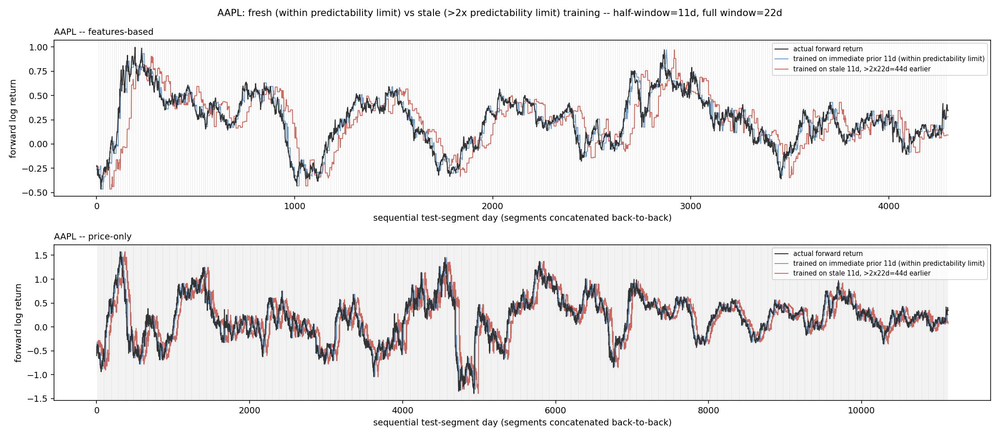
*Figure 2. AAPL (τ\* = 22d, w = 11d). The clearest features-based divergence in the panel: stale-trained predictions overshoot far past the actual curve in multiple stretches (e.g. sequential-day 0–500, 1000–1200). The price-only panel again shows the same effect at reduced scale, visible around the sharp dip near sequential-day 4700–5000.*

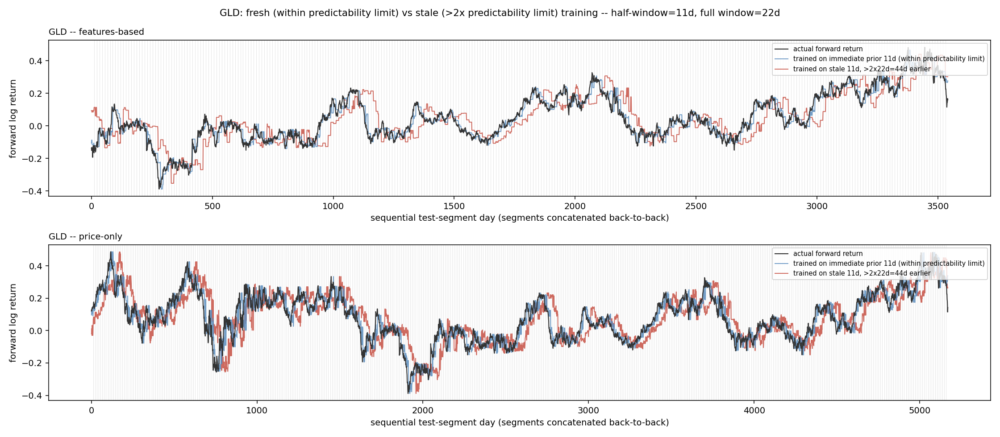
*Figure 3. GLD (τ\* = 22d, w = 11d). Features-based stale predictions diverge repeatedly (e.g. near sequential-day 0–200, 2000–2200, 2600–2700). Price-only shows a real, moderate divergence throughout, larger than JPM/AAPL's price-only panels.*

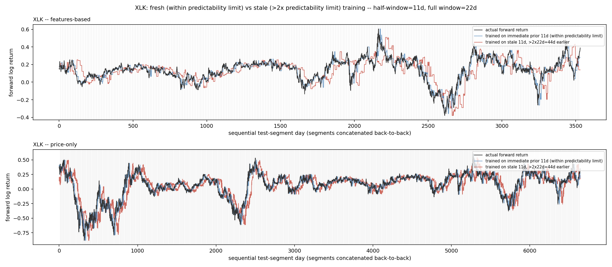
*Figure 4. XLK (τ\* = 22d, w = 11d). Features-based stale predictions diverge visibly around sequential-day 1700–2000 and 2500–2700; fresh predictions track the actual curve's dips and recoveries closely throughout both panels.*

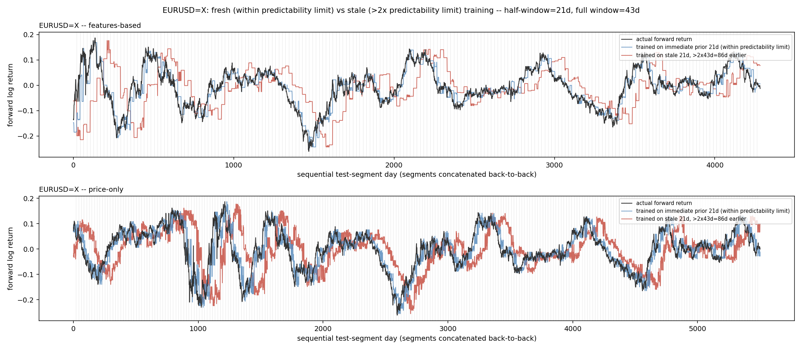
*Figure 5. EURUSD=X (τ\* = 43d, w = 21d). One of the two instruments where the price-only panel shows the effect as clearly as the features-based panel — stale predictions (red) diverge from actual across extended stretches in both.*

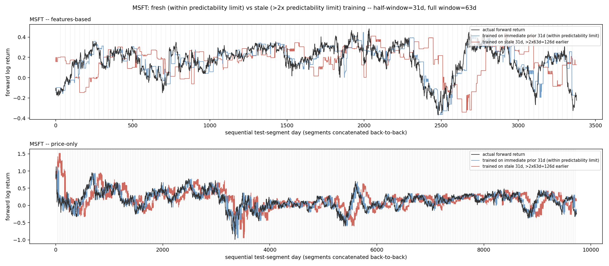
*Figure 6. MSFT (τ\* = 63d, w = 31d, the longest half-window in this panel). Features-based divergence is pronounced near sequential-day 0–300 and 2400–2700; price-only shows a real, sustained offset through much of the sequence, the other instrument (with EURUSD=X) where the effect is as visible in price-only as in features-based.*

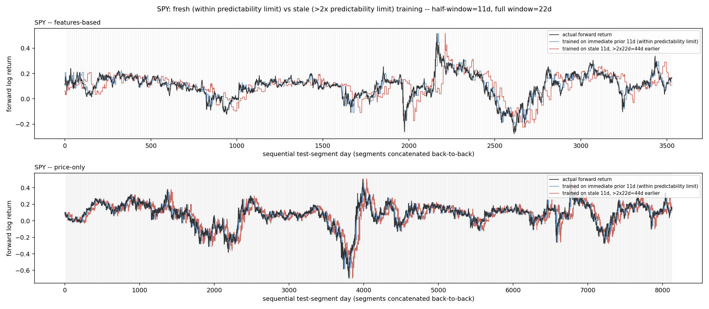
*Figure 7. SPY (τ\* = 22d, w = 11d). Features-based stale predictions diverge repeatedly, most visibly around sequential-day 1600–2000 and 2500–2900. Price-only shows the smaller-magnitude version of the same pattern seen in JPM and AAPL.*

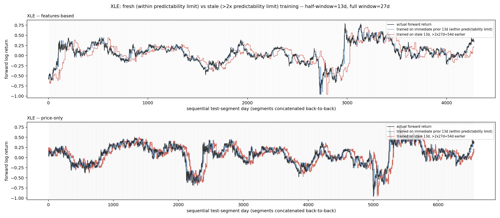
*Figure 8. XLE (τ\* = 27d, w = 13d). Features-based divergence is visible throughout, most dramatically around the sharp move near sequential-day 2900–3000. Price-only shows a moderate, consistent offset.*

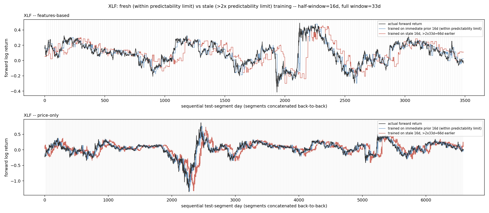
*Figure 9. XLF (τ\* = 33d, w = 16d). Features-based stale predictions diverge sharply around the spike near sequential-day 2100–2500. Price-only shows a visible but smaller offset around the same region.*

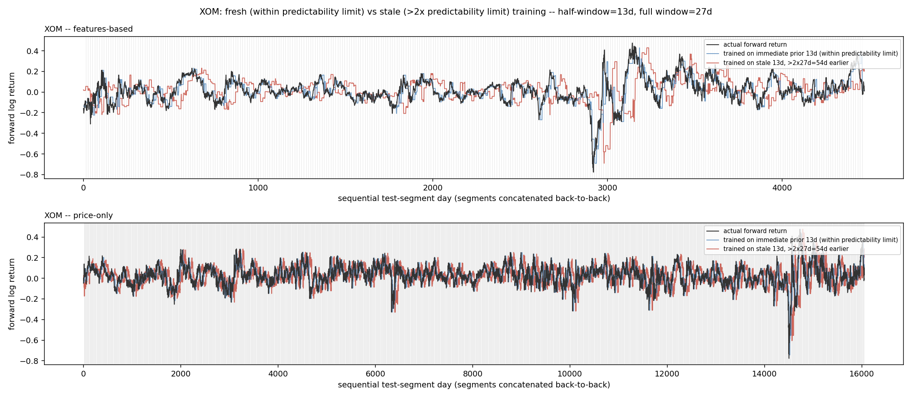
*Figure 10. XOM (τ\* = 27d, w = 13d). Features-based divergence is visible across most of the sequence, most sharply near sequential-day 2900–3300. Price-only shows the smaller-magnitude pattern seen in JPM/AAPL/SPY.*

### 4.2 Two instruments where the underlying target is inherently noisier

IWM and QQQ are both 21-day-horizon instruments — far shorter than any other instrument in this panel (the next-shortest is XOM at 63 days) — and their forward-return target is correspondingly far choppier, with much less window-to-window overlap smoothing the curve. Both instruments show a large, shared dip at the same point in their respective sequences, almost certainly the COVID-19 crash given the timing. In both, the fresh-versus-stale distinction that is easy to read by eye in Section 4.1's instruments is genuinely harder to make out against this much noisier backdrop, in both variants.

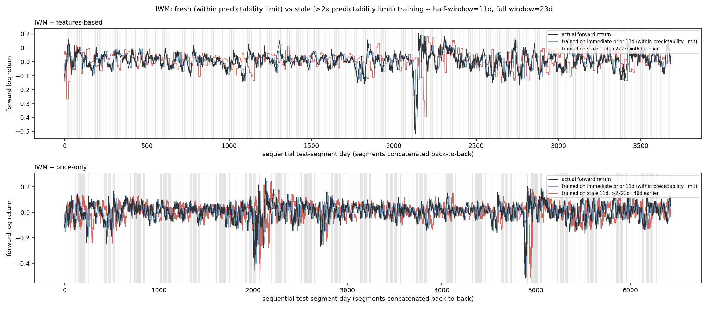
*Figure 11. IWM (τ\* = 23d, w = 11d, 21-day horizon). Considerably noisier than the longer-horizon instruments above in both panels; a large shared dip near sequential-day 2100–2200 is visible in both variants.*

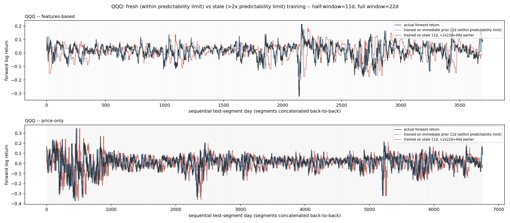
*Figure 12. QQQ (τ\* = 22d, w = 11d, 21-day horizon). Same short-horizon noisiness as IWM; the fresh-versus-stale distinction is present but harder to isolate visually against the choppier target.*

This is read as a property of horizon length making the underlying comparison noisier, not as evidence the design fails specifically for short horizons — the same instruments' *rate of transfer success* (a separate, coarser diagnostic used earlier in this research program's development, not reported here per Section 1's stated evidentiary standard) was not obviously worse for IWM/QQQ than for the rest of the panel; it is specifically the visual comparison that degrades at short horizons, because there is less structure in the target curve itself for any comparison to be legible against.

## 5. Discussion

**The practical prescription.** For an instrument with an empirically-measured predictability limit τ\*, train a model on the most recent ⌊τ\*/2⌋ days of data, and treat a model's training data as increasingly suspect once the model is being applied more than roughly 2τ\* days past the end of that training window — not because of any fixed calendar convention, but because that is the point past which this paper's own direct tests stop showing the training window still describing the instrument's subsequent behavior.

**This is a narrower claim than "predictability limits fix everything in this research program's live system," and that boundary is worth stating explicitly.** Paper 12's live deployment uses a substantially longer window (756–1008 days) for its own post-processing correction, chosen for a different reason entirely: building a *stable estimate of a forecast-error correction* requires far more data than tracking an instrument's own *price-dynamics* predictability does, since the two are simply different statistical objects. An internal check that substituted a predictability-limit-sized window directly into that live correction was tested against the system's actual deployed accuracy and found to underperform it — dramatically so for one instrument. This paper's prescription concerns how long a memorizing, overfit-prone model's training data can be trusted, which is a distinct and, the author would argue, more fundamental question than how to calibrate a specific downstream correction — but it is not a universal solvent for every design choice in this research program's own systems, and this paper does not claim otherwise.

**The features-versus-price-only asymmetry** observed throughout Section 4 — present in both variants for every instrument tested, but consistently larger in the features-based variant — is mechanistically plausible without further verification in this paper: an instrument's own raw return statistics (its mean, its volatility, its autocorrelation) may simply be more stable across time than the specific, regime-conditioned relationship between those multifractal features and the credit-spread/VIX-term-structure state, which is exactly the kind of relationship a genuine regime change would be expected to disrupt first.

## 6. Limitations

- **Coverage.** Only 12 of this research program's 22 live-forecasting instruments have an already-published Paper 11 predictability limit; this paper's evidence is confined to those 12, deliberately, rather than estimating a limit for the remaining 10.
- **Short-horizon legibility.** IWM and QQQ's 21-day horizon produces a visibly noisier comparison in both variants, making this paper's central visual claim harder — though not obviously wrong — to assess by eye for exactly these two instruments.
- **No independent ground truth for "regime change."** This paper demonstrates that fresh training tracks subsequent reality better than stale training; it does not independently establish that the moments where this gap widens correspond to any externally verifiable definition of a regime shift. This is a deliberate, stated choice of evidentiary standard (Section 1), not an oversight to be corrected with a future significance test.
- **The overfit-tree diagnostic is a probe, not a product.** It is deliberately built to have no regularization, specifically to be maximally sensitive to a training-window boundary; it is not proposed here as a deployable forecasting model in its own right.

## 7. Conclusion

An instrument's own empirical predictability limit — already published, fully non-parametric, requiring no new estimation — answers a question every practitioner using AI/ML on financial data has to answer somehow: how much history should the model see, and when does that history stop counting. Trained on half that limit and tested one window forward, a deliberately unregularized model tracks an instrument's subsequent behavior closely, across every one of the 12 instruments this can currently be tested on; trained on equally-sized but genuinely stale data from beyond twice that limit, the same model visibly does not. Shown directly, instrument by instrument, curve by curve, this is a small, concrete, and immediately usable answer to a much bigger question than its size suggests — and, as Section 1 argues, a bigger question than its home field. The mechanism was borrowed once already, from atmospheric turbulence theory into finance, before this paper ever repurposed it as a training-window rule; there is no reason that migration has to stop here. Any AI/ML pipeline that currently picks its training window by convention, in any domain with genuinely non-stationary dynamics, has the same question sitting in front of it, and the same kind of answer available: measure the system's own memory, and let that decide.

---

## References

Breiman, L., Friedman, J. H., Olshen, R. A., & Stone, C. J. (1984). *Classification and Regression Trees*. Wadsworth.

Ramanathan, A. (2026). Empirical Predictability Limits of Financial Markets via Correlated–Decorrelated Structure Function Decomposition: A Departure from Atmospheric Turbulence Theory. *Zenodo* (Paper 11, this series). https://doi.org/10.5281/zenodo.21373459

Ramanathan, A. (2026). A Master-Model Framework for Regime-Conditioned Price Forecasting: Real Statistical Skill, and Why It Mostly Isn't Alpha. *Zenodo* (Paper 12, this series). https://doi.org/10.5281/zenodo.21454884

---

## Code and Data Availability

This paper's figures are generated entirely by the self-contained `notebooks/predictor_v1/64_good_vs_stale_test.py`, plus its equation-rendering script `render_paper13_equations.py`, both available at `notebooks/predictor_v1/` in the `quantarram/quant-regime-research` repository. That script's design builds on this research program's own development history — the windowing methodology first established in `59_predictability_limit_transfer_test.py` and the overfit-model diagnostic first established in `62_overfit_transfer_probe.py` — though neither is required to reproduce this paper's results. This work builds directly on Paper 11's predictability-limit results (`predictability_paper/results_correlated_decorrelated.json`) and Paper 12's live master-model forecasting system.
