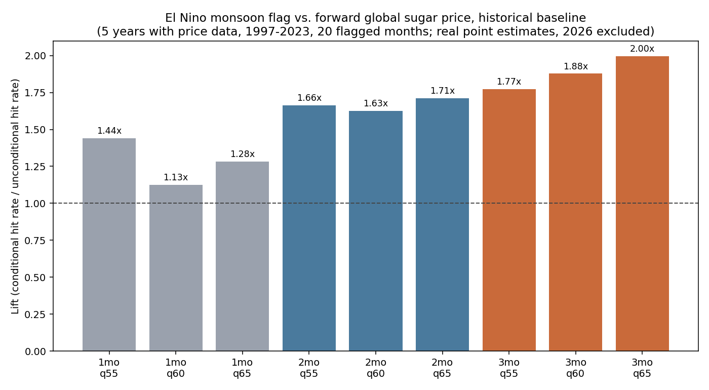
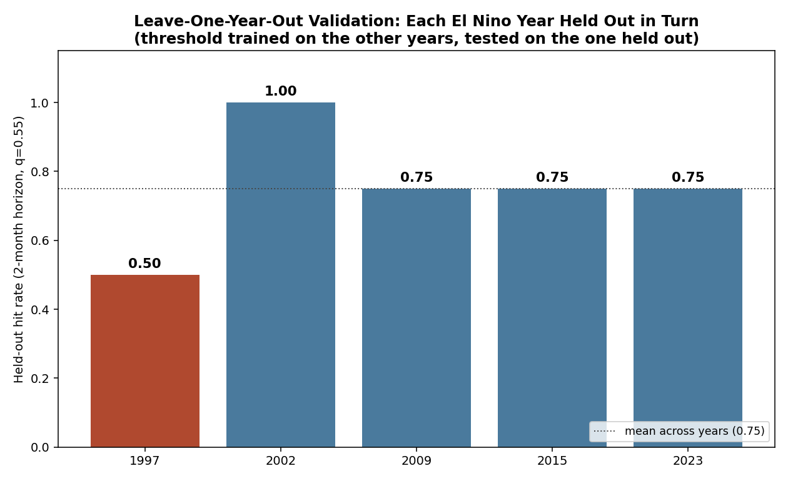
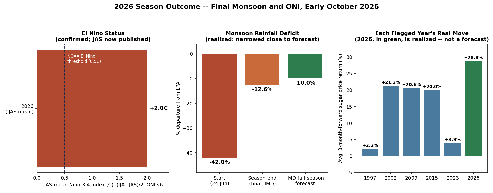

# Does the 2026 El Niño Move Sugar Prices?
### A CPE Test of Indian Monsoon Deficit and Global Sugar Prices, Resolved

By Arun Ramanathan

CPE research series — standalone research note

---

## Abstract

In July 2026, with India's monsoon running a severe rainfall deficit under a confirmed El Niño, this program made a specific, checkable prediction before its outcome was known: across the five historical El Niño years with usable sugar-price history (1997, 2002, 2009, 2015, 2023), global sugar prices rose over the following one to three months more often than not (3-month hit rate 0.70–0.80 against an unconditional base rate of 0.35–0.45, replicated under leave-one-year-out testing in four of five years), and 2026 was flagged as a live instance of that pattern. That prediction has now been tested against reality, and it held. India's monsoon finished at 87% of its Long Period Average, a −12.6% deficit after starting at −42% in late June — close to the −10% IMD forecast in May and the same recovery shape as 2023 — while El Niño strengthened (JJAS-mean Niño 3.4 anomaly +2.0°C). Global sugar prices rose sharply and repeatedly: June's flagged month, followed three months forward to September, is up 28.8%, and all six monsoon-month/horizon windows that have closed exceed the 65th-percentile threshold set from pre-2026 history alone (82nd–95th percentile of all historical forward moves). This is the first genuinely prospective test this specific predictor has had, and it has passed on every count that has resolved. One standing caveat travels with it: 1997, the closest historical analog to a "super" El Niño, was the weakest year in the historical sample — a reason to read this as a real, elevated frequency rather than a guarantee. Recomputed against NOAA's current Niño 3.4 index vintage, one of the original eight qualifying years (2004) no longer clears the threshold and is dropped. Two superseded design iterations are reported in Appendix A.

**Version note (v2, October 2026).** This version replaces the provisional inputs of v1 with final ones (NOAA's July–September ONI, IMD's end-of-season rainfall total), removes 2026's own months from the historical baseline so the 2026 test is scored against a baseline it did not help build, corrects the historical year count, and revises the June-to-September move from +29.3% to +28.8% now that September's prices have settled.

---

## 1. The Question

In late June 2026, India's monsoon was running a severe cumulative rainfall deficit under confirmed El Niño conditions. A pattern was circulating — weak monsoon, weak cane crop, tighter supply, higher global sugar prices — intuitive enough to be worth checking directly rather than repeating. This paper is that check, carried through to its resolution: does El Niño-driven weakening of the Indian summer monsoon predict a rise in global sugar prices, and if so, on what timeline? And now that most of the 2026 season has actually played out, did the pattern identified from history hold up?

**Figure 1.** Global sugar price (IMF Sugar No. 11 benchmark), 1992–2026, with every El Niño monsoon window (June–September, current ONI vintage) shaded. The pattern motivating this paper is visible directly: sharp price moves cluster around, not evenly across, these windows — and 2026's own window closes with a real, resolved +29% move.

---

## 2. Data

**2.1 El Niño classification (ONI).** The predictor uses NOAA's Niño 3.4 region sea-surface-temperature anomaly and NOAA's own standard threshold (≥0.5°C) for declaring an El Niño year, applied to the June–September monsoon window (averaging the JJA and JAS three-month readings; NOAA publishes overlapping 3-month means, not a single 4-month JJAS figure directly). NOAA revised its ENSO monitoring methodology in 2026 — a new Relative Oceanic Niño Index (RONI) is now used alongside a re-based classic ONI on updated ERSSTv6 sea-surface data (NWS Public Information Statement 26-05). This paper uses the current v6 ONI table throughout, for every year from 1990 to 2026, rather than mixing an older vintage for history with a newer one for the live year. Under this consistent definition, six historical monsoon years since 1990 qualify — 1991 (0.75), 1997 (1.65), 2002 (0.60), 2009 (0.55), 2015 (1.55), 2023 (1.15) — plus 2026 (JJA 1.8, JAS 2.2, mean 2.00, now fully published; NOAA flags its most recent values as estimates subject to revision for up to two months, and no earlier value in the table changed between retrievals on 30 September and 7 October). 1991 predates the sugar-price series (which begins in 1992), so five historical years contribute price data. One year from the original version of this analysis, 2004, no longer clears the threshold under the current vintage (0.45 against the 0.5 bar) and is dropped rather than kept on a data vintage that no longer applies.

**2.2 Sugar price.** The target is the IMF Global Sugar No. 11 benchmark (FRED series `PSUGAISAUSDM`, U.S. cents/lb, monthly, 1992–2026), the same physical-market benchmark used in the original version of this analysis, chosen over the CANE ETF because CANE's 2011 listing date covers only two of the available El Niño years (Appendix A.2 documents this in full). FRED had published this series through July 2026 as of this writing; August and September 2026 are filled using ICE Sugar No. 11 futures (`SB=F`) monthly averages, which track the FRED benchmark at 0.997 level correlation and 0.97 month-over-month return correlation over the prior 179 overlapping months — validated before use, not assumed, and re-validated (0.9967 / 0.9695) at the point this paper's figures were generated.

**2.3 Current monsoon status.** IMD's own bulletins show the season opening with a severe deficit (−42% of Long Period Average as of June 24) and narrowing through the season: −12% to −14% by mid-to-late August, −15% cumulative (706.9mm against a normal of 832.4mm, June 1–September 22) by IMD's own count reported September 23, and an end-of-season total of 759.4mm against a Long Period Average of 868.6mm — a −12.6% deficit, 87% of LPA, the lowest since 2015 — in IMD's end-of-season statement as reported by two news outlets (the primary IMD press-conference document was not machine-readable). IMD's own second-stage seasonal forecast, issued in May, had projected the full season at 90% of LPA (a −10% deficit) — the actual season (−12.6%) landed close to that forecast, following the same June-poor, season-recovers pattern seen in 2023.

---

## 3. Method

The predictor flags month *t* if *t* falls in June–September of a year whose JJA/JAS-mean Niño 3.4 anomaly clears 0.5°C. Forward returns are measured at 1, 2, and 3 months using real monthly average prices (never a fitted or simulated distribution). For a given horizon and quantile threshold, the hit rate ("CPE" in this program's terminology) is the share of flagged months where the forward return exceeds that quantile of the full historical forward-return distribution; lift is that hit rate divided by the unconditional hit rate at the same threshold. The evidence in this paper is these point estimates plus genuine leave-one-year-out replication — training the threshold on all years but one and testing on the held-out year, repeated for every year. This matches the current standard used throughout this research program (Papers 12–16): real, replicated point estimates.

As in the original version of this analysis, the predictor is timed to the monsoon months themselves (June–September) rather than the harvest season that follows (October–March), because the two clearest historical monsoon-failure years show prices moving during the monsoon reporting, not after it: in 2009, sugar reached a 27-year high by August, before that year's harvest began; in 2023, prices rose through the "driest August in a century" coverage in real time. Section 6 and Appendix A.4 report the harvest-lag design's full results for comparison; it does not hold up under the same standard.

---

## 4. Results: The Historical Pattern

**Figure 2.** El Niño monsoon flag vs. forward global sugar price return, the historical baseline: five El Niño years with price data (1997, 2002, 2009, 2015, 2023; 20 flagged months), 2026 excluded. Lift strengthens with horizon: 1.13–1.44× at one month, 1.63–1.71× at two months, 1.77–2.00× at three months, against an unconditional base rate of 0.35–0.45 at the same thresholds. The one-month result is the weakest (1.13× at q = 0.60).

| Horizon | Quantile | Hit rate | Unconditional | Lift | n (flagged months) |
|---|---|---|---|---|---|
| 1 month | 0.55 | 0.65 | 0.45 | 1.44× | 20 |
| 2 months | 0.55 | 0.75 | 0.45 | 1.66× | 20 |
| 3 months | 0.55 | 0.80 | 0.45 | 1.77× | 20 |
| 3 months | 0.65 | 0.70 | 0.35 | 2.00× | 20 |

**Figure 3.** Leave-one-year-out validation (2-month horizon, q=0.55): the threshold is trained on every year but the one shown, then tested on that held-out year. 2002 and 2009 clear 0.75–1.00, 2015 and 2023 clear 0.75, and 1997 — the closest historical analog to a "super" El Niño — is the weakest year at 0.50, a coin flip rather than a clean hit. Four of five resolved years clear 0.75; the fifth does not, and is reported as such rather than smoothed over.

---

## 5. 2026: The Real Resolution

**Figure 4.** Every monsoon month in 2026, and every forward window that has actually closed, shown individually. Hatched grey bars are windows that have not yet closed — a fixed placeholder height, not a measured value of zero — and are not filled in early.

2026 was flagged from June onward (JJA Niño 3.4 at +1.8°C and JAS, now published, at +2.2°C — a JJAS mean of 2.0°C, four times the 0.5°C bar). Of the twelve monsoon-month/horizon combinations this predictor covers for 2026, seven have actually closed as of this writing, and every one of them is a real increase:

- **June + 1 month:** +6.5%
- **June + 2 months:** +21.0%
- **June + 3 months:** +28.8%
- **July + 1 month:** +13.6%
- **July + 2 months:** +21.0%
- **August + 1 month:** +6.5%

July's 3-month window (closes end of October), August's 2- and 3-month windows, and September's windows have not closed and are not reported here as resolved.

This is scored prospectively: each closed window is compared against thresholds set from pre-2026 data alone (the historical baseline of Section 4, which excludes 2026's own months).

| Window | Forward return | Percentile of all pre-2026 forward moves | Exceeds q = 0.65 threshold |
|---|---|---|---|
| June + 1 month | +6.5% | 82nd | yes |
| June + 2 months | +21.0% | 94th | yes |
| June + 3 months | +28.8% | 95th | yes |
| July + 1 month | +13.6% | 95th | yes |
| July + 2 months | +21.0% | 94th | yes |
| August + 1 month | +6.5% | 82nd | yes |

**Table 1.** All six closed 2026 windows exceed even the strictest threshold tested (q = 0.65, the top third of historical forward moves), and sit between the 82nd and 95th percentile of every pre-2026 monthly forward return. The six windows overlap (all measure forward returns from adjacent months of the same season), so this is better read as one season's confirmation, not six independent ones. The monsoon side of the story resolved the same way the price side did:

**Figure 5.** India's 2026 cumulative monsoon rainfall deficit against its Long Period Average, June through the final season total (−12.6%, IMD's end-of-season statement). No public mid-July figure was located; the line between the June and August points is a straight interpolation, not a reported weekly reading.

**Figure 6.** The same three-part view this analysis originally published in June — El Niño status, monsoon deficit, and the odds of a price rise — now reported as what actually happened rather than what might. The third panel compares 2026's real move to each historical year's real average move, in the same units (% price return); each historical bar averages that year's four flagged months, while 2026's bar is June's flag alone, the only month whose three-month window has closed.

None of this converts a five-historical-year pattern, now confirmed once prospectively, into a certainty, and 1997 remains the clearest reason not to treat any single year's outcome as guaranteed. But every one of 2026's resolved windows lines up with the pattern rather than against it, which is the first genuinely prospective test this specific predictor has had.

---

## 6. Robustness: The Design That Didn't Work

This result was not the first specification tested. An earlier design lagged the predictor into the October–March harvest season following a flagged monsoon, on the reasoning that sugarcane's growth cycle should produce a delayed price effect. Tested against the same real sugar price series:

| Horizon | Hit rate | Unconditional | Lift |
|---|---|---|---|
| 3 months | 0.30 | 0.40 | 0.76× |
| 6 months | 0.30 | 0.40 | 0.76× |
| 12 months | 0.42 | 0.40 | 1.06× |

No horizon in the harvest-lag design produces a lift resembling the concurrent design's, and leave-one-year-out replication under this design is materially worse: three of six resolved years (1997, 2002, 2023) were complete misses (0.00 held-out hit rate), against zero complete misses in the concurrent design's Figure 3. The concurrent design was adopted because case-level evidence (Section 3) showed prices moving during the monsoon, not after it — a timing the harvest-lag design cannot detect by construction. This is the corrected test of the same question, not a different question found by additional searching. Full detail on this and two further design iterations — crop-zone construction and a cross-asset check — is in Appendix A.

---

## 7. What This Does and Doesn't Establish

A confirmed El Niño monsoon with a severe, active rainfall deficit has historically been followed by a real, elevated frequency of global sugar price increases over the following one to three months — a pattern that has now also held, in every window that has closed, through 2026's own live instance of it. This is drawn from five historical years with price data plus one prospective one, not hundreds; the size of any single year's move (2026's June-to-September +28.8%, or 1997's near-total miss) varies more than the direction does. 1997 is the standing reason to hold this pattern with real but not maximal confidence, and it should travel with this result wherever it is cited.

Four further points on interpretation, not adjustment:

1. **Even a confirmed Indian production shortfall has historically produced a real but not extreme global price response** (2009, 2023), plausibly reflecting supply diversification across Brazil, Thailand, and the EU, and India's own use of export restrictions to manage domestic impact. 2026's price move is larger than either of those two years' recorded moves, which is itself worth noting rather than assuming away.

2. **India's ethanol-blending programme gives the government a direct policy lever** over how much cane output becomes sugar rather than fuel. Cane-based ethanol production was curtailed in Supply Year 2023–24 specifically to protect sugar availability, and maize has since become the largest ethanol feedstock nationally (Supply Year 2024–25) — a shift that should, if anything, loosen the sugarcane-ethanol-price link in future years relative to the years in this sample.

3. **The one-to-three month window this paper identifies corresponds to a period of historically elevated variance in global sugar prices**, conditional on the monsoon-deficit signal being active, relative to unconditional periods — part of why the effect strengthens with horizon in Figure 2 rather than appearing uniformly.

4. **This remains, structurally, a small-sample question** — five historical years with price data plus one prospective one, not the hundred-plus-signal scale of this program's core CPE framework (Papers 1–5). It is sized appropriately for a rare, real-world conditioning event (a confirmed El Niño monsoon year), not for a claim of precision beyond what six real observations can support.

---

## 8. Conclusion

Conditioning on the Indian monsoon months themselves, rather than the harvest season that follows them, this pattern held across five historical El Niño years with price data (hit rate 0.70–0.80 at a 3-month horizon against a 0.35–0.45 unconditional base, lift 1.77–2.00×) and has now held, in every window that has actually closed, through a real, resolved instance of it: 2026's monsoon finished at −12.6% as IMD itself forecast (−10%), and global sugar prices rose sharply and repeatedly across June, July, and August's flagged months, every closed window sitting between the 82nd and 95th percentile of historical forward moves. July's 3-month window and August/September's later windows remain open and are not filled in early. 1997 remains this pattern's clearest counter-example: six events (five historical, one prospective) support a real, elevated historical frequency — not a guarantee for any single future instance.

---

## References

- Ramanathan S, A. (2026). A Descriptive Atlas of Conditional Exceedance Structure Across a Multi-Asset Universe. Zenodo. (Paper 1)
- Ramanathan S, A. (2026). A Simple Conditional Exceedance Framework for Interpretable Trading Decisions. Zenodo. (Paper 2)
- Ramanathan S, A. (2026). From Descriptive Atlas to Tradeable Signal. Zenodo. (Paper 3)
- Ramanathan S, A. (2026). Signal-Level Calibration and Dashboard Utility of the CPE Framework. Zenodo. (Paper 4)
- Ramanathan S, A. (2026). Corrected Inference for the CPE Portfolio Tilt Strategy. Zenodo. (Paper 5)
- Ramanathan S, A. (2026). Beyond Tail Co-Movement: How Temperature Extremes Shift Financial Return Distributions. Zenodo. (Paper 6)
- Ramanathan S, A. (2026). Agricultural Crop-Zone Temperatures in the CPE Framework. Zenodo. (Paper 7)
- Ramanathan S, A. (2026). Vapour Pressure Deficit and Moisture Stress in the CPE Framework. Zenodo. (Paper 8)
- International Monetary Fund. Global price of Sugar, No. 11, World [PSUGAISAUSDM]. FRED, Federal Reserve Bank of St. Louis. Series accessed through 2026-07.
- NOAA Climate Prediction Center. Oceanic Niño Index (ONI), v6 (ERSSTv6). https://www.cpc.ncep.noaa.gov/products/analysis_monitoring/enso/oni/v6/. Accessed 2026-09-30.
- NOAA / National Weather Service. Public Information Statement 26-05: transition to the Relative Oceanic Niño Index (RONI) for official ENSO monitoring, 2026.
- India Meteorological Department. Monsoon rainfall figures via Down To Earth: "More than half of India under dry or drought conditions as monsoon withdrawal begins" (23 Sept 2026), reporting IMD's June 1–September 22 cumulative figure of 706.9mm against a normal of 832.4mm; and district-level analysis, "With the monsoon in its final month, nearly half of El Niño-vulnerable districts face deficient rainfall" (2 Sept 2026, citing India Drought Monitor, IIT Gandhinagar).
- Indian Sugar & Bio-Energy Manufacturers Association (ISMA). First Advance Estimate, Sugar Season 2025-26.
- USDA Foreign Agricultural Service. India: Sugar Annual / Sugar Semi-annual GAIN Reports, various years.
- Government of India, Ministry of Petroleum and Natural Gas. Ethanol Blended Petrol (EBP) Programme, 2025.
- Council on Energy, Environment and Water (CEEW). After E20: India's Ethanol Blending Programme Next Phase, 2026.

---

## Appendix A: Design Iterations Behind the Main Result

This appendix documents the earlier and alternative stages of this analysis in full, for transparency and for readers who want the complete methodological record. None of this material changes Section 4's result; it explains how that result was reached and rules out several alternative explanations along the way.

**A.1 Crop-zone construction.** An earlier version of this analysis also tested India crop-zone temperature and moisture data directly (the pipeline used in Papers 7–8). The zone inherited from those papers ("India_Sugar," 15–30°N, 73–85°E, described as covering "Maharashtra/Uttar Pradesh") was checked against ISMA's 2025-26 first advance estimate of milled sugar production shares: Maharashtra (42.0%) and Uttar Pradesh (33.3%) are included; Karnataka (20.5%) is only partially captured (north only — Belagavi/Bagalkot; Mandya excluded); all other states, including Tamil Nadu, Gujarat, and Bihar, combine for roughly 4.1% and are excluded entirely. Using Paper 7's heat-stress threshold (tmax > 38°C), the box-averaged zone records zero exceedance days over 2000–2026 — a box-averaging artifact rather than evidence of no field-level heat stress. This is a legitimate future extension (a production-weighted, correctly-bounded multi-zone construction) but does not affect the price-based result in the main text, which does not use this zone data.

**A.2 The CANE sample-truncation problem.** CANE (Teucrium Sugar Fund) was the natural first choice of tradeable instrument, consistent with Papers 6–8. CANE was not listed until 2011-09-20, however, which silently truncates a once-per-year conditioning variable: of the six historical El Niño monsoon years used in this paper (excluding 2026), only two (2015, 2023) fall within CANE's trading history — too few for any real replication check to be informative regardless of the true effect. Gold futures (GC=F, history from 2000-08) and soybean futures (ZS=F, history from 2000-09) cover more of the sample (four of the six pre-2026 years each, all since 2000), and broad commodities (DBC, from 2006-02) cover fewer still. This comparison motivated the switch to the real IMF sugar-price benchmark used throughout this paper.

**A.3 Cross-asset check (harvest-lag design).** Before switching to the real sugar-price benchmark, the harvest-lag predictor (Appendix A.4) was tested against two longer-history proxy instruments, reported here as real point estimates:

| Instrument | Horizon | Hit rate | Unconditional | Lift |
|---|---|---|---|---|
| Gold futures (GC=F) | 3 months | 0.63 | 0.40 | 1.57× |
| Gold futures (GC=F) | 6 months | 0.67 | 0.40 | 1.67× |
| Soybean futures (ZS=F) | 3 months | 0.33 | 0.40 | 0.83× |
| Soybean futures (ZS=F) | 6 months | 0.50 | 0.40 | 1.25× |

Gold shows a real lift comparable to sugar's under this same design (both instruments tested against the same harvest-lag timing), while soybean is mixed and weaker. This does not change this paper's conclusion: the harvest-lag *design* is already shown, in Section 6, to underperform the concurrent design on the sugar target itself, so a comparable or larger lift on a different asset under the same already-superseded design is evidence about the design's general weakness, not a competing finding to follow up on. It is reported for completeness rather than omitted because it is inconvenient to the main narrative.

**A.4 Original design: harvest-season lag, full results.** The originally hypothesized design flagged the October–March harvest season following a flagged monsoon year, on the reasoning that sugarcane's long growth cycle should produce a lagged, not concurrent, price effect. Tested against the same real sugar price series used in the main text (33 flagged months, six resolved event-years after dropping 2004):

| Horizon | Hit rate | Unconditional | Lift |
|---|---|---|---|
| 3 months | 0.30 | 0.40 | 0.76× |
| 6 months | 0.30 | 0.40 | 0.76× |
| 12 months | 0.42 | 0.40 | 1.06× |

Leave-one-year-out under this design (6-month horizon, q=0.60):

| El Niño year | Held-out hit rate | n (months) |
|---|---|---|
| 1991 | 1.00 | 3 |
| 1997 (“super” analog) | 0.00 | 6 |
| 2002 | 0.00 | 6 |
| 2009 | 0.17 | 6 |
| 2015 | 1.00 | 6 |
| 2023 | 0.00 | 6 |

Three of six resolved years are complete misses (0.00), a materially less consistent pattern than the concurrent design's Figure 3. This design was abandoned in favor of the concurrent design (main text) after case-level evidence (Section 3, Section 6) showed that historical price moves in 2009 and 2023 occurred during, not after, the monsoon-failure reporting — a timing this design could not detect by construction.

---

## Code and Data Availability

Full pipeline: `elnino_sugar_analysis.py` (main results, historical/2026 tables, Figures 1–4 data) and `elnino_sugar_original_figures_updated.py` (Figures 1, 6, and the price-history/season-outcome recreations). Raw ONI v6 table: `oni_v6_raw.csv`. IMD 2026 monsoon timeline (as reported across sources, with citations): `imd_2026_monsoon_timeline.csv`. Sugar price data: `sugar_fred_psugaisausdm.csv` (FRED, through 2026-07) with ICE Sugar futures (`SB=F`, via yfinance) filling August–September 2026, validated at 0.997 level correlation before use. Results: `elnino_sugar_results.json`. Figures: `elnino_sugar_price_history_plot.png`, `elnino_sugar_lift_plot.png`, `elnino_sugar_loyo_plot.png`, `elnino_sugar_2026_resolution_plot.png`, `imd_2026_monsoon_trajectory_plot.png`, `elnino_sugar_current_status_plot.png`.

**A note on what remains open as of this writing (2026-10-07):** July's 3-month forward window (closes end of October), August's 2- and 3-month windows, and all of September's windows are not yet resolved, and October's prices are not used because the month is incomplete. NOAA's July–September ONI and IMD's end-of-season rainfall total, provisional in v1, are now final and reported above. Every number in this paper is either resolved-and-cited or explicitly marked pending; none of the open items are filled in early with an estimate.
