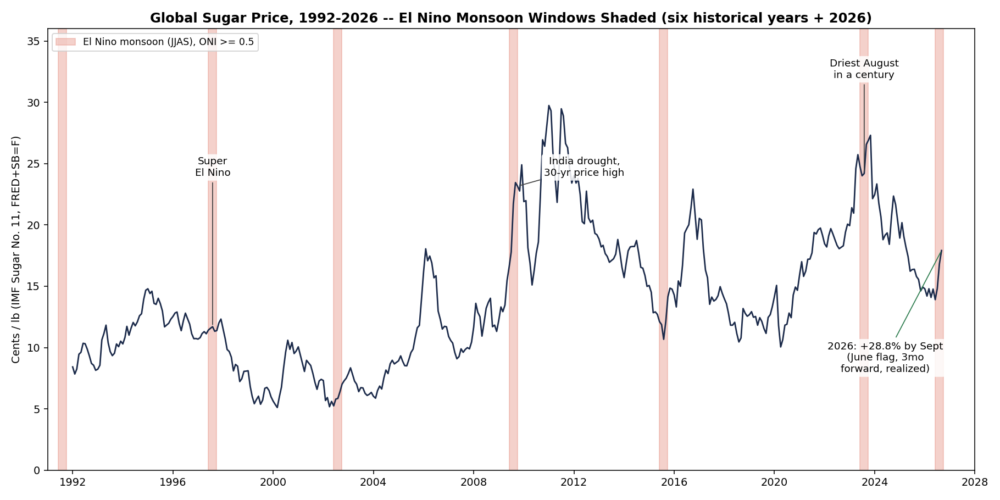
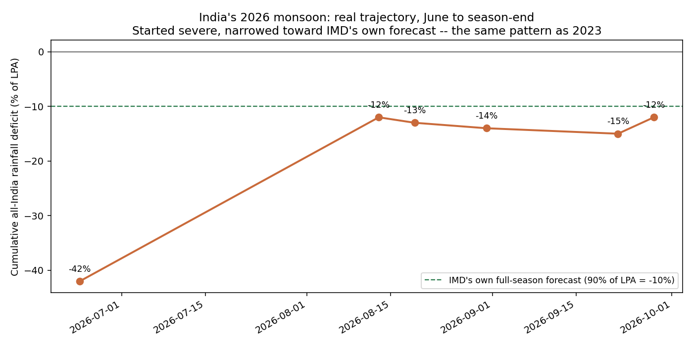
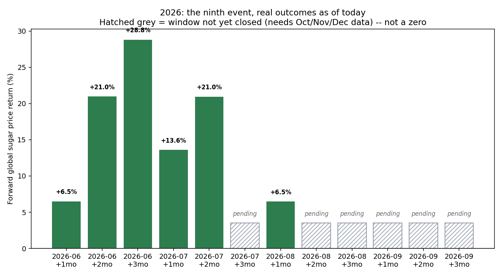

# The El Niño Sugar Prediction, Checked Against What Actually Happened

Back in July, I published a piece making a specific, checkable claim before I knew how it would turn out: with India's monsoon running a severe deficit under a confirmed El Niño, five historical El Niño years since 1990 with usable sugar-price history showed global sugar prices rising over the following one to three months more often than not — a 3-month hit rate of 0.70–0.80 against an unconditional base rate of 0.35–0.45. 2026 was flagged as a live instance of that pattern. I said I'd publish the full methodology and report what actually happened, whichever way it went, once the season resolved.

The season has resolved. Here's what happened.

India's monsoon deficit, which stood at -42% of its Long Period Average in late June, narrowed through the season: -12% to -14% by mid-to-late August, -15% cumulative by IMD's own count on September 23, and a final season total of -12.6% (759 mm against a 869 mm Long Period Average, the lowest since 2015). That's close to what IMD's own forecast, issued back in May, actually projected — the same recovery shape as 2023, when a poor June was followed by a wet July.

Global sugar prices did what the historical pattern said they'd do, and did it clearly. June's flagged month, followed three months forward to September, is up 28.8%. July's flagged month is up 13.6% after one month and 21.0% after two. August's first month is up 6.5%. Every single window that has closed so far — six of the twelve this predictor covers for 2026 — is a real increase, and each one sits between the 82nd and 95th percentile of every pre-2026 monthly forward move. July's three-month window won't close until the end of October, and August's later windows and September's are still open; I'm not filling those in early.

Before writing any of this up, I went back and re-checked the historical record itself, because NOAA revised how it computes its El Niño index this year (JJAS mean for 2026: +2.0°C, now fully published). Recomputed on the current index, one of the eight years I originally counted — 2004 — no longer clears the same bar. I dropped it rather than keep a count that only worked on an index vintage that no longer applies, leaving six historical years (five with price data, since 1991 predates the sugar series) plus 2026. The historical baseline excludes 2026's own months, so 2026 is scored against thresholds it had no hand in.

The standing caveat is still standing: 1997, the closest historical analog to a "super" El Niño, was the weakest year in the entire historical sample — a coin-flip outcome, not a clean hit. That's the reason to treat this as a real, elevated historical frequency rather than a guarantee for any one year, and it's exactly why 2026 mattered as a genuine test rather than a formality. It came back a hit, on every count that's closed so far.

Full methodology, the corrected historical table, and every real number behind this: https://zenodo.org/records/23053552
Code and all the underlying data: https://github.com/quantarram/quant-regime-research

*Independent quantitative research. Not investment advice.*
